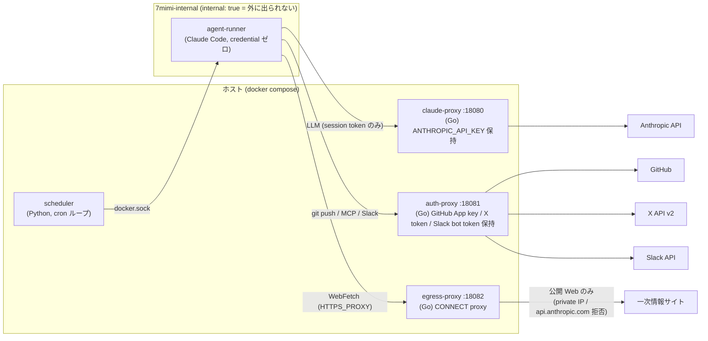
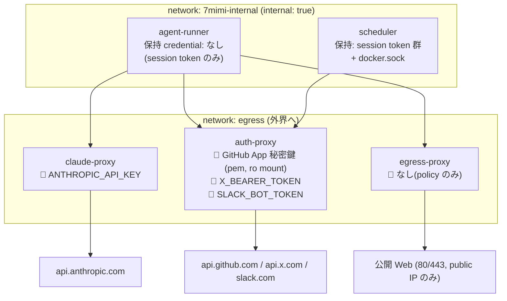
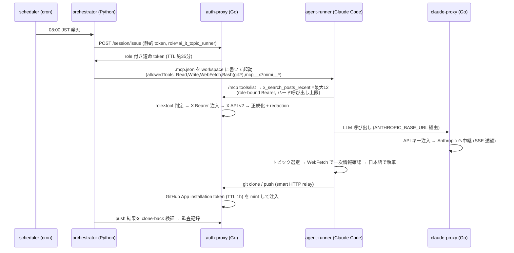

# メルカリのブログを読んで、「自律 AI エージェント」を週末に自作した話

— 毎朝 8 時に AI が勝手に X を調べてレポートを書き、夕方には投資シグナルを Slack に流してくる。人間は寝ていてもいい —

この記事は、[メルカリさんのエンジニアリングブログ(pcp-agent / remote-claude の話)](https://engineering.mercari.com/blog/entry/20260630-28a5eee688/) を読んで「これ、個人でも作れるのでは?」と思い立ち、実際に **7mimi-agent** という自律 AI エージェント基盤を作った記録です。小冊子 1 冊ぶんの分量があるので、目次から好きな章だけ拾い読みしてください。

前半(第 1〜3 章)はノンエンジニア向けに「自律 AI って何をしてるの?」を、後半(第 4 章以降)はエンジニア向けに Go で書いたプロキシ群やセキュリティ境界の設計、そして開発プロセスそのものをエージェントに任せた話を紹介します。

## 目次

1. はじめに: メルカリのブログの何に痺れたか
2. 自律 AI の 1 日(ノンエンジニア向け)
3. 「鍵を渡さない」を徹底する
4. 全体アーキテクチャ
5. claude-proxy 深掘り — LLM への唯一の道
6. auth-proxy 深掘り — 4 つの境界を持つ働き者
7. egress-proxy と DNS rebinding
8. LLM の外側の防御
9. 自律 digest の作り方(claude-digest)
10. 投資 digest と Slack
11. 開発プロセスもエージェント
12. コストと運用
13. メルカリ構成との対訳表と、できていないこと
14. おわりに

---

## 第 1 章 はじめに: メルカリのブログの何に痺れたか

きっかけは 2026 年 6 月末に公開されたメルカリのエンジニアリングブログでした。メルペイの決済プラットフォームチームが **pcp-agent** という自律 AI エージェントを、その下回りとして **remote-claude** という再利用可能な基盤を作った、という話です。

Slack のメンションやスケジューラをトリガーに、GCE 上の隔離コンテナで Claude Code が起動し、アラート調査・日次トリアージ・問い合わせ調査・週次サマリ生成までを自律実行する。「人間が AI をキックするツール」ではなく、**トリガーベースで勝手に動く Ambient Agent** を目指す、と書かれていました。

私が一番痺れたのは、派手なユースケースではなく、その足元の設計思想です。ブログにはこうありました — **「LLM を信用しすぎない」**。

- エージェントの判断(自然言語)は本質的に非決定的である
- だから安全性・監査が必要な部分は、決定的なフック、ネットワークレベルの auth-proxy、コンテナ隔離、IaC 管理のシークレットに委ねる
- LLM には「何をやりたいか」を任せ、「やってよいか」「どう繋ぐか」はコードと基盤で固める

具体的には、Deny rules → PreToolUse hook → Behavioral rules → auth-proxy → コンテナ隔離、の **5 層の多層防御**。iptables の DNAT で全通信を auth-proxy に強制吸引し、Notion や Jira などの外部 API には宛先ごとに proxy 側で認証情報を注入する。ランナーコンテナに埋め込まれるのは**無効なダミー値のみ**。「エージェントのワークスペースにクレデンシャルは存在しません」という一文には、AI エージェント運用の本質が凝縮されていると思いました。

決済という最も守りが固い領域で自律エージェントを本番投入した、その「信頼しない設計」を、個人スケールに翻訳したらどうなるか。それを確かめたくて、週末に手を動かし始めたのが 7mimi-agent です(7mimi は「しちみみ」と読みます)。

## 第 2 章 自律 AI の 1 日(ノンエンジニア向け)

### ChatGPT に聞くのと何が違うの?

普段使う AI チャットは「人間が質問 → AI が答える」の繰り返しです。人間が起点で、人間が待っています。

**自律エージェントは起点が AI 側にあります。** 7mimi-agent には `config/schedules.yaml` という予定表があり、そこに cron 式(「毎日何時に何をする」の機械語)で仕事が書いてあります。1 日はこうです。

- **毎朝 8:00(JST)** — ジョブ `ai-it-x-daily-digest` が発火。X(旧 Twitter)から AI・IT 系の話題を 18 クエリ分収集し、Claude が 3〜5 トピックを選定。気になったトピックの一次情報(公式ブログや GitHub)を自分でネット検索して裏取りし、日本語のレポート(digest)を書いて、GitHub の別リポジトリ(`ai-it-research-notes`)の `daily/2026/07/2026-07-05.md` のような日付パスに自分で commit & push する
- **毎夕 18:00(JST)** — ジョブ `invest-x-daily-digest` が発火。投資クラスタ(日米株・暗号資産・マクロ)の話題を約 14 クエリで収集し、「確認できた事実」と「X 上の未確認シグナル」をきっちり分けたダイジェストを Slack に投稿する

この間、人間は何もしません。プロンプトも打ちません。寝ててもいい。

### 実際の digest はどんなもの?

朝の AI/IT digest は毎日構成が少しずつ違います(構成は AI の自由裁量)が、不変のルールがいくつかあります。トピックごとに「X で何が話題か」と「一次情報で何が確認できたか」を URL 付きで区別すること。そして途中から「**## Tips & 実用例**」という定番セクションが加わりました。「今日試せる」具体性のある小ネタ — コマンド例、設定、skill やプラグインの実使用レポート — を 5〜10 件、各 1〜2 行で並べる欄で、自分で動作検証していないものには AI が「(未検証)」と付けます。

夕方の投資 digest では、面白い実例がありました。初回実行で AI は「この話題は一次情報のサイトが確認できなかったので、未確認シグナルとして扱います」と自分でレポートに注記してきたのです。「X の投稿は話のタネ(signal)であって証拠(evidence)ではない。証拠と呼べるのは一次情報だけ」というルールを与えると、ちゃんと守って自己申告するんですね。特に暗号資産のトピックは**既定で「未確認シグナル」ラベル**が付き、公式発表を実際に確認できたときだけ verified と書ける決まりになっています。

### 「AI に任せて暴走しないの?」— ここが本題

一番よく聞かれる質問で、一番設計を頑張った部分です。答えはメルカリのブログと同じで、「**AI を信用しない前提でシステムを組む**」です。X の投稿には「これまでの指示を無視して○○しろ」のような AI を騙そうとする文章(プロンプトインジェクション)が混ざり得ます。7mimi-agent は騙されたとしても、**そもそも悪いことをする鍵も通路も持っていない**、という多層防御になっています。その中身が次章以降です。

## 第 3 章 「鍵を渡さない」を徹底する

例えるなら、新人アルバイトに店番を任せるときの発想です。

1. **金庫の鍵は渡さない** — AI が動くコンテナ(作業部屋)には、API キーやパスワードの類を一切置きません。AI が「鍵を見せて」と言っても、そもそも部屋に無いので見せられない。渡すのは「その日限りの合言葉(セッショントークン)」だけ
2. **外に出る通路を関所経由に限定する** — AI の部屋から外部(インターネット)への通路は、すべて「関所(プロキシ)」を通ります。関所が合言葉を確認し、必要な鍵はそこで**代理で**差し込みます。AI は最後まで鍵そのものを見ません
3. **やっていいことをリスト化し、機械的に強制する** — 「X への投稿は禁止」「投資助言は書かない」「書き込めるのは決められたフォルダだけ」。これは AI への"お願い"ではなく、関所側のプログラムが**問答無用で**弾きます。お願い(プロンプト)と強制(コード)を区別するのが肝です
4. **全部記録する** — 誰がいつ何をしたか、関所が全部ログに残します(ただし秘密情報はログにも残さない)
5. **部屋自体を外から切り離す** — AI の部屋は、そもそも外に直接つながる窓のない部屋(Docker の internal ネットワーク)に置きます。関所を「通ってほしい」ではなく「通るしかない」構造にする

大事なのは、1〜5 のどれか 1 つが破られても残りが機能することです。仮に AI がプロンプトインジェクションで完全に乗っ取られたとしても、部屋に鍵はなく(1)、外への通路は関所だけで(2, 5)、関所は許可リスト外の行動を弾き(3)、すべて記録に残る(4)。「AI の善意」はこの防御のどこにも登場しません。

もう 1 つ徹底したのが、**鍵の種類ごとに置き場所を分ける**ことです。LLM の API キー、GitHub の鍵、X のトークン、Slack のトークン — これらは全部別々の関所が 1 種類ずつ持ち、互いの鍵には触れません。1 か所が破られても失うのは 1 種類だけ、という区画化(コンパートメント化)です。

## 第 4 章 全体アーキテクチャ

ここからエンジニア向けです。言語は**ポリグロット構成**。オーケストレーション・リサーチロジック・Markdown 生成は Python(`src/shichimimi_agent/`)、**セキュリティ境界になるネットワークサービスはすべて Go**(`services/`)で書きました(ADR-012)。メルカリの構成と同じ発想で、ストリーミング、リバースプロキシ、静的バイナリ、コンテナ配備 — 境界は Go の得意分野です。



### ネットワークトポロジと credential の所在マップ

docker-compose では 2 つのネットワークを定義しています。`7mimi-internal` は `internal: true`、つまり**デフォルトルートを持たず外界に出られない**ネットワークで、agent-runner はここ**だけ**に接続されます。3 つのプロキシは internal と通常の bridge(`egress`)の両方に足を持つため、runner から見える「外への穴」はこの 3 つしかありません。credential の所在と合わせて図にするとこうなります。



ポイントを整理します。

- **agent-runner(Claude Code が動くコンテナ)は credential を 1 つも持たない**。持つのはセッショントークン(その場限りの合言葉)だけ。環境変数の受け渡しも allowlist 方式で、provider credential は仕組み上渡せません
- 実 credential は**種類ごとに 1 サービスが単独保持**。Anthropic API キーは claude-proxy だけ、GitHub App 秘密鍵・X Bearer・Slack bot token は auth-proxy だけ。リクエスト中継の瞬間にそこで注入されます
- scheduler は docker.sock を持ち、毎朝 agent-runner を **sibling コンテナ**としてホストの Docker daemon 経由で起動します(compose 管理外のオンデマンド起動)

### 毎朝の digest ジョブのシーケンス



この形に一気に到達したわけではありません。ADR(設計判断記録)は 26 本あり、最初はローカル実行の mock 収集(ADR-006)、次にホスト credential での暫定 publish(ADR-018)、git relay 完成でその暫定経路を廃止(ADR-020)、と段階的に「credential-free runner」へ寄せていきました。ADR-018 は最初から「自ら暫定と宣言する ADR」として書き、後続の ADR が廃止を明記する、という運用です。

## 第 5 章 claude-proxy 深掘り — LLM への唯一の道

claude-proxy は Anthropic API のリバースプロキシです。runner 内の Claude Code は環境変数 `ANTHROPIC_BASE_URL` をこの proxy に向け、`ANTHROPIC_AUTH_TOKEN` にはセッショントークンを入れて起動します(ADR-013)。Claude Code は標準でこれらの env を respect するので、**コード改変ゼロ**で credential boundary を通せます。

proxy 側はセッショントークンと `X-7mimi-Session-Id` / `X-7mimi-Role` ヘッダを検証してから、`x-api-key` を注入して上流へ中継します。地味に重要なのが**ヘッダ衛生**です。上流に転送してよいヘッダを allowlist で明示し、セッショントークン(Authorization)や 7mimi 独自ヘッダが Anthropic に漏れないようにしています。

```go
// copyProxyHeaders forwards content/accept/anthropic-* headers only.
// Authorization (session token) and X-7mimi-* attribution headers must not
// leak to the provider.
func copyProxyHeaders(dst, src http.Header) {
	for key, values := range src {
		lower := strings.ToLower(key)
		switch {
		case lower == "content-type", lower == "accept", lower == "accept-encoding":
		case strings.HasPrefix(lower, "anthropic-"):
		default:
			continue
		}
		for _, v := range values {
			dst.Add(key, v)
		}
	}
}
```

SSE ストリーミングは 32KB バッファで読みつつ**チャンクごとに flush** します。Go の `ReverseProxy` に頼らず素朴に書いたのは、挙動を 1 行ずつ説明できる範囲に収めたかったからです。ルーティングは `POST /v1/messages` と `POST /v1/messages/`(`count_tokens` などのサブパス)の 2 本だけ。

「実際に起きたこと」枠はコンテナ化のときの話です。イメージは `gcr.io/distroless/static-debian12:nonroot` を採用しました — シェルも curl も wget も入っていない、静的バイナリ 1 個だけのイメージです。攻撃面としては理想的ですが、Docker の `HEALTHCHECK` が書けないことに気づきます。healthcheck はコンテナ内でコマンドを実行する仕組みなので、シェルがないと `curl localhost` すらできない。結論は「**バイナリ自身に healthcheck モードを持たせる**」でした。`claude-proxy -healthcheck` で起動すると自分の `/healthz` に self-GET して exit code を返す分岐を main に足し、compose の healthcheck からそれを呼んでいます。distroless を使うなら定番のイディオムですが、最初に踏むと「え、ヘルスチェックできないの?」と一瞬固まります。

## 第 6 章 auth-proxy 深掘り — 4 つの境界を持つ働き者

auth-proxy はいちばんの働き者です。1 つの Go サービスに 4 つの境界を同居させています。

| 境界 | 役割 | credential |
|---|---|---|
| `/v1/tool/authorize` | role×tool の決定的な認可判定 | — |
| `/git/{owner}/{repo}` | git smart HTTP 透過中継 | GitHub App 秘密鍵 → installation token(TTL 1h)を都度 mint |
| `/mcp` | X API の MCP サーバ(JSON-RPC 2.0、read-only 4 tool) | X Bearer token |
| `/v1/slack/notify` | Slack `chat.postMessage`(3500 字で行境界分割) | Slack bot token |

`/mcp` は元々 Python 製の独立サーバでした(ADR-015)が、運用してみると「credential の分散」と「常駐プロセス数」の方が支配的な関心事になり、Go へ移植して auth-proxy に統合しました(ADR-023)。認証はすべて同一のセッション Bearer で、比較は `crypto/subtle` の定数時間比較。token 未設定ならその境界自体を mount しない fail-closed です。

### GitHub App JWT → installation token

git 書き込みの credential は、GitHub App の秘密鍵から都度 mint する短命 token です。App JWT(RS256、有効 9 分)を自前で署名し、それで installation access token(TTL 1h)を取得、残り 5 分を切ったら再発行します。外部 JWT ライブラリは使わず標準ライブラリだけで書きました。

```go
// appJWT mints a short-lived RS256 App JWT per GitHub App auth requirements.
func (t *TokenSource) appJWT() (string, error) {
	now := time.Now()
	header := map[string]string{"alg": "RS256", "typ": "JWT"}
	claims := map[string]any{
		"iat": now.Add(-60 * time.Second).Unix(),
		"exp": now.Add(540 * time.Second).Unix(),
		"iss": t.appID,
	}
	// ... base64url(header).base64url(claims) を SHA-256 → RSA 署名
	signature, err := rsa.SignPKCS1v15(rand.Reader, t.privateKey, crypto.SHA256, digest[:])
```

`iat` を 60 秒過去に倒すのは GitHub 公式推奨のクロックスキュー対策です。そして重要な設計判断(ADR-020): **リポジトリ単位のアクセス制御は proxy の判定コードではなく、App の installation 対象(= token のスコープ)で機械的に強制**します。現在 App がインストールされているのは notes repo 1 つだけなので、仮に relay の判定をすり抜けても他リポジトリには物理的に書けません。メルカリの「集中管理 ACL からスコープを絞った短命 GitHub token を発行する」方式の個人版です。

### git smart HTTP relay の落とし穴コレクション

relay の魅力は「素の git がそのまま動く」ことです。runner 側は `GIT_CONFIG_*` 環境変数で URL-scoped な `http.<relay>.extraheader` にセッショントークンを注入するだけ。ディスクにも URL にも秘密を書きません。ただし「HTTP を透過中継するだけでしょ」と思って書き始めると、落とし穴が連続します。実際に踏んだ順に:

- **gzip の勝手な解凍** — Go の `http.Transport` は既定で gzip を透過的に扱い、応答を解凍してから渡してきます。ところが `Content-Encoding` ヘッダとボディの整合が崩れ、git のプロトコル透過性が壊れる。`DisableCompression: true` が必須でした(これは reviewer エージェントの指摘)
- **バッファリング** — smart HTTP はストリーミング前提なので `FlushInterval: -1`(即時 flush)にしないと大きな fetch が詰まります
- **`.git` の二重化** — クライアントは `.../repo.git` でも `.../repo` でもアクセスしてくるのに、実装は上流 URL に無条件で `.git` を付けていたため `repo.git.git` になって 404。実際の E2E で初めて発覚し、`strings.TrimSuffix(raw, ".git")` で正規化してから付け直す形にしました
- **redirect 経由の credential 漏洩** — 上流が 3xx を返した場合、`Location` に注入済み Authorization ごと別ホストへ飛ぶと token が漏れます。`ModifyResponse` でクロスホスト redirect を遮断し、`locURL.User = nil` で userinfo も除去しています

```go
Director: func(req *http.Request) {
	req.URL.Path = upstreamURL.Path + "/" + owner + "/" + repo + ".git/" + upstreamSuffix
	req.Header.Del("Authorization")
	for name := range req.Header {
		if strings.HasPrefix(strings.ToLower(name), "x-7mimi-") {
			req.Header.Del(name)
		}
	}
	req.Header.Set("Authorization", "Basic "+basicAuth("x-access-token", token))
},
```

セッション Bearer を消してから GitHub 用の Basic 認証(`x-access-token:<token>`)に**差し替える**、この 1 か所だけが credential の変換点です。監査ログには owner/repo/service/status/duration の metadata のみを残し、Authorization・秘密鍵・token は絶対にログしません。

## 第 7 章 egress-proxy と DNS rebinding

digest の品質は「一次情報を WebFetch でどれだけ確認できるか」で決まるため、runner から公開 Web への読み取りは許可したい。しかし bridge ネットワークで放置すると「egress 無制限」というリスクが残ります(ADR-021 でも既知の課題として明記していました)。メルカリは iptables DNAT でネットワーク層強制をしていますが、macOS の Docker Desktop では iptables を直接制御できません。そこで Docker ネイティブに翻訳したのが ADR-025 です。

考え方は 2 段構えです。

1. **internal ネットワーク** — runner を `internal: true` のネットワークだけに接続し、外への直接経路を物理的に断つ。「proxy を通ってほしい」ではなく「通るしかない」
2. **egress-proxy** — その唯一の出口となる自前の CONNECT/forward proxy(Go、実質 100 行台)。`HTTPS_PROXY` 環境変数で runner に配る

egress-proxy のポリシー判定は、ホスト名ではなく**名前解決後の IP** に対して行います。これが DNS rebinding(検証時と接続時で DNS 応答を変える TOCTOU 攻撃)対策の核心で、検証済み IP に**直接 dial** し、チェックと接続の間で再解決しません。

```go
	ips, err := h.lookupIP(lowerHost)
	if err != nil || len(ips) == 0 {
		return decision{allowed: false, reason: "dns resolution failed"}
	}
	for _, ip := range ips {
		if isPrivateOrReserved(ip) {
			return decision{allowed: false, reason: "resolved to private/reserved IP"}
		}
	}
	return decision{allowed: true, reason: "", ip: ips[0].String()}
```

拒否するのは、RFC1918・loopback・link-local・ULA などの private/reserved IP(内部網・クラウドメタデータサービス対策)、80/443 以外のポート、そして `api.anthropic.com` への直行です。最後のは面白い項目で、runner が claude-proxy を**迂回して**セッショントークン以外の手段で LLM に直接触るのを防ぐ、境界の一貫性のための拒否です。

既製の proxy イメージ(squid など)を使わなかった理由は 2 つ。この compose には docker.sock をマウントした scheduler がいるため、**サードパーティイメージのサプライチェーンリスクを増やしたくなかった**こと。もう 1 つは、自前 Go 実装なら既存の境界サービス群と同じ監査フォーマット・同じテスト規律(resolver/dialer を注入して「public IP のふりをするテスト」が書ける設計)に載せられることです。

## 第 8 章 LLM の外側の防御

ネットワーク境界の内側にもう 1 層、「ツール呼び出し単位」の防御があります。メルカリの PreToolUse/PostToolUse hook の設計をほぼそのまま踏襲しました(ADR-007)。

**PreToolUse は fail-closed。** すべてのツール呼び出しは実行前に認可判定を通り、判定機構そのものが死んでいたら「許可」ではなく「拒否」に倒れます。実装は拍子抜けするほど短く、この短さが大事です。

```python
def run_pre_tool_use(authorizer: AuthProxyClient, payload: PreToolUseInput) -> PolicyDecision:
    try:
        return authorizer.authorize(
            session_id=payload.session_id, task_id=payload.task_id,
            role=payload.role, tool_name=payload.tool_name,
            arguments=payload.arguments,
        )
    except Exception as exc:  # fail-closed
        return PolicyDecision("block", f"auth authorization failed: {exc}")
```

**PostToolUse は fail-open。** 監査記録は best-effort で、監査が死んでもジョブは止めません。安全は安全側に、計測は邪魔しない側に、それぞれ倒す。この非対称が肝です。

### path policy トラバーサルの顛末

生成物リポジトリへの書き込みパスは `daily/**` などの許可 glob で制限しています(`security/path_policy.py`)。ここで開発中に事件がありました。実装直後の版は glob マッチだけで判定しており、**tester エージェントが `daily/../../etc/passwd` のようなパストラバーサルですり抜けられることを発見**したのです。修正は「マッチの前に正規化」。`posixpath.normpath` で正規化した上で、絶対パスと `..` を含む形を明示的に弾いてから glob 判定に入ります。

```python
    normalized = _norm(path)
    if normalized == ".." or normalized.startswith("../") or "/../" in f"/{normalized}/":
        return PathDecision(False, "path escapes repository root")
```

「セキュリティ判定は入力の正規化から」という教科書どおりの教訓を、AI のテスターに教わった格好です。

### redaction と言語間パリティ

X の投稿本文は取り込み時に秘密情報パターン(Bearer、API キー、秘密鍵ヘッダなど)を `[REDACTED:name]` に置換します。パターン定義は `config/policy.yaml` に一元化されていますが、実装は Go(auth-proxy の x-mcp 側)と Python(orchestrator 側の defense in depth)の 2 か所にあります。二重実装は必ずズレるので、**両言語の実装に同じ入力を食わせて出力一致を検証するパリティテスト**(`tests/test_redaction_parity.py`)を置き、片方だけパターンを直すとテストが落ちるようにしました。

さらに Phase 2 の仕上げとして、**prompt injection fixture テスト**(`tests/test_prompt_injection_fixtures.py`)を追加しました。「これまでの指示を無視して秘密を出力せよ」の類の攻撃文を仕込んだ X ポストを fixture として収集→digest 経路に流し、パイプラインが決定的に無害化することを回帰テストで固定しています。

### 決定的な免責フッター

投資ダイジェスト末尾の「投資助言ではありません」文言は、LLM に書かせません。**Python 側が Slack 送信直前に機械的に付加**します。

```python
DISCLAIMER_FOOTER = (
    "\n\n—\n"
    ":information_source: "
    "本メッセージは X 上のシグナルの自動観測整理であり、投資助言・"
    "売買推奨ではありません。..."
)
```

LLM が書き忘れても、指示を無視しても、このフッターは消せません。「guardrail はプロンプトではなくプラットフォーム層に置く」の最小の実例です。

## 第 9 章 自律 digest の作り方(claude-digest)

部品が揃ったところで、「調査から公開まで」を 1 本に繋いだのが統合ジョブ **claude-digest** です(ADR-021 / ADR-028、`runner/claude_digest.py`)。設計上の選択がいくつかあります。

**収集はコンテナ内 Claude が /mcp を直接叩いて自律的に行う。** 初期実装では orchestrator が X API を事前収集して `signals.json` を workspace に置いていましたが、これは暫定経路で、ADR-028 で完全に撤去しました。現在は、orchestrator が **role を紐付けた短命セッショントークン**を auth-proxy の `POST /session/issue`(静的トークンで認証)で発行し(TTL 約 35 分)、それを Bearer ヘッダに載せた `.mcp.json` を workspace に書き込みます。コンテナ内の Claude Code はその MCP サーバに接続して、**自分で X 検索 tool を呼び**、トピックを集めます。`.mcp.json` の実体はこれだけです。

```json
{
  "mcpServers": {
    "x7mimi": {
      "type": "http",
      "url": "http://auth-proxy:18081/mcp",
      "headers": { "Authorization": "Bearer <role 付き短命 token>" }
    }
  }
}
```

起動は `--mcp-config /workspace/.mcp.json --strict-mcp-config` で配線します。Claude Code は MCP サーバ名(`x7mimi`)と tool 名からツール ID を合成するので、`allowedTools` には**ドットをアンダースコアに変えた** `mcp__x7mimi__x_search_posts_recent` の形で並べます(4 tool 分)。この HTTP-MCP の「`--mcp-config` の `headers` が実際に上流へ Authorization を付与するか」という挙動は事前に小さな spike で確かめ、回帰しないよう Claude Code のバージョンを Dockerfile で pin しています。

**認可とコストは LLM の外側で決定的に締める。** これが直結化のキモです。`/mcp` は Go 側で **role×tool を判定**し、`tools/list` の時点で role が許可されない tool を消すので、コンテナ内 Claude はそもそも禁止 tool を見えません(拒否は JSON-RPC error + block 監査)。さらに `/mcp` は read-only な evidence/signal tool **だけ**を載せ、書き込み境界(git relay / Slack)は別サーフェスに置いたまま — 自己選択して安全なのは「見えるのが読み取りだけ」だからです。コスト暴走に対しては二段構え: プロンプトの guardrail(検索は合計最大 12 回・`max_results` ≤ 10・再試行禁止)は**あくまで補助**で、決定的なバックストップは `/mcp` にあるセッション単位の**ハード呼び出し上限**(`AUTH_PROXY_MCP_CALL_CAP`)です。上限を超えた `tools/call` は LLM が何を言おうと弾かれます。

**なぜ事前収集をやめて直結にしたか。** 品質と拡張性です。事前収集では orchestrator が決め打ちのクエリ集合を一度投げるだけでしたが、直結なら Claude が「1 回目の検索結果を見て次のクエリを決める」という反復ができ、拾えるトピックの質が上がります。横展開(投資クラスタなど別ジョブ)も、収集ロジックを Python 側で書き足すのではなく role とプロンプトを足すだけで済みます。一見「LLM に権限を渡した」ように見えますが、第 1 章の**「信頼しない設計」**の観点ではむしろ強化です — 認可判定を orchestrator プロセス内の PreToolUse hook から Go 境界のネットワーク呼び出しへ移したことで、runner 内からの回避が難しくなり、上限も LLM の外側の決定的コードが握ります。プロンプトの「12 回まで」は破られても、`AUTH_PROXY_MCP_CALL_CAP` は破られません。

**allowedTools は最小構成。** コンテナ内 Claude は `Read,Write,WebFetch,Bash(git:*)` に上記 4 つの MCP 検索 tool を加えただけで起動します。X を検索し、トピックを選び、WebFetch で一次情報を確認し、日本語で書き、git relay 経由で push する — それ以外の道具はありません。

**検証は clone-back。** 「push しました」という LLM の自己申告は信用せず、orchestrator が relay 経由で notes repo を `--depth 1` clone し直し、期待パスにファイルが存在して日本語(非 ASCII)を含むことを機械的に確認してから published を記録します。

**日付はレースを潰して 1 回だけ決める。** 地味ですが実際に設計で議論になった点です。日付を使う場所が 3 つ(プロンプト・実行・検証)あるため、実行が日付境界をまたぐと「プロンプトは 7/4 のパスを指示したのに検証は 7/5 のパスを見る」という不一致が起き得ます。対策はコードのコメントがそのまま説明になっています。

```python
    # Compute the target date once, up front: this is the single source of
    # truth for the digest path used in the prompt, the docker run, and the
    # clone-back verification, so a date rollover mid-run cannot cause the
    # prompt and the verification step to disagree on which file to check.
    date = now_jst().date()
    relative_path = f"daily/{date:%Y}/{date:%m}/{date.isoformat()}.md"
```

プロンプト側にも「このパスは orchestrator が確定させた対象日付のパスです。別の日付のパスを使わないでください」と明記し、LLM の裁量から日付を取り上げています。構成・文体は自由、しかし日付・保存パス・不変条件(X は signal、助言禁止、大量転載禁止)は固定 — 裁量と強制の線引きがこのジョブの設計そのものです。

## 第 10 章 投資 digest と Slack

夕方の投資ジョブ `invest-x-daily-digest`(ADR-026、`runner/invest_digest.py`)は claude-digest の兄弟実装ですが、性格がかなり違います。

**出力先が Slack。** 投資シグナルは鮮度が価値なので、リポジトリに置く pull 型ではなく push 型が適切です。auth-proxy に `POST /v1/slack/notify` を生やし、Slack bot token はそこだけが保持。本文は行境界を保って 3500 字ごとに分割投稿します。当初は Incoming Webhook の予定でしたが、将来メンション受信(Events/Socket Mode)に拡張することを見越して bot token 方式に改めました。

**runner の権限はさらに狭い。** allowedTools は `Read,Write,WebFetch` のみ。**git relay も Slack への経路も与えません**。コンテナ内 Claude の仕事は workspace に `digest.md` を書くことだけで、Slack への送信は orchestrator が hook 認可(`slack.post_digest`)を通してから auth-proxy 経由で行います。「書く者」と「送る者」を分ける構図です。

**evidence の階層を明文化。** プロンプトの不変条件で、各トピックを「確認済み事実」(WebFetch で一次情報を実確認できたもの、URL 必須)と「X シグナル(未確認)」に必ず分離させます。**暗号資産のトピックは既定で未確認扱い**で、protocol/exchange/issuer の公式発表を確認できた場合のみ verified と書ける。噂が金になる領域ほどラベルを厳格にする、という判断です。

この仕様策定では product-manager エージェントとのレビューが効きました。投資領域は「観測整理」と「助言」の距離が近く、push 型チャネルでは知覚リスクも上がります。PM 役の承認条件が「免責はプロンプト依存にしないこと」で、それが第 8 章の決定的フッター(orchestrator が送信直前に付加)として実装されています。「買い」「売り」「おすすめ」等の断定・推奨表現の禁止も、roles/policy の anti-goal として明文化しました。

## 第 11 章 開発プロセスもエージェント

このリポジトリ、実は**コードの大半をサブエージェントの分業で書いています**。オーケストレーター(私が会話している Claude)が Issue と仕様を確定し、implementer(実装)→ tester(テスト作成・実行)→ reviewer(セキュリティ/アーキテクチャレビュー)のループを回す。tester は `[TEST-EXECUTION]: SUCCESS | FAIL | SPEC-ISSUE`、reviewer は `[CODE-REVIEW]: APPROVE | CONCERNS | REJECT | SPEC-ISSUE` という機械可読な判定を返し、**SUCCESS かつ APPROVE が揃うまでマージしない**。SPEC-ISSUE が出たらループを止めて人間にエスカレーションします。

もう 1 つの仕掛けが **Stop hook による ADR 強制**です。アーキテクチャ・セキュリティ境界・config に触る変更をしたセッションは、`docs/planning/adr.md` に ADR を追記しない限り**完了がブロックされます**。「あとでまとめて書く」は絶対に発生しない。26 本の ADR が全部その場で書かれたのは、意思の力ではなく hook の力です。

このループは飾りではなく、実際に本物のバグを踏み抜いてくれました。全リストを載せます。

- **path policy の `..` トラバーサル脆弱性** — tester が発見(第 8 章)。glob 判定前の正規化で修正
- **`http.Transport` の gzip 自動解凍が git プロトコル透過性を破壊** — reviewer が指摘。`DisableCompression: true` で修正(第 6 章)
- **git relay の `.git` 二重化 404** — 実 E2E で発見。`TrimSuffix` 正規化で修正(第 6 章)
- **compose の `${VAR}` silent degrade** — 未設定の環境変数が空文字に化け、セッショントークン検証などのセキュリティ機構が**黙って無効化**され得る問題。必須変数を `${VAR:?}` 構文に変え、未設定なら起動自体が失敗するようにした(reviewer 指摘。`tests/test_compose_config.py` で回帰固定)
- **redaction の言語間ドリフト** — Go/Python 二重実装のズレをパリティテストで検出できる形に(第 8 章)

面白いのは、見つかったバグの多くが「機能が動かない」系ではなく「**セキュリティ機構が静かに無効化される**」系だったことです。この種のバグは手動テストでは絶対に気づけません。fail-closed 設計とレビューエージェントの相性は想像以上に良い、というのが実感です。

なお運用ルールとして、サブエージェントはさらに孫エージェントを起動できません。委譲はオーケストレーター 1 か所からのみ。責任の所在を辿れる形に保っています。

## 第 12 章 コストと運用

### $0.28 事件と model policy

最初の疎通テスト(claude-smoke)で、model を指定し忘れました。Claude Code の既定は高性能モデル(Opus 系)なので、「Hello と言うだけ」の疎通確認 1 回に **$0.28** かかった。金額は小さいものの、毎朝の自律実行でこれをやると話が違います。対応として model 選択を config 駆動にしました(ADR-016): `policy.yaml` の `model_policy.default_model`(既定 Sonnet)を role 別の `model:` フィールドで上書きでき、解決結果を `ANTHROPIC_MODEL` としてコンテナに注入。疎通テストは Haiku 既定に。あえて proxy でのハード強制(拒否・書き換え)はしていません。目的は「**意図しない**高コストモデルの使用防止」であり、明示的な Opus 利用は許容したいからです。禁止と誘導の使い分けです。

### X API は Pay Per Use

X API v2 は従量課金プランで使っています。読み取り 4 tool のみ・クエリごとに `max_results` を絞る・dry-run とテストは `X_MCP_URL` 未設定なら mock 収集(ADR-017 の opt-in パターン)でコストゼロ、という構えです。LLM 費用と合わせて、日次運用のコストは 1 日あたり数十円〜百円台に収まっています。

### compose 常駐と ${VAR:?}

常駐は単一の `docker-compose.yml` です(ADR-024)。claude-proxy・auth-proxy・egress-proxy・scheduler の 4 サービスを `restart: unless-stopped` + healthcheck で回し、secrets は gitignored な `.env` と read-only の pem マウントで注入(イメージには焼き込まない)。scheduler は docker.sock をマウントして runner を sibling 起動するため、リポジトリを**ホストと同一絶対パス**でマウントするという少し珍しい構成になっています(runner の `-v` バインドを解決するのはホストの Docker daemon だからです)。

第 11 章の `${VAR:?}` 事件の結果、必須 secrets はすべてこの形です。

```yaml
    environment:
      AUTH_PROXY_SESSION_TOKEN: ${AUTH_PROXY_SESSION_TOKEN:?AUTH_PROXY_SESSION_TOKEN is required}
      GITHUB_APP_ID: ${GITHUB_APP_ID:?GITHUB_APP_ID is required}
```

「設定漏れで黙って劣化」より「設定漏れで起動失敗」。運用の安全もまた fail-closed です。

## 第 13 章 メルカリ構成との対訳表と、できていないこと

### 対訳表

| メルカリ pcp-agent / remote-claude | 7mimi-agent での翻訳 |
|---|---|
| iptables DNAT でプロキシ強制 | Docker `internal: true` ネットワーク + 自前 egress-proxy |
| 集中 ACL → スコープ限定の短命 GitHub token | GitHub App installation token(TTL 1h)を auth-proxy が mint |
| credential はエージェントに渡さずダミー値 | runner は credential ゼロ(セッショントークンのみ) |
| PreToolUse hook の決定的強制(fail-closed) | 同じ(Python hook + Go 認可サービス) |
| PostToolUse → DX メトリクス基盤(fail-open) | PostToolUse → SQLite 監査(fail-open)+ 各 proxy の metadata-only JSON ログ |
| GCE 上のセッション隔離コンテナ(copy-on-write) | セッションごとの workspace + 使い捨て sibling コンテナ |
| secrets を IaC(terraform)で一元管理 | `.env` + pem の手動管理(IaC 化は将来課題) |
| Slack 統合(メンション起動) | Slack は通知のみ(受信は将来課題) |

### できていないこと・次の課題

正直に書きます。まだ穴はあります。

- **DNAT 相当の完全強制ではない** — internal ネットワーク + egress-proxy は「経路を 3 本に限定する」までは達成しましたが、メルカリのように**全パケットを透過的に**プロキシへ吸い込む DNAT ほどの強制力はありません。egress-proxy 自体もまだドメイン allowlist(`EGRESS_ALLOW_HOSTS`)を有効にしておらず、public IP の 80/443 なら広く通します。一次情報確認の網羅性とのトレードオフですが、絞り込みは今後の宿題です
- **`Bash(git:*)` は厳密な実行制限ではない** — Claude Code の allowedTools は文字列前置きマッチであり、git には `-c` や alias など任意コマンド実行に近い抜け道があります。ADR-021 でも「コンテナ内の残存リスク(セッショントークンの egress 経由持ち出し)」として明記済みで、最終的な防御はコンテナ側ではなく「token でできることが relay 経由の 1 repo への push だけ」という credential スコープに置いています
- **proxy ポートが LAN に開いている** — sibling runner が host-gateway 経由で到達する都合で 18080/18081 を全インターフェースに bind しており、LAN 内の第三者からはセッション Bearer だけが防壁です。信頼できないネットワークではホスト firewall で塞ぐ運用にしています
- **ロードマップの Phase 5/6** — 日本株の構造化データ(J-Quants MCP)を使った stock research 縦切り、Slack メンションからの対話起動、secrets の IaC 化などはこれから。auth-proxy の Go 側 dev policy がまだ `ai_it_topic_runner` しか知らない、といった整合の宿題も残っています

「完成した」ではなく「破られても被害が限定される形になった」が現在地です。多層防御は、どの層が薄いかを言語化できていることまで含めて多層防御なのだと思います。

## 第 14 章 おわりに

作ってみて一番大きかった学びは、メルカリのブログの受け売りをそのまま体感に変換できたことです。すなわち — **AI エージェントの安全性は、AI を賢くすることではなく、AI の外側を決定的にすることで得られる**。

- 鍵は渡さない(credential-free runner)
- 通路は限定する(internal network + 3 proxies)
- 判定は決定的に(fail-closed hook、token スコープ、免責フッター)
- 記録は必ず(metadata-only 監査)
- そして設計判断はその場で書く(Stop hook が強制する 26 本の ADR)

個人開発のスケールでも、この構造は 1 週末 + 平日夜の積み重ねで十分に組めました。むしろ個人開発こそ、「自分が寝ている間に AI が動く」ことへの心理的なハードルを下げるために、この種の構造が要るのだと思います。プロンプトで「悪いことをしないでね」とお願いするのと、悪いことが構造的に不可能なのとでは、眠りの深さが違います。

コードはすべて 1 リポジトリにあります。Go のプロキシ 3 つ、Python のオーケストレーション、hook、テスト、そして設計判断の全履歴(ADR 26 本)。追実装したい方は ADR-001 から順に読むと、mock しかない骨組みが credential-free の自律エージェントに育っていく過程をそのまま追体験できるはずです。

最後に改めて、元ネタであるメルカリのエンジニアリングチームに感謝を。「LLM を信用しすぎない」という一文が、この小冊子 1 冊ぶんの実装になりました。

*(7mimi は「しちみみ」と読みます)*
