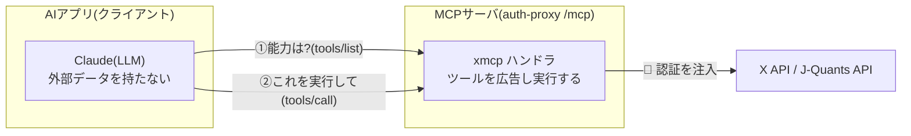
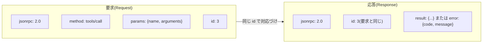
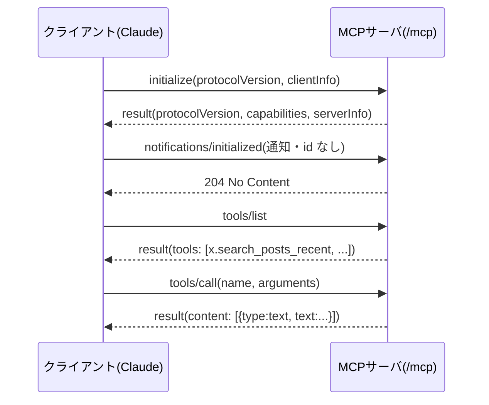
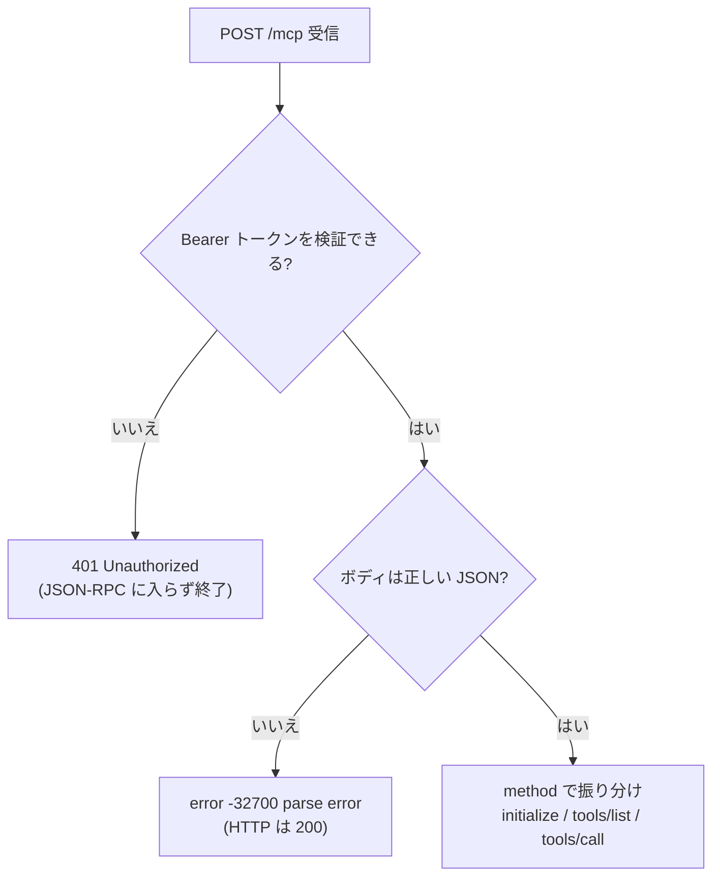
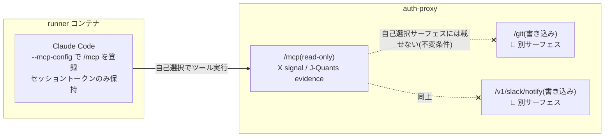
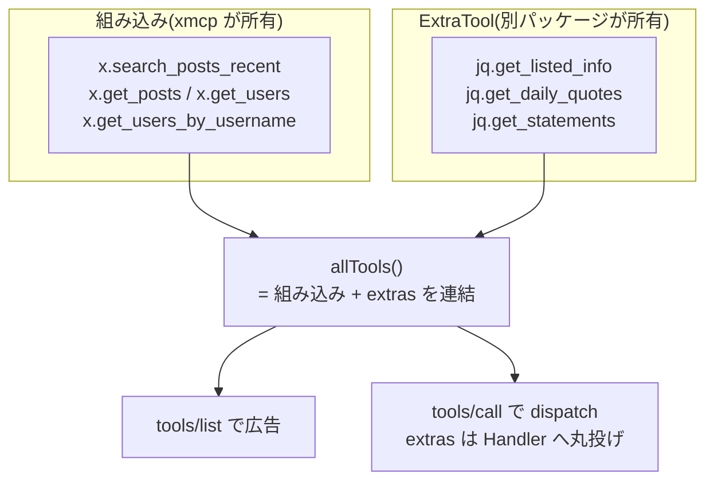
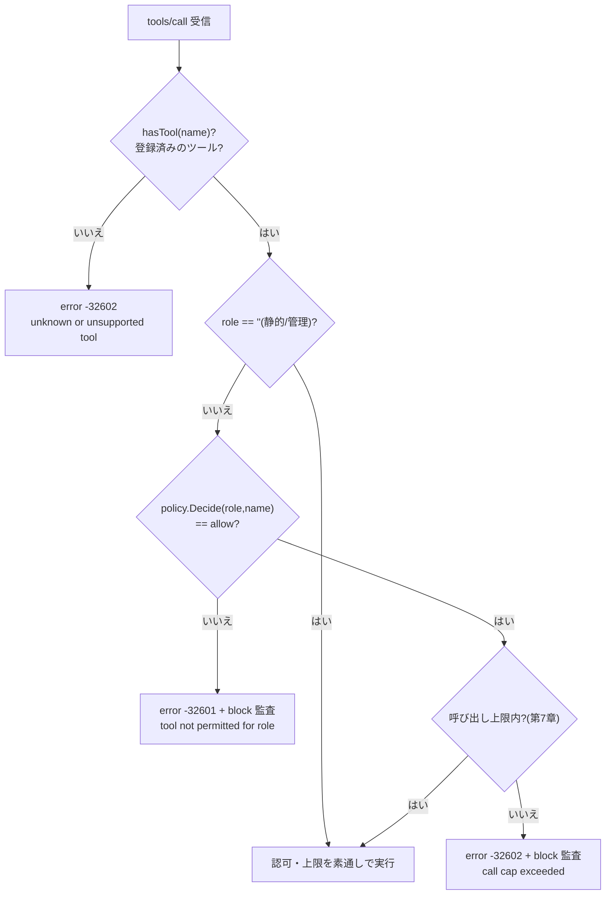
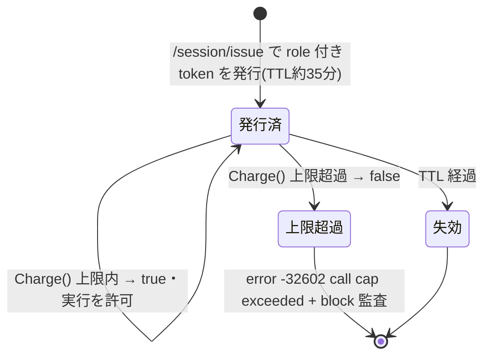
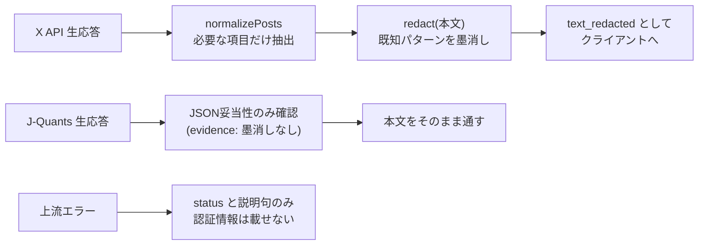
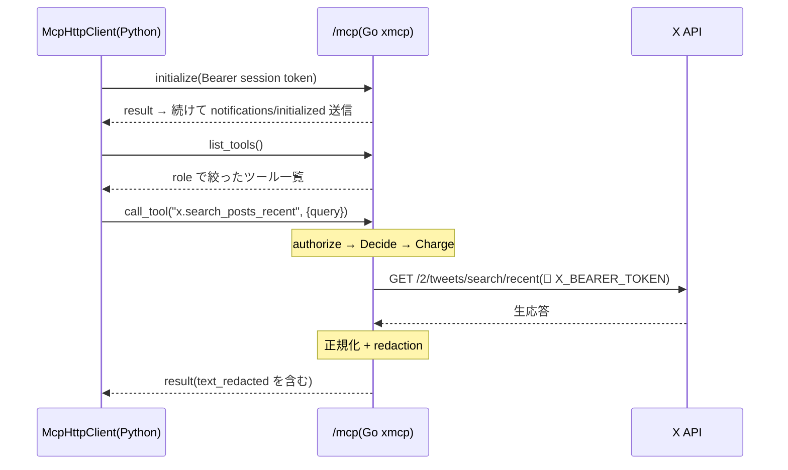

# MCP と JSON-RPC 入門 — auth-proxy の /mcp を教材に

本書は、7mimi-agent の境界サービス **auth-proxy** が備える `/mcp` エンドポイント（`internal/xmcp`）を題材に、MCP（Model Context Protocol）と、その土台である JSON-RPC 2.0 の仕組みを、前提知識のない読者に向けて解説するものである。「AIに外部の道具を与える」とはプロトコルとしてどういうことか、そしてその入り口をどう安全な境界にするのかを、実際のGoおよびPythonのソースコードを引用しながら、一つずつ確認していく。口語的な読み物ではなく、順を追って理解を積み上げる教科書として記述する。

## 目次

1. [MCPとは何か](#第1章-mcpとは何か)
2. [JSON-RPC 2.0 の最小知識](#第2章-json-rpc-20-の最小知識)
3. [3つのメソッド — initialize / tools/list / tools/call](#第3章-3つのメソッド--initialize--toolslist--toolscall)
4. [Streamable HTTP transport と Claude Code 直結](#第4章-streamable-http-transport-と-claude-code-直結)
5. [ツールの登録と拡張](#第5章-ツールの登録と拡張)
6. [認可 — ロールで能力を絞る](#第6章-認可--ロールで能力を絞る)
7. [コスト上限 — ハードな呼び出しキャップ](#第7章-コスト上限--ハードな呼び出しキャップ)
8. [応答の正規化・redaction・秘密の非漏洩](#第8章-応答の正規化redaction秘密の非漏洩)
9. [Python クライアントからの呼び出し](#第9章-python-クライアントからの呼び出し)
10. [むすび](#むすび)

---

## 第1章 MCPとは何か

### 1.1 AIに「外部の道具」を与える標準

大規模言語モデル（LLM）は、それ自身の内部知識だけで文章を生成する。しかし現実の仕事では、最新のX（旧Twitter）の投稿を検索したり、株価データを取り出したりと、モデルの外側にあるデータや機能へアクセスする必要がある。この「モデルの外側の能力」をモデルに接続するための取り決めが **MCP（Model Context Protocol）** である。

MCPは、AIアプリケーション（クライアント）と、道具を提供する側（サーバ）の間の会話のしかたを定める。サーバは自分が提供できる**ツール（tool）**の一覧を広告し、クライアントはその中から必要なものを選んで実行を依頼する。重要なのは、これが特定の製品に固有の仕組みではなく、**共通の規約**だという点である。同じ規約に従うサーバであれば、クライアントは中身の実装を知らずとも接続できる。

本書が教材とする `internal/xmcp` は、まさにこのMCPサーバの一実装である。ソース冒頭のコメントが役割を端的に述べている。

```go
// Package xmcp implements the x-mcp-readonly MCP protocol contract (ADR-015,
// ADR-023) as a Go handler inside auth-proxy. It exposes exactly four
// read-only tools for the X API (x.search_posts_recent, x.get_posts,
// x.get_users, x.get_users_by_username) over JSON-RPC 2.0 at POST /mcp.
package xmcp
```

すなわち、Xの読み取り専用ツールを4つ、**JSON-RPC 2.0** という形式で、`POST /mcp` というHTTPの入り口で提供するサーバである。次章以降、この一文に含まれる要素を順に解きほぐしていく。



*図1-1 MCPの立ち位置。サーバが「使える道具」を広告し、クライアントが選んで実行を依頼する。外部APIの認証情報はサーバ側だけが持つ。*

### 1.2 なぜ「境界」に置くのか

7mimi-agent では、このMCPサーバを認証情報を保持する境界サービス auth-proxy の内側に置いている。Xの認証情報（`X_BEARER_TOKEN`）はauth-proxyのプロセスだけが読み、AIが動くコンテナには一切渡さない。コメントもそれを明言している。

```go
// The X API credential (X_BEARER_TOKEN) is read from this process's
// environment only, per request, and is never forwarded to callers or
// logged. stdlib only, no third-party dependencies.
```

つまりMCPは、単に「AIに能力を与える」だけでなく、「その能力を安全な境界の内側でだけ実行させる」設計の要にもなっている。AIは「何をしたいか」を宣言し、境界サービスが「してよいか」「どう外部と繋ぐか」を決める。この構図は本書を貫くので、最初に頭に置いておいてほしい。

---

## 第2章 JSON-RPC 2.0 の最小知識

### 2.1 メソッド・パラメータ・ID

MCPの会話は **JSON-RPC 2.0** という汎用の手続き呼び出し形式に乗る。RPCは Remote Procedure Call（遠隔手続き呼び出し）の略で、「離れた相手の関数を呼ぶ」ことを意味する。JSON-RPCは、その呼び出しをJSONというデータ形式で表現する取り決めである。要求（リクエスト）は次の4つの要素で成り立つ。

- `jsonrpc`: 規約のバージョン。常に文字列 `"2.0"`。
- `method`: 呼びたい手続きの名前。例：`"tools/list"`。
- `params`: 手続きに渡す引数。無い場合もある。
- `id`: この要求を識別する番号や文字列。応答はこの `id` を返し、どの要求への返事かを対応づける。

xmcp が受け取る要求の型定義を見ると、この4要素がそのまま構造体になっている。

```go
type jsonrpcRequest struct {
	JSONRPC string          `json:"jsonrpc"`
	ID      any             `json:"id"`
	Method  string          `json:"method"`
	Params  json.RawMessage `json:"params"`
}
```

右側の `` `json:"..."` `` はタグと呼ばれ、JSONのキー名とGoのフィールドを対応づける。`Params` が `json.RawMessage`（生のJSONのまま保持）になっているのは、メソッドごとに引数の形が違うため、ここでは解釈せず後で必要な型に変換するためである。



*図2-1 JSON-RPC の要求と応答。id が両者を紐づけ、応答は result か error のどちらか一方を持つ。*

### 2.2 結果とエラー

応答は、成功なら `result`、失敗なら `error` を持つ。両方を同時に持つことはない。xmcp の応答型と、それを作る補助関数を見る。

```go
type jsonrpcResponse struct {
	JSONRPC string        `json:"jsonrpc"`
	ID      any           `json:"id"`
	Result  any           `json:"result,omitempty"`
	Error   *jsonrpcError `json:"error,omitempty"`
}

func errorResponse(id any, code int, message string) jsonrpcResponse {
	return jsonrpcResponse{JSONRPC: "2.0", ID: id, Error: &jsonrpcError{Code: code, Message: message}}
}
```

`omitempty` は「値が空なら出力しない」という指定である。成功時は `Error` が `nil` なので出力されず、失敗時は `Result` が出力されない。こうして「どちらか一方」が自然に表現される。

エラーには数値の**コード**が付く。JSON-RPC 2.0 は標準的なコードを定めており、xmcp はそのうち3つを使う。

```go
const (
	jsonrpcParseError    = -32700
	jsonrpcMethodMissing = -32601
	jsonrpcInvalidParams = -32602
)
```

| コード | 意味 | xmcp での用例 |
|---|---|---|
| `-32700` | Parse error（JSONとして壊れている） | ボディが空、またはJSONとして解釈できないとき |
| `-32601` | Method not found（未知のメソッド） | 未知メソッド、および「ロールに許可されないツール」 |
| `-32602` | Invalid params（引数が不正） | 未登録のツール名、呼び出し上限の超過 |

ここで一つ、7mimi-agent 独特の設計判断がある。エラーであってもHTTPのステータスは `200 OK` で返す。失敗はHTTP層ではなくJSON-RPC層の `error` フィールドで表す。壊れたJSONを受け取ったときの分岐がそれを示す。

```go
	var req jsonrpcRequest
	if len(body) == 0 || json.Unmarshal(body, &req) != nil {
		h.writeJSON(w, http.StatusOK, errorResponse(nil, jsonrpcParseError, "parse error"))
		return
	}
```

`json.Unmarshal` はJSONをGoの構造体へ変換する関数で、失敗すれば非 `nil` のエラーを返す。ボディが空か変換に失敗すれば、`id` を `nil` にした `-32700` を、しかしHTTPは `200` で返す。要求のどれがどう失敗したかは、あくまでJSON-RPCの語彙で伝えるのである。

---

## 第3章 3つのメソッド — initialize / tools/list / tools/call

MCPの中核は、たった3つのメソッドである。**握手（initialize）・能力の広告（tools/list）・実行（tools/call）**。xmcp の `handlePost` は、要求のメソッド名でこの3つ（と通知1つ）に振り分ける。

```go
	switch req.Method {
	case "initialize":
		// ... プロトコル情報を返す ...
	case "notifications/initialized":
		w.WriteHeader(http.StatusNoContent)
	case "tools/list":
		// ... ツール一覧を返す ...
	case "tools/call":
		h.handleToolsCall(w, req, role, token, start)
	default:
		// ... -32601 unknown method ...
	}
```

未知のメソッドは `default` に落ち、`-32601`（method not found）で返る。以下、3つを順に見る。

### 3.1 initialize — ハンドシェイク

接続の最初に、クライアントとサーバが互いの素性とバージョンを確認する。これがハンドシェイク（握手）である。xmcp の応答はこうである。

```go
	case "initialize":
		h.writeJSON(w, http.StatusOK, resultResponse(req.ID, map[string]any{
			"protocolVersion": protocolVersion,
			"capabilities":    map[string]any{"tools": map[string]any{}},
			"serverInfo":      map[string]any{"name": serverName, "version": serverVersion},
		}))
```

返すのは3つである。`protocolVersion`（このサーバが話すMCPの版、ここでは `"2025-03-26"`）、`capabilities`（能力の宣言。`tools` を持つことを示す）、`serverInfo`（サーバ名 `x-mcp-readonly` とバージョン）。クライアントはこれを見て、以降どう会話すればよいかを判断する。

握手の直後、クライアントは `notifications/initialized` という**通知**を送る。通知は `id` を持たず、応答を期待しない一方向のメッセージである。xmcp はこれに `204 No Content`（本文なし）だけを返す。

### 3.2 tools/list — 能力の広告

クライアントが「あなたは何ができるのか」を尋ねるのが `tools/list` である。サーバは提供するツールの一覧を、名前・説明・入力スキーマ付きで返す。ツール定義の型は次のとおりである。

```go
// Tool describes an MCP tool definition returned from tools/list.
type Tool struct {
	Name        string         `json:"name"`
	Description string         `json:"description"`
	InputSchema map[string]any `json:"inputSchema"`
}
```

`InputSchema` は、そのツールがどんな引数を取るかを JSON Schema という形式で記述したものである。たとえば `x.search_posts_recent` は文字列の `query`（必須）と、10〜100の整数 `max_results` を取る、と広告される。クライアント側のLLMはこのスキーマを読んで、正しい形の引数を組み立てる。`tools/list` の実体は、後述する `toolsForRole` が返すツール群をそのまま包むだけである。

### 3.3 tools/call — 実行

クライアントが実際に道具を使うのが `tools/call` である。`params` にツール名と引数を載せる。xmcp はそれを次の型で受け取る。

```go
type toolsCallParams struct {
	Name      string         `json:"name"`
	Arguments map[string]any `json:"arguments"`
}
```

この後、名前の存在確認・認可・上限確認を経て、実際にXのAPIを叩き、結果を `result` として返す。その詳細は第6章以降で扱う。まずは3つのメソッドが一連の会話として、どういう順で流れるかを見よう。



*図3-1 MCPの基本的な会話の流れ。握手 → 能力の確認 → 実行、という順序をとる。*

---

## 第4章 Streamable HTTP transport と Claude Code 直結

### 4.1 POST /mcp と Bearer 認証

JSON-RPCのメッセージは、何かの通信路（transport）に乗って運ばれる。MCPが標準として定める通信路の一つが **Streamable HTTP** であり、その実体は単純に「`/mcp` というパスへの `POST` リクエスト」である。xmcp のルート登録を見る。

```go
func (h *Handler) Routes() *http.ServeMux {
	mux := http.NewServeMux()
	mux.HandleFunc("POST /mcp", h.handlePost)
	mux.HandleFunc("/mcp", h.handleOther)
	return mux
}
```

`POST /mcp` が本体の処理へ、それ以外のメソッド（GETなど）は `handleOther` へ振り分けられ、`405 Method Not Allowed` を返す。JSON-RPCのやりとりはすべて `POST /mcp` の一点に集約されている。

この入り口は、他の境界（git中継）と同じく `Authorization: Bearer <token>` ヘッダで保護される。`handlePost` の冒頭が最初の関門である。

```go
	ok, role := h.authorizeToken(r)
	if !ok {
		http.Error(w, "unauthorized", http.StatusUnauthorized)
		return
	}
```

トークンを検証できなければ、JSON-RPCの土俵に上がる前に `401 Unauthorized` で弾く。これは fail-closed、すなわち「条件を満たさない要求は先へ進ませない」設計である。`authorizeToken` が返す `role` の意味は、第6章で詳しく扱う。



*図4-1 Streamable HTTP の入り口。まずBearer認証、次にJSONの妥当性、それからJSON-RPCのメソッド振り分けへ進む。*

### 4.2 Claude Code の --mcp-config 直結（ADR-028）

この `/mcp` は、runner コンテナの中で動く Claude Code が直接叩く。ADR-028 が定めた設計である。従来はオーケストレータが事前にXの投稿を収集してファイルに投入していたが、これを廃し、Claude Code 自身が `--mcp-config` でMCPサーバを登録し、必要なときに `tools/call` でX信号を取りに行く方式へ移行した。ADR-028 の決定を引く。

```text
Decision: ai-it-x-daily-digest の X シグナル収集を、orchestrator の
事前収集から、runner 内 Claude Code が auth-proxy の /mcp を Streamable
HTTP MCP(--mcp-config、Authorization: Bearer <session token>)で直接
叩く方式へ移行する。
```

ここで重要なのは、AIが「自分で使う道具を選ぶ」（自己選択）ことを許しながら、なお安全である理由である。ADR-028 は、`/mcp` に載せるのは**読み取り専用**の evidence/signal ツールだけで、書き込みを伴う境界（git中継、Slack通知）はこの自己選択サーフェスに**絶対に載せない**、という不変条件を置いている。AIが自由に選べるのは「読むこと」だけであり、「書くこと」は別の、認証情報が分離された境界に留まる。だからこそ直結を許せる。



*図4-2 Claude Code 直結。AIが自由に選べるのは read-only の /mcp だけで、書き込み境界は別サーフェスに隔離される。*

---

## 第5章 ツールの登録と拡張

### 5.1 組み込みの X 読み取り4種

xmcp が最初から備えるのは、Xの読み取り専用ツール4つである。パッケージ変数 `tools` に定義されており、名前だけ挙げると次のとおりである。

- `x.search_posts_recent` — 最近の投稿を検索する。
- `x.get_posts` — ID を指定して投稿を取得する。
- `x.get_users` — ID を指定してユーザを取得する。
- `x.get_users_by_username` — ユーザ名を指定してユーザを取得する。

いずれも「取得・検索」だけで、投稿・削除といった書き込み系は存在しない。読み取り専用（read-only）という性質は、ここで名前の集合そのものによって担保されている。

### 5.2 ExtraTool による差し込み（ADR-027）

xmcp は、Xツールだけに閉じていない。**他の認証情報の保有者**が、同じ `/mcp` エンドポイントに自分のツールを追加できる仕組みを持つ。それが `ExtraTool` である。

```go
// ExtraTool pairs a tool definition with its handler, allowing other
// credential holders (e.g. J-Quants, ADR-027) to register additional tools
// on the same /mcp endpoint without xmcp owning their credentials or HTTP
// logic.
type ExtraTool struct {
	Tool    Tool
	Handler ToolHandler
}
```

`ExtraTool` は「ツール定義（`Tool`）」と「それを実行する関数（`Handler`）」の組である。xmcp は追加ツールの**認証情報もHTTP処理も一切知らず**、ただ定義を広告し、呼ばれたらハンドラに丸投げする。この分離により、J-Quants（日本株データ）の3ツールを、xmcp本体に手を入れずに差し込める。ADR-027 が定めた統合である。

J-Quants 側（`jqmcp`）は、自分のツールを `ExtraTool` の並びとして返すだけでよい。

```go
func Tools(tokens *jquants.TokenSource) []xmcp.ExtraTool {
	return []xmcp.ExtraTool{
		{
			Tool: xmcp.Tool{
				Name:        "jq.get_listed_info",
				Description: "Get J-Quants listed company info ... (read-only, structured evidence).",
				// ... InputSchema ...
			},
			Handler: handleListedInfo(tokens),
		},
		// jq.get_daily_quotes, jq.get_statements も同様に続く
	}
}
```

登録の実際は、Handler 構築時に `extras` を受け取り、定義とハンドラをそれぞれ蓄える。

```go
	for _, extra := range extras {
		h.extraTools = append(h.extraTools, extra.Tool)
		h.extraHandlers[extra.Tool.Name] = extra.Handler
	}
```

`tools/list` が返す一覧は、組み込みXツールとこれらの extras を単純に連結したものになる（`allTools`）。`tools/call` の実行時は、名前が extras にあればそのハンドラを、なければ組み込みXツールの処理を呼ぶ（`callTool` 冒頭の `if handler, ok := h.extraHandlers[name]; ok`）。追加ツールは、あたかも最初からそこにあったかのように振る舞う。



*図5-1 ツールの登録。xmcp は自分のXツールと、他者が差し込む ExtraTool を等しく扱う。認証情報とHTTP処理はそれぞれの所有者に留まる。*

---

## 第6章 認可 — ロールで能力を絞る

### 6.1 静的トークンとセッショントークン

第4章で触れた `authorizeToken` は、単に「通す/通さない」を決めるだけでなく、**誰として**通すのかを返す。二種類のトークンを区別するのがその要点である。

```go
func (h *Handler) authorizeToken(r *http.Request) (ok bool, role string) {
	// ... "Bearer " 接頭辞を外して token を取り出す ...
	if subtle.ConstantTimeCompare([]byte(token), []byte(h.sessionToken)) == 1 {
		return true, ""
	}
	if h.store != nil {
		if resolvedRole, found := h.store.Resolve(token); found {
			return true, resolvedRole
		}
	}
	return false, ""
}
```

- **静的な管理トークン**（`h.sessionToken`）に一致すれば、`role` を空文字列 `""` として通す。これは「役割の縛りなし、全ツールに全アクセス」の管理者的な経路で、従来からの後方互換の挙動である。比較には `subtle.ConstantTimeCompare`（定数時間比較）を使い、一致判定にかかる時間から秘密を推測されるタイミング攻撃を防ぐ。
- 一致しなければ、**セッションストア**（第7章）にトークンを問い合わせる。見つかれば、そのトークンに**紐付いたロール**を返す。オーケストレータが `POST /session/issue` で発行した、役割に縛られた短命トークンがこれである。
- どちらでもなければ、認可失敗である。

以降、`role == ""` なら管理経路、そうでなければ「ロールに縛られた経路」として扱われる。この分岐が認可の骨格である。

### 6.2 tools/list をロールで絞る

ロールに縛られたトークンには、そもそも**使えないツールを見せない**。`tools/list` が返す一覧を、ロールで濾過するのである。

```go
func (h *Handler) toolsForRole(role string) []Tool {
	all := h.allTools()
	if role == "" {
		return all // 静的/管理トークン: 全一覧
	}
	if h.policyEngine == nil {
		return nil // fail closed: エンジンが無ければ何も見せない
	}
	filtered := make([]Tool, 0, len(all))
	for _, t := range all {
		if h.policyEngine.Decide(role, t.Name).Decision == "allow" {
			filtered = append(filtered, t)
		}
	}
	return filtered
}
```

`policyEngine.Decide(role, ツール名)` が「このロールはこのツールを使ってよいか」を決定的に（AIの判断ではなく確定したコードで）判定する。`allow` のものだけが一覧に残る。ロールに紐付いたトークンでありながら判定エンジンが配線されていなければ、`nil`（何も見せない）を返す。これも fail-closed の徹底で、「設定漏れは全開放ではなく全閉鎖に倒す」。

### 6.3 tools/call を policy.Decide で判定する

一覧から隠すだけでは不十分である。クライアントが名前を直接指定して `tools/call` を呼ぶ可能性があるため、実行時にも同じ判定を行う。`handleToolsCall` の認可部分を見る。

```go
	if role != "" {
		if h.policyEngine == nil {
			h.auditBlock(role, params.Name, "no policy engine for role-bound token")
			h.writeJSON(w, http.StatusOK, errorResponse(req.ID, jsonrpcMethodMissing, "tool not permitted for role"))
			return
		}
		decision := h.policyEngine.Decide(role, params.Name)
		if decision.Decision != "allow" {
			h.auditBlock(role, params.Name, "tool not permitted for role: "+decision.Reason)
			h.writeJSON(w, http.StatusOK, errorResponse(req.ID, jsonrpcMethodMissing, "tool not permitted for role"))
			return
		}
		// ... この後、呼び出し上限の確認へ(第7章)...
	}
```

ロール付きトークンの場合、`Decide` が `allow` を返さない限り、`-32601`（method not found）で拒否し、同時に監査ログへ `block` として記録する。許可されないツールを、あたかも「存在しないメソッド」であるかのように扱う点に注意したい。ロールから見れば、許可されないツールは端から存在しないのと同じなのである。

なお、この `Decide` に到達するのは、**この Handler に登録済みだが当該ロールには許可されない**ツール名に限られる（例：`ai_it_topic_runner` にとっての `jq.*`）。そもそも一度も登録されていない名前（たとえば `x-mcp-readonly` が決して持たない `x.create_post`）は、手前の `hasTool` 検査で `-32602` として弾かれ、`Decide` には届かない。



*図6-1 tools/call の認可フロー。存在確認 → ロール判定 → 上限確認、の三段を通って初めて実行に至る。*

---

## 第7章 コスト上限 — ハードな呼び出しキャップ

認可を通過したツールでも、無制限には呼べない。X API や J-Quants API の呼び出しはコストと速度制限を伴うため、ADR-028 は**セッション単位のハードな呼び出し上限**を決定的なバックストップとして置いた。プロンプトでAIに「検索は控えめに」と頼むことも併用するが、それはあくまで補助であり、最後の砦はコードで強制する。第6章末尾に続く上限確認がそれである。

```go
		if h.store != nil && !h.store.Charge(token) {
			h.auditBlock(role, params.Name, "call cap exceeded")
			h.writeJSON(w, http.StatusOK, errorResponse(req.ID, jsonrpcInvalidParams, "call cap exceeded"))
			return
		}
```

`store.Charge(token)` は、そのセッショントークンの使用回数を1つ増やし、**上限内なら `true`、超過なら `false`** を返す。超過すれば `-32602`（invalid params）で拒否し、`block` として監査する。上限値は環境変数 `AUTH_PROXY_MCP_CALL_CAP` で与えられる。

この上限はセッション（短命トークン1つ）に紐づく。トークン自体がTTL（有効期間、既定35分）で失効するため、「短命かつ回数制限つき」という二重の枠がかかる。仮にAIが暴走的にツールを呼び続けても、あるいはトークンが漏れても、被害はこの二つの枠の内側に閉じる。管理経路（`role == ""`）はこの上限を素通りする点にも注意したい。上限は「AIに委ねた自己選択の経路」にのみ課される安全弁である。



*図7-1 呼び出し上限とTTL。セッションは回数と時間の二重の枠で囲まれ、超過も失効も安全側に倒れる。*

---

## 第8章 応答の正規化・redaction・秘密の非漏洩

### 8.1 X API 応答の正規化

ツールが実際にXのAPIを叩いて得る生の応答は、そのままではAIに渡すのに冗長で扱いにくい。xmcp は必要な項目だけを抜き出し、決まった形に整える**正規化（normalization）**を施す。投稿の正規化 `normalizePosts` の核心を見る。

```go
		posts = append(posts, map[string]any{
			"id":            postID,
			"url":           postURL(postID, username),
			"author_handle": username,
			"created_at":    createdAt,
			"text_redacted": redact(text),
			"urls":          extractURLs(entities),
			"topics":        []string{},
			// ... engagement(like/repost/reply/quote), collected_at ...
		})
```

投稿ID、投稿URL、著者ハンドル、作成日時、本文、含まれるリンク、エンゲージメント数（いいね・リポスト等）といった、後段の分析に必要な項目だけを、一定のキー名で並べる。生応答の枝葉は落とされる。フィールド名が `text` ではなく **`text_redacted`** である点に、次に述べる処理の意図が現れている。

### 8.2 redaction — 秘密の墨消し

Xの投稿本文には、うっかりAPIキーや秘密鍵の類が書かれていることがあり得る。それをそのままAIや下流に流さないよう、`redact` が既知のパターンを墨消しする。パターンは `config/policy.yaml` の定義をGoへ移植したものである。

```go
func redact(text string) string {
	redacted := text
	for _, p := range defaultRedactionPatterns {
		redacted = p.regex.ReplaceAllString(redacted, "[REDACTED:"+p.name+"]")
	}
	return redacted
}
```

対象パターンは、`api_key=` 等の環境変数代入、`-----BEGIN ... PRIVATE KEY-----`、`Bearer` トークン、`sk-ant-` で始まる Anthropic キー、`cp_sess_` で始まる claude-proxy のセッショントークンである。該当箇所は `[REDACTED:名前]` に置き換わる。X由来のテキストは「未確認の信号（signal）」であり、こうした墨消しを課す。

対照的に、J-Quants の応答は**構造化された証拠（evidence）**であり、redaction を課さずそのまま通す（ADR-027）。`jqmcp` はJSONとして妥当かだけを確認して素通しする。「Xは信号、J-Quantsは証拠」という設計原則が、ツール層のこの差に現れている。

### 8.3 エラーに秘密を載せない

失敗したときのメッセージにも認証情報を混ぜないよう、上流のエラーは慎重に加工される。X API が失敗した場合、xmcp は応答本文から `title` や `detail` といった**説明用のフィールドだけ**を取り出してエラー文言に使う。J-Quants 側はさらに厳格で、ステータスコードしか外に出さない。

```go
	if resp.StatusCode >= 300 {
		return xmcp.NewErrorResult(fmt.Sprintf("jquants API error (status=%d)", resp.StatusCode), resp.StatusCode)
	}
```

関数コメントが明言するとおり、「エラーは idToken やリフレッシュトークンを決して含まず、上流のHTTPステータスだけを表に出す」。成功・失敗のいずれの経路でも、秘密がクライアント側やログに漏れない設計になっている。



*図8-1 応答の加工。X由来は正規化+墨消し、J-Quantsは妥当性確認のみ、エラーは秘密を除いた最小情報のみ。*

---

## 第9章 Python クライアントからの呼び出し

ここまでサーバ側を読んできた。最後に、この `/mcp` を叩く側 — Python の `McpHttpClient`（`src/shichimimi_agent/mcp/client.py`）を見る。クライアントの実装を読むと、第3章で学んだ3メソッドが、そのまま3つのPythonメソッドに対応していることがわかる。まずクライアントの土台である。

```python
@dataclass
class McpHttpClient:
    base_url: str
    timeout_seconds: float = 20.0
    session_token: str | None = None

    def _endpoint(self) -> str:
        return f"{self.base_url.rstrip('/')}/mcp"
```

接続先URLは、ベースURLの末尾に `/mcp` を足すだけである。第4章で見たサーバ側のパスと正確に対応している。要求の送信部分 `_post` は、セッショントークンがあれば `Authorization: Bearer` ヘッダとして付ける。

```python
        headers = {"Content-Type": "application/json"}
        if self.session_token:
            headers["Authorization"] = f"Bearer {self.session_token}"
        request = urllib.request.Request(
            self._endpoint(),
            data=json.dumps(message).encode("utf-8"),
            method="POST",
            headers=headers,
        )
```

これは第4章のBearer認証の、クライアント側の対応物である。サーバの `authorizeToken` がこのヘッダを読んでロールを解決する。標準ライブラリ（`urllib`）だけで書かれ、外部依存を持たない点も、Go側と揃った設計思想である。

そして3つのメソッド呼び出し。握手 `initialize` は、応答を受けた後に `notifications/initialized` 通知を送るところまで面倒を見る。

```python
    def initialize(self) -> dict[str, Any]:
        response = self._post({"jsonrpc": "2.0", "id": self._next_id(),
            "method": "initialize", "params": {"protocolVersion": "2025-03-26", ...}})
        if response is None or "error" in response:
            raise McpClientError(f"initialize failed: {response}")
        self._post({"jsonrpc": "2.0", "method": "notifications/initialized"})
        return response["result"]
```

クライアントの `protocolVersion`（`"2025-03-26"`）が、サーバの `protocolVersion` と一致していることに注目してほしい。握手が成立する前提である。残る2つ、`list_tools` と `call_tool` も同じ骨格である。

```python
    def call_tool(self, name: str, arguments: dict[str, Any]) -> dict[str, Any]:
        response = self._post({"jsonrpc": "2.0", "id": self._next_id(),
            "method": "tools/call", "params": {"name": name, "arguments": arguments}})
        if response is None or "error" in response:
            raise McpClientError(f"tools/call failed: {response}")
        return response["result"]
```

要求の `params` が、サーバ側の `toolsCallParams`（`name` と `arguments`）と正確に噛み合っている。応答に `error` があれば例外を投げ、無ければ `result` を返す — これは第2章で見た「result か error のどちらか一方」というJSON-RPCの原則を、クライアント側から確認する形になっている。`id` は `_next_id` で1ずつ増やして採番する。



*図9-1 Python クライアントからサーバ、外部APIまでの一連。クライアントは3メソッドを呼ぶだけで、認可・上限・墨消し・認証注入はすべてサーバ側で完結する。*

---

## むすび

本書は、`/mcp` という一つのエンドポイントを通して、MCP と JSON-RPC 2.0 の全体像を追ってきた。JSON-RPCは `method`・`params`・`id` と、`result` か `error` という単純な語彙で会話を組み立て、MCPはその上に `initialize`・`tools/list`・`tools/call` の3メソッドで「握手 → 能力の広告 → 実行」という型を与えていた。Streamable HTTP は、これを `POST /mcp` という平易なHTTPに乗せるだけの通信路であった。

そして、その平易な入り口の内側に、7mimi-agent は幾重もの境界を敷いていた。Bearer認証、ロールによる `tools/list` の濾過と `tools/call` の `policy.Decide` 判定、セッション単位のハードな呼び出し上限、応答の正規化と redaction、そして秘密を載せないエラー。これらはいずれも、非決定的なAIの判断ではなく、確定したGoのコードが決めている。

MCPの本質は、「AIが使える能力をプロトコルとして**宣言**し、その能力を**境界で認可する**」ことにある。AIには「何をしたいか」を自由に選ばせ、「してよいか」「どう外部と繋ぐか」は境界サービスが決める。読み取り専用に限った自己選択サーフェスと、認証情報を分離した書き込み境界の分離が、その自由と安全を両立させていた。`/mcp` という小さなエンドポイントは、この設計思想が凝縮した、格好の教材だったのである。
