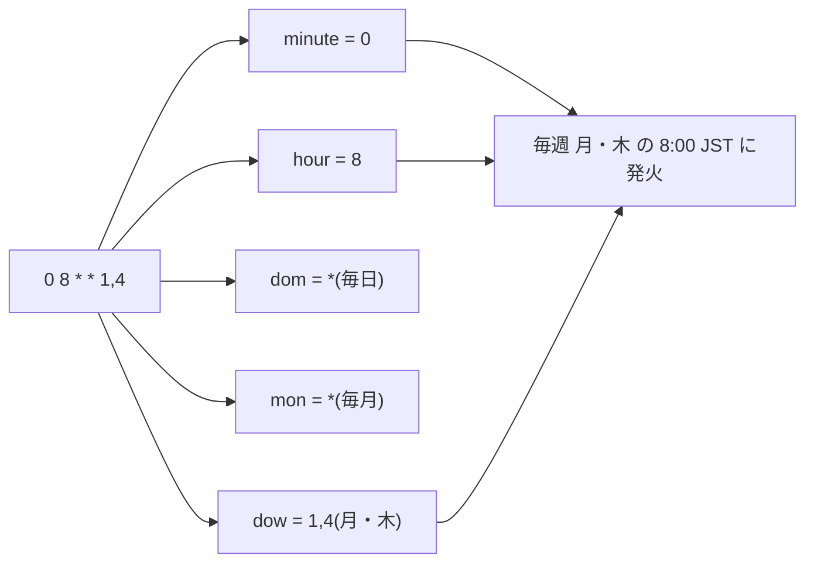
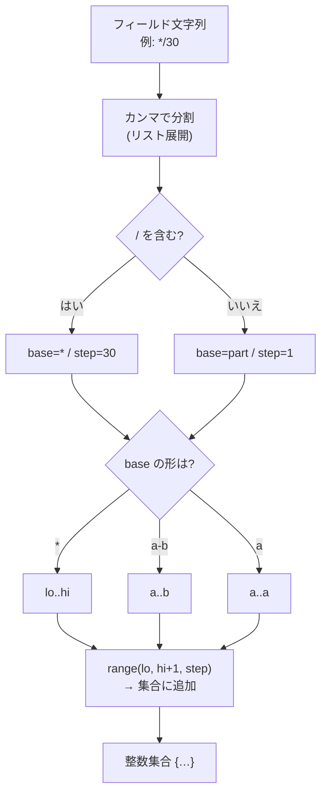
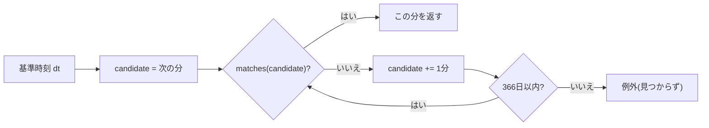
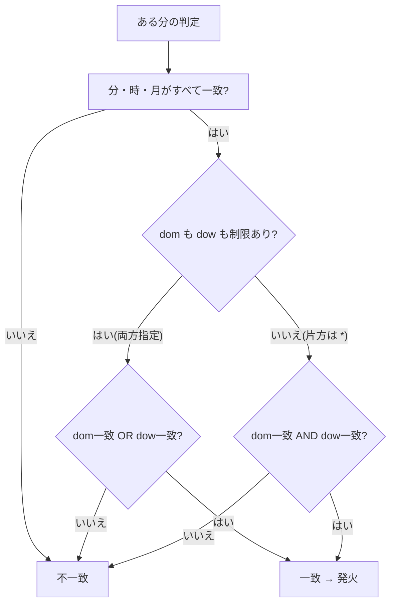
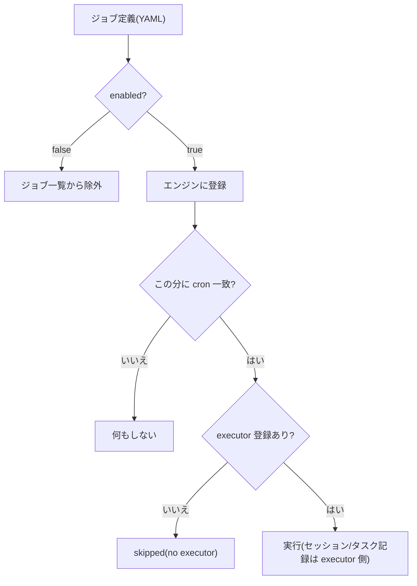
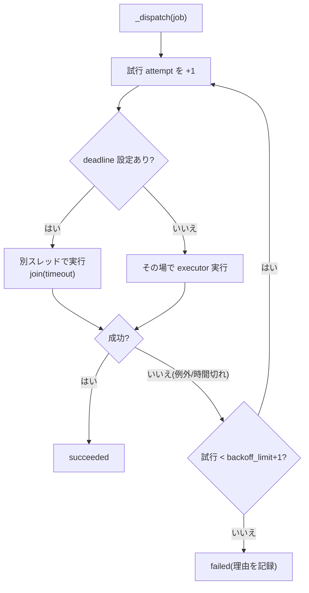
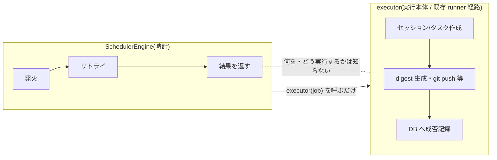
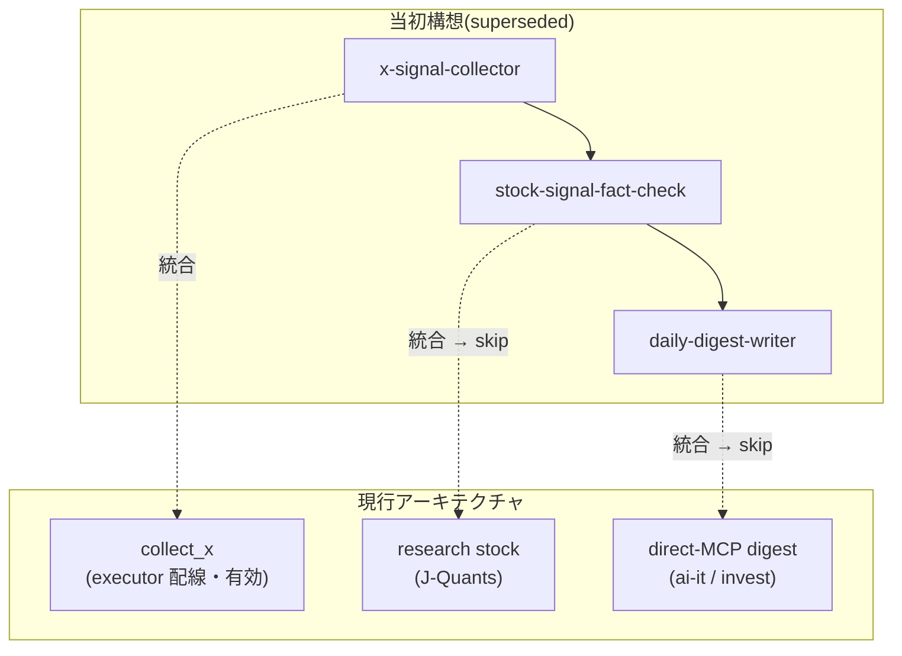

# scheduler と cron を読む — 自律実行の時計

本書は、7mimi-agent の定時実行を担う **scheduler** と、その心臓部である **cron 式パーサ** を題材に、これらがどのような仕組みで「決まった時刻に決まった仕事を起動する」のかを、予備知識のない読者に向けて解説するものである。実際の Python ソースコードを引用しながら、一行ずつ意味を確認していく形式をとる。口語的な読み物ではなく、順を追って理解を積み上げる教科書として記述する。主題は一貫して一つである。**決定的な時計が、非決定的な AI を定時に起動する**。

## 目次

1. [cron 式とは何か](#第1章-cron-式とは何か)
2. [cron パーサ — 記法を集合に変える](#第2章-cron-パーサ--記法を集合に変える)
3. [dom と dow の OR セマンティクス](#第3章-dom-と-dow-の-or-セマンティクス)
4. [エンジン — 毎分の常駐ループ](#第4章-エンジン--毎分の常駐ループ)
5. [executor の登録 — 実行できるジョブだけを実行する](#第5章-executor-の登録--実行できるジョブだけを実行する)
6. [耐障害性 — 一つの失敗で時計を止めない](#第6章-耐障害性--一つの失敗で時計を止めない)
7. [責務の限定(ADR-022)](#第7章-責務の限定adr-022)
8. [Phase 3 ジョブの整理(ADR-029)](#第8章-phase-3-ジョブの整理adr-029)
9. [むすび](#むすび)

---

## 第1章 cron 式とは何か

### 1.1 5つのフィールド

cron(クロン)式とは、「いつ実行するか」を5つの数字の欄(フィールド)で表す記法である。Unix 系 OS で数十年使われてきた、定時実行の事実上の標準記法である。空白で区切られた5つのフィールドは、左から順に次の意味を持つ。

```
# ┌──────── minute (0-59)  分
# │ ┌────── hour   (0-23)  時
# │ │ ┌──── dom    (1-31)  日(day of month)
# │ │ │ ┌── mon    (1-12)  月
# │ │ │ │ ┌ dow    (0-7)   曜日(day of week、0と7が日曜)
# │ │ │ │ │
#  0 8 * * 1,4
```

末尾の `0 8 * * 1,4` は「分=0、時=8、日=任意、月=任意、曜日=月または木」を意味し、すなわち**毎週月曜と木曜の 8:00** に一致する。7mimi-agent では時刻はすべて Asia/Tokyo(日本時間)として解釈する。



*図1-1 5フィールドの分解。各欄が独立に条件を表し、すべてを満たした分に発火する。*

### 1.2 実際のジョブ定義

7mimi-agent のジョブは `config/schedules.yaml` に定義される。実際に使われている cron 式を表に示す。記法の詳細は次章で扱うが、まずは「どんな時刻表現が現れるか」を眺めておく。

| ジョブ名 | cron 式 | 意味 |
| --- | --- | --- |
| `x-signal-collector` | `*/30 8-23 * * *` | 毎日 8時〜23時台、30分ごと |
| `stock-signal-fact-check` | `0 16 * * 1-5` | 平日(月〜金)の 16:00 |
| `daily-digest-writer` | `30 17 * * 1-5` | 平日の 17:30 |
| `weekly-research-review` | `0 10 * * 6` | 毎週土曜の 10:00 |
| `ai-it-x-daily-digest` | `0 8 * * 1,4` | 月・木の 8:00 |
| `invest-x-daily-digest` | `0 18 * * *` | 毎日 18:00 |

この表には、次章で解説する4つの記法 — 単一値(`0`)、ワイルドカード(`*`)、リスト(`1,4`)、範囲(`8-23`、`1-5`)、刻み(`*/30`)— がすべて登場している。cron 式を読めるとは、これらを正しく展開できることに他ならない。

---

## 第2章 cron パーサ — 記法を集合に変える

cron 式は文字列である。プログラムがこれを使うには、「この分は一致するか?」という問いに答えられる形へ変換しなければならない。7mimi-agent の `scheduler/cron.py` は、各フィールドを**整数の集合(set)**に展開することでこれを実現する。たとえば `8-23` は `{8, 9, 10, …, 23}` という集合になり、「今の時刻がこの集合に含まれるか」を調べれば一致判定ができる。

### 2.1 4つの記法

各フィールドが取りうる記法は4種類、そしてそれらの組み合わせである。

| 記法 | 読み方 | 例 | 展開後の集合 |
| --- | --- | --- | --- |
| `*` | その欄の全範囲 | hour の `*` | `{0..23}` |
| `a` | 単一の値 | `8` | `{8}` |
| `a,b` | リスト(複数指定) | `1,4` | `{1, 4}` |
| `a-b` | 範囲 | `8-23` | `{8..23}` |
| `*/n` | 刻み(n おき) | `*/30`(分) | `{0, 30}` |

### 2.2 一つのフィールドを集合に展開する

この展開を担うのが `_parse_field` 関数である。フィールド文字列 `expr` と、その欄が取りうる下限 `lo`・上限 `hi` を受け取り、整数集合を返す。まず、リスト(カンマ区切り)を分解し、各要素について刻み `/n` を切り出す部分を見る。

```python
def _parse_field(expr: str, lo: int, hi: int) -> set[int]:
    values: set[int] = set()
    for part in expr.split(","):
        part = part.strip()
        if not part:
            raise ValueError(f"invalid cron field: {expr!r}")
        step = 1
        if "/" in part:
            base, step_str = part.split("/", 1)
            step = int(step_str)
        else:
            base = part
```

`expr.split(",")` でリストを要素ごとに分ける。各要素 `part` に `/` があれば、その前を `base`(基礎部分)、後ろを `step`(刻み幅)として切り出す。`/` がなければ刻みは `1`、すなわち「その範囲を1おき=すべて」である。

次に、`base` の部分を解釈して、範囲の下限 `range_lo` と上限 `range_hi` を決める。

```python
        if base == "*":
            range_lo, range_hi = lo, hi
        elif "-" in base:
            lo_str, hi_str = base.split("-", 1)
            range_lo, range_hi = int(lo_str), int(hi_str)
        else:
            range_lo = range_hi = int(base)

        if range_lo > range_hi or range_lo < lo or range_hi > hi:
            raise ValueError(f"cron field out of range: {expr!r}")

        for value in range(range_lo, range_hi + 1, step):
            values.add(value)
```

3通りに分岐する。`*` ならフィールドの全範囲 `lo..hi`、`a-b` なら `a..b`、単一値 `a` なら下限も上限も `a` とする。続く検査で、範囲が逆転していないか、欄の許容範囲を超えていないかを確かめ、外れていれば例外を投げる(fail-closed、不正な式は起動時に弾く)。最後に `range(range_lo, range_hi + 1, step)` で、下限から上限まで `step` おきの値を集合に足す。`*/30` なら `range(0, 60, 30)` となり `{0, 30}` が得られる。



*図2-1 _parse_field の展開手順。リスト → 刻み → 基礎部分の順に分解し、最終的に整数集合を得る。*

### 2.3 5フィールドをまとめる — CronSchedule

各フィールドを集合にできたら、5つをまとめて一つのオブジェクトにする。それが `CronSchedule` データクラスの `parse` である。

```python
    @classmethod
    def parse(cls, expr: str) -> "CronSchedule":
        fields = expr.split()
        if len(fields) != 5:
            raise ValueError(f"cron expression must have 5 fields: {expr!r}")
        minute_s, hour_s, dom_s, mon_s, dow_s = fields

        minute = _parse_field(minute_s, *_FIELD_RANGES["minute"])
        hour = _parse_field(hour_s, *_FIELD_RANGES["hour"])
        dom = _parse_field(dom_s, *_FIELD_RANGES["dom"])
        mon = _parse_field(mon_s, *_FIELD_RANGES["mon"])
        dow_raw = _parse_field(dow_s, *_FIELD_RANGES["dow"])
        # normalize 7 -> 0 (Sunday)
        dow = {0 if v == 7 else v for v in dow_raw}
```

空白で5つに割り、ちょうど5個でなければ拒否する(fail-closed)。各欄を `_parse_field` で集合に変える。`_FIELD_RANGES` は欄ごとの下限・上限の対応表で、`minute` は `(0, 59)`、`hour` は `(0, 23)` といった具合である。末尾の一行に注目したい。曜日(dow)では慣習上 `0` と `7` がともに日曜を表す。そこで `7` を `0` に正規化し、以降は日曜を `0` に統一して扱う。

parse の戻り値には集合そのものに加え、`dom_restricted` と `dow_restricted` という真偽値も含まれる。これは「日/曜日の欄が `*` でなく具体的に絞られているか」を表し、第3章で決定的な役割を果たす。

### 2.4 一致判定と次回発火 — matches と next_after

集合さえできれば、ある時刻が一致するかの判定は簡単な包含チェックになる。`matches` の前半を見る。

```python
    def matches(self, dt: datetime) -> bool:
        if dt.minute not in self.minute:
            return False
        if dt.hour not in self.hour:
            return False
        if dt.month not in self.mon:
            return False
```

分・時・月について、実際の時刻の値がそれぞれの集合に含まれるかを確かめる。一つでも外れれば即座に `False` を返す。日と曜日の判定だけは特殊で、これは第3章で扱う。

「次にいつ発火するか」を求めるのが `next_after` である。凝った逆算はせず、素朴に「次の分から1分ずつ試す」方式をとる。

```python
    def next_after(self, dt: datetime) -> datetime:
        candidate = (dt + timedelta(minutes=1)).replace(second=0, microsecond=0)
        limit = dt + timedelta(days=366)
        while candidate <= limit:
            if self.matches(candidate):
                return candidate
            candidate += timedelta(minutes=1)
        raise ValueError(f"no matching time found within search cap for cron: {self.expr!r}")
```

与えられた時刻の次の分を起点に、`matches` が真になる分が見つかるまで1分ずつ進める。上限は366日先で、そこまで見つからなければ例外を返す(通常の cron 式なら必ずその手前で見つかる)。分解能が「分」であるため、この線形探索でも最大でも数十万回で答えに至り、実用上まったく問題がない。素朴だが確実な設計である。



*図2-2 next_after の線形探索。分単位で1分ずつ前進し、最初に一致した分を次回発火時刻とする。*

---

## 第3章 dom と dow の OR セマンティクス

標準 cron には、初学者を必ず一度は戸惑わせる「癖」がある。日(dom)と曜日(dow)の両方を指定したときの意味である。直感的には「両方を満たす日(AND)」と思いたくなるが、標準 cron の定義は逆で、**どちらか一方でも満たせば一致(OR)**である。

### 3.1 なぜ OR なのか

例として `0 0 1 * 1`(分=0、時=0、日=1、曜日=月)を考える。これは「毎月1日の 0:00」と「毎週月曜の 0:00」の**両方**に一致する。「1日かつ月曜」という稀な日だけ、ではない。これは「毎月1日に、加えて毎週月曜にも実行したい」という現実の要求に沿った設計である。ただし、片方が `*`(無制限)のときは話が別で、その場合は素直に AND として扱う。整理すると次の通りである。

| dom | dow | 判定 |
| --- | --- | --- |
| 制限あり | 制限あり | **OR**(どちらか一致で発火) |
| 制限あり | `*` | AND(実質 dom のみで決まる) |
| `*` | 制限あり | AND(実質 dow のみで決まる) |
| `*` | `*` | AND(毎日一致) |

### 3.2 コードでの実装

この規則を実装しているのが `matches` の後半である。第2.3節で触れた `dom_restricted` / `dow_restricted` がここで効く。

```python
        dom_match = dt.day in self.dom
        dow_match = (dt.isoweekday() % 7) in self.dow  # Mon=1..Sun=7 -> Sun=0

        if self.dom_restricted and self.dow_restricted:
            return dom_match or dow_match
        return dom_match and dow_match
```

まず日の一致 `dom_match` と曜日の一致 `dow_match` を個別に求める。曜日は `dt.isoweekday() % 7` で変換している。Python の `isoweekday()` は月曜=1〜日曜=7 を返すため、7で割った余りをとると日曜=0、月曜=1…土曜=6 となり、cron の慣習(日曜=0)に一致する。そして判定の分岐である。**両欄とも制限されているときだけ OR**、それ以外は AND。この4行が、標準 cron の癖を忠実に再現している。



*図3-1 dom / dow の判定分岐。両方が制限されているときのみ OR、片方が * なら AND に切り替わる。*

---

## 第4章 エンジン — 毎分の常駐ループ

cron 式を集合に変えるパーサができた。次は、それを使って「今この分に一致するジョブを実際に起動する」常駐プログラムである。`scheduler/engine.py` の `SchedulerEngine` がそれを担う。設計方針(ADR-022)は明快で、**単一プロセス・単一スレッド・逐次実行**である。並列も分散もしない。ジョブ数が少なく実行間隔も分オーダーであるため、これで十分である。

### 4.1 毎分、分境界で目覚める

エンジンの本体は `run_forever`、無限ループである。要点は「毎分1回、ちょうど分の境目で目を覚まして、その分に一致するジョブを起動する」ことにある。

```python
    def run_forever(self) -> None:
        while True:
            now = self._now_fn()
            try:
                self.run_pending(now)
            except Exception as exc:  # keep the resident loop alive
                print(f"scheduler: run_pending raised unexpectedly: {exc}", file=sys.stderr)
            next_minute = (now.replace(second=0, microsecond=0)) + timedelta(minutes=1)
            seconds = max(0.0, (next_minute - now).total_seconds())
            self._sleep_fn(seconds)
```

ループの一周はこうである。現在時刻 `now` を取り、`run_pending(now)` でその分に一致するジョブを起動する。次に「次の分の 0 秒」を計算し、そこまでの秒数を `sleep` で眠る。たとえば今が 8:00:12 なら、次の分 8:01:00 まで 48 秒眠る。こうして**常に分の境界で目覚める**ため、判定が「今の分」に対して安定して行える。`_now_fn` と `_sleep_fn` が差し替え可能になっているのは、テストで時刻と睡眠を制御できるようにするためである。


*図4-1 run_forever の一周。分境界で目覚め、一致ジョブを起動し、次の分境界まで眠る。*

### 4.2 その分に一致するジョブを集める — run_pending

`run_pending` は、登録された全ジョブを順に調べ、いま処理中の分(`current_minute`)に cron が一致するものを起動する。逐次実行なので、あるジョブが終わるまで次のジョブは始まらない。

```python
    def run_pending(self, at: datetime) -> list[JobRunResult]:
        results: list[JobRunResult] = []
        current_minute = at.replace(second=0, microsecond=0)

        for job in self._jobs:
            try:
                cron = self._crons[job.name]
                if not cron.matches(current_minute):
                    continue
```

まず秒以下を切り捨てて「分」に丸める。各ジョブについて、あらかじめ `parse` しておいた `CronSchedule` を引き、`matches` で一致を確かめる。一致しなければ `continue` で次のジョブへ。一致したジョブについては、この後に二重発火防止と起動処理が続く(第6章で詳述する)。ここで押さえるべきは、判定の中心にあるのが第2〜3章で読んだ `matches` であり、**パーサとエンジンがここで繋がる**という一点である。

---

## 第5章 executor の登録 — 実行できるジョブだけを実行する

cron が一致したとして、「では何を実行するのか」。ジョブ定義(YAML)は「いつ・どのロールで」を語るが、実際の処理本体は Python 側で **executor(実行関数)**として配線される。ここで重要な設計判断がある。**executor が登録されているジョブだけを実行し、無いジョブは明示的に skip する**。見かけ上「有効」なのに実体のないジョブを、動いているふりで放置しない。

### 5.1 起動時の二重フィルタ

ジョブが実行対象になるには2段階の関門がある。第一は YAML の `enabled`、第二は executor の存在である。エンジンはジョブ読み込み時、まず `enabled: false` のジョブを落とす。

```python
        for raw in schedules.get("jobs") or []:
            enabled = raw.get("enabled", defaults.get("enabled", True))
            if not enabled:
                continue
            jobs.append(_JobSpec(name=raw["name"], role=raw.get("role", ""), ...))
```

たとえば `x-signal-collector` と `invest-x-daily-digest` は現在 `enabled: false`(コスト削減のため停止中)であり、この時点でジョブ一覧から外れる。

### 5.2 executor の配線

第二の関門が executor である。`cli.py` の `_build_scheduler_executors` が、実装済みの実行経路を持つジョブにだけ関数を割り当てる。現在 executor を持つのは3つのジョブである。

| ジョブ名 | executor(実行本体) | required_env(必要な環境変数) |
| --- | --- | --- |
| `ai-it-x-daily-digest` | claude-digest パイプライン | X_MCP / CLAUDE_PROXY / GIT_PROXY の URL とトークン |
| `invest-x-daily-digest` | invest-digest パイプライン | X_MCP / CLAUDE_PROXY / SLACK_NOTIFY の URL とトークン |
| `x-signal-collector` | collect_x(決定的な X 収集) | X_MCP_URL / X_MCP_SESSION_TOKEN |

各 executor は、実行の冒頭で自分に必要な環境変数が揃っているかを確かめる。欠けていれば即座に失敗させる(fail-closed)。

```python
    def _run_ai_it_x_daily_digest(job: dict[str, Any]) -> None:
        missing = [name for name in required_env if not os.environ.get(name)]
        if missing:
            raise RuntimeError(f"required env missing: {', '.join(missing)}")
        ...
        session_id = repository.create_session(source="scheduler", role=role, workspace_path="")
        workspace = create_workspace(config.root, session_id)
        task_id = repository.create_task(session_id=session_id, role=role, input_data={"job": job})
```

注目すべきは、**DB へのセッション・タスク記録が executor 側で行われる**点である。`create_session` / `create_task` を呼び、実行結果に応じて `finish_task` で成否を記録する。エンジン自身は DB に何も書かない。この責務分担は次章と第7章の主題である。

### 5.3 executor の無いジョブは skip

cron が一致しても executor が登録されていなければ、エンジンの `_dispatch` はそれを実行せず、明示的に「skip」として記録する。

```python
    def _dispatch(self, job: _JobSpec) -> JobRunResult:
        executor = self._executors.get(job.name)
        if executor is None:
            print(f"scheduler: no executor registered for job {job.name!r}; skipping", file=sys.stderr)
            return JobRunResult(job_name=job.name, status="skipped", reason="no executor")
```

`stock-signal-fact-check` や `daily-digest-writer` はこの経路をたどる。YAML には定義が残っているが executor を持たないため、一致しても `status="skipped"`、`reason="no executor"` として返るだけである。理由は第8章で述べる。



*図5-1 二重フィルタ。enabled と executor の両方を満たしたジョブだけが実行され、他は除外または skip される。*

---

## 第6章 耐障害性 — 一つの失敗で時計を止めない

常駐する時計に最も求められるのは、**止まらないこと**である。あるジョブがバグや外部障害で例外を投げても、時計そのものが死んではならない。エンジンには、そのための仕掛けが4つある。二重の例外ガード、同一分の二重発火防止、リトライ、そして実行時間の打ち切りである。

### 6.1 二重の例外ガード

例外がループを殺さないよう、ガードは2層に置かれている。外側は第4.1節で見た `run_forever` の `try/except`(ループ全体を守る)。内側は `run_pending` のループ内、ジョブ1件ごとの `try/except` である。

```python
        for job in self._jobs:
            try:
                cron = self._crons[job.name]
                if not cron.matches(current_minute):
                    continue
                ...
                results.append(self._dispatch(job))
            except Exception as exc:  # one job's bug must not break the loop
                print(f"scheduler: job {job.name!r} raised unexpectedly: {exc}", file=sys.stderr)
                results.append(JobRunResult(job_name=job.name, status="failed", reason=str(exc)))
```

ジョブ単位で例外を捕らえ、失敗を `JobRunResult` に記録して**次のジョブへ進む**。コメントが方針を明言している — 「一つのジョブのバグがループを壊してはならない」。内側で捕り損ねた想定外の異常だけが外側のガードに到達し、それでもループは次の分へ生き延びる。障害の影響を1ジョブ・1分に閉じ込める設計である。

### 6.2 同一分の二重発火防止

単一スレッド逐次実行のため、ジョブの実行が時間的に重なることは原理的に起きない。したがって `concurrency_policy: forbid` は「同じ分に二度起動しない」ガードとして実装される。同じ分に `run_pending` が二度呼ばれても、二度目は skip される。

```python
                if job.concurrency_policy == "forbid":
                    last = self._last_fired.get(job.name)
                    if last == current_minute:
                        results.append(
                            JobRunResult(job_name=job.name, status="skipped", reason="already fired this minute")
                        )
                        continue

                self._last_fired[job.name] = current_minute
                results.append(self._dispatch(job))
```

`_last_fired` という辞書に「そのジョブが最後に発火した分」を覚えておく。今処理中の分と一致していれば、既に撃ったとみなして skip。そうでなければ、発火時刻を記録してから `_dispatch` を呼ぶ。記録を**実行の前に**行うのが要点で、これにより実行中に再入しても二重には撃たない。

### 6.3 リトライ(backoff_limit)

実行本体が失敗したとき、すぐに諦めず数回やり直す。`backoff_limit` は「待ち時間なしの即時リトライ回数」として解釈される(ADR-022)。実装は `_dispatch` の中にある。

```python
        attempts = 0
        max_attempts = max(1, job.backoff_limit + 1)
        last_error: Exception | None = None

        while attempts < max_attempts:
            attempts += 1
            try:
                if job.active_deadline_seconds:
                    self._run_with_deadline(executor, job.raw, job.active_deadline_seconds)
                else:
                    executor(job.raw)
                last_error = None
                break
            except Exception as exc:  # recorded, not swallowed silently
                last_error = exc
```

試行回数の上限は `backoff_limit + 1`(最低でも1回は試す)。成功すれば `break` で抜け、失敗すれば例外を `last_error` に控えて次の試行へ。全試行が失敗して初めて、そのジョブは `failed` として記録される。`backoff_limit: 1`(既定)なら「本番1回 + リトライ1回」の計2回試すことになる。

### 6.4 実行時間の打ち切り(active_deadline_seconds)

外部 API を叩くジョブは、応答が返らずいつまでも終わらない危険がある。`active_deadline_seconds` は「この秒数を超えたら打ち切る」上限で、補助スレッドと `join(timeout)` で実装される。

```python
    @staticmethod
    def _run_with_deadline(executor, job, deadline_seconds: float) -> None:
        error_box: list[BaseException] = []

        def _target() -> None:
            try:
                executor(job)
            except BaseException as exc:
                error_box.append(exc)

        worker = threading.Thread(target=_target, daemon=True)
        worker.start()
        worker.join(timeout=deadline_seconds)
        if worker.is_alive():
            raise RuntimeError("deadline exceeded")
```

executor を別スレッド(`worker`)で走らせ、親は `join(timeout=deadline_seconds)` で「最大その秒数だけ」待つ。時間内に終われば正常。時間切れでもスレッドがまだ生きていれば(`is_alive()`)、`deadline exceeded` として失敗にし、エンジンは次へ進む。ただし正直に述べると、Python にはスレッドを安全に強制終了する手段がないため、はみ出したワーカースレッドは daemon 化されたまま裏で走り続ける。これは MVP の既知の制約としてコメントに明記されている。



*図6-1 _dispatch の耐障害フロー。deadline による打ち切りと backoff によるリトライを、失敗を握りつぶさず記録しながら回す。*

---

## 第7章 責務の限定(ADR-022)

ここまでで気づいた読者もいよう。エンジンは「起動する・リトライする・結果を返す」ことはするが、**ジョブが実際に何をするかは一切知らない**し、**DB にも何も書かない**。これは偶然ではなく、ADR-022 が定めた明確な責務の限定である。

### 7.1 エンジンの責務は「発火・リトライ・記録の返却」だけ

ADR-022 はこう定める。スケジューラは「発火(firing)・リトライ(retrying)・結果返却(returning results)」のみを行う。実行本体は、既に認可・監査・認証情報分離が済んでいる**既存の runner 経路に委ねる**。実行結果の DB 記録は executor(実行本体)側の責務とする。エンジンのコメントもこれを裏書きする。

```python
# The engine itself records nothing in the DB: it is only responsible for
# firing, retrying, and returning results. Each executor owns its own
# session/task lifecycle (e.g. the claude-digest executor creates its own
# session+task with real outputs per attempt). Jobs with no executor are
# reported as skipped without touching the DB.
```

だからこそ第5.2節で見たように、`create_session` や `finish_task` は executor の中にあった。エンジンは `repository` を引数として受け取りこそすれ、自分では使わない(将来のための API 安定性として保持しているだけである)。



*図7-1 責務の分離(ADR-022)。時計は「いつ起動するか」だけを司り、「何をし・どう記録するか」は executor が持つ。*

### 7.2 なぜ分けるのか

この分離には実利がある。第一に、**関心の分離**。時計のロジック(cron 判定・リトライ・二重発火防止)と、業務ロジック(X 収集・digest 生成・git push)が混ざらないため、どちらも小さく保て、テストしやすい。第二に、**認可と監査の一貫性**。実行本体を既存 runner 経路に委ねることで、手動起動(`run-job`)でもスケジュール起動でも、同じ認可・同じ監査・同じ認証情報分離を通る。時計が別経路を新設して抜け道を作ることがない。第三に、**正直さ**。executor を持たないジョブは skip され、動いているふりをしない。

---

## 第8章 Phase 3 ジョブの整理(ADR-029)

最後に、YAML に定義があるのに executor を持たないジョブ、すなわち第5.3節で skip されていた `stock-signal-fact-check` と `daily-digest-writer` の事情に触れておく。これは ADR-029 が記録した設計変更の名残である。

### 8.1 当初の3段連鎖と、その置き換え

roadmap の Phase 3 では当初、「research_queue に貯める → fact-check する → document_writer が digest を書く」という3つのスケジュールジョブの**連鎖**を想定していた。しかし開発が進む中で、各機能はより直接的な別経路に実装・統合された。ADR-029 はこの現実に合わせて Phase 3 ジョブを整理した(旧構想は superseded、すなわち差し替え)。

| 当初の placeholder ジョブ | 現在の扱い | 統合先 |
| --- | --- | --- |
| `x-signal-collector` | executor を配線し実ジョブ化 | `collect_x`(決定的な X シグナル登録) |
| `stock-signal-fact-check` | 定義は残すが executor 無し → skip | `research stock`(J-Quants evidence) |
| `daily-digest-writer` | 定義は残すが executor 無し → skip | direct-MCP digest(ai-it / invest) |

収集・evidence 確認・digest 生成の各機能が既に別の形で実装・実運用されているため、旧 placeholder の3段連鎖は重複する。ADR-029 はこれらを統合先へ機能移管し、旧ジョブ2件は「定義は残すが executor を与えず、engine は skip する」状態に落ち着かせた。

### 8.2 なぜ定義を消さずに残すのか

単に削除しないのは、将来 research_queue を起点とした自動ファクトチェック連鎖が必要になったときの再検討の足場を残すためである。そして、この「executor 無し = 明示的 skip」という扱いは、第7章で見た ADR-022 の方針 — 未実装ジョブを見かけ上有効に見せない — と完全に整合している。定義が有効そうに見えても、executor が無ければ engine は正直に skip を報告する。運用者は `schedule run --once` の出力で `status=skipped reason=no executor` を目にし、実体の有無を誤解しない。



*図8-1 ADR-029 による整理。3段連鎖の各機能は独立した直接経路へ統合され、旧ジョブ2件は定義を残しつつ skip される。*

---

## むすび

本書で読んだのは、cron 式パーサ約130行と、スケジューラエンジン約200行の、決して大きくないプログラムである。しかしその中に、定時実行に必要な要素が過不足なく現れていた。cron 式を整数の集合に展開し(第2章)、標準 cron の OR の癖まで忠実に再現し(第3章)、分境界で目覚める常駐ループがその集合と時刻を突き合わせ(第4章)、実体を持つジョブだけを起動し(第5章)、一つの失敗が全体を止めないよう幾重にも守る(第6章)。

そして全体を貫くのは、**責務を限定した時計**という思想である(第7・8章)。エンジンは「いつ起動するか」だけを決定的なコードで司り、「何をするか」「どう記録するか」は既存の runner 経路と executor に委ねる。この分離が、認可と監査の一貫性を保ち、未実装ジョブを正直に skip させ、コードを小さく保つ。

スケジューラの本質は、突き詰めれば一つの対比に行き着く。AI の振る舞いは非決定的である — 同じ入力でも出力は揺れ、時に誤り、時に予期せぬ挙動をする。しかしそれを**いつ起動するか**は、揺らいではならない。cron の集合演算も、分境界の `sleep` も、二重発火の防止も、すべては「決まった時刻に、確実に一度だけ」を保証するための決定的な機構である。**決定的な時計が、非決定的な AI を定時に起動する** — この一行が、scheduler と cron の全体を要約している。
