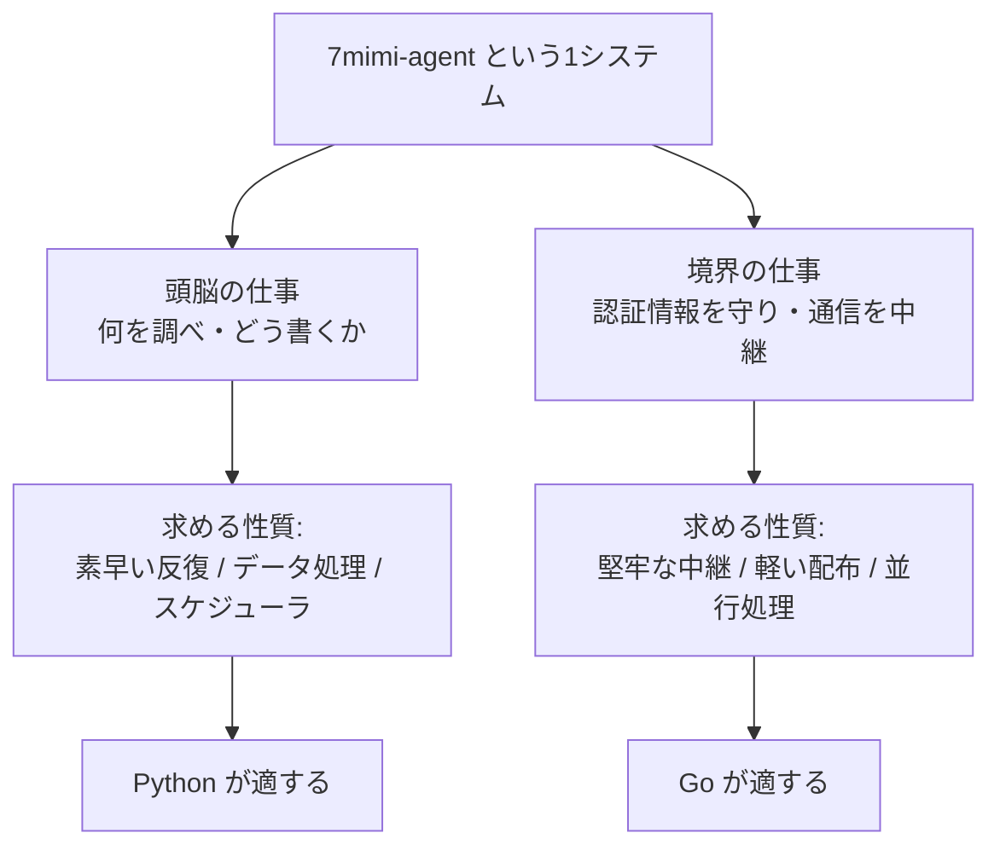
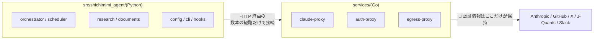
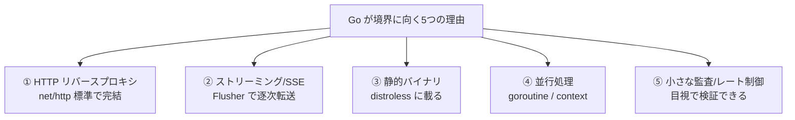
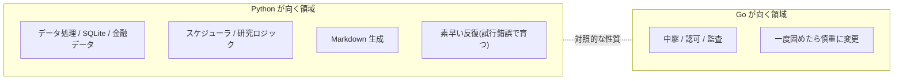
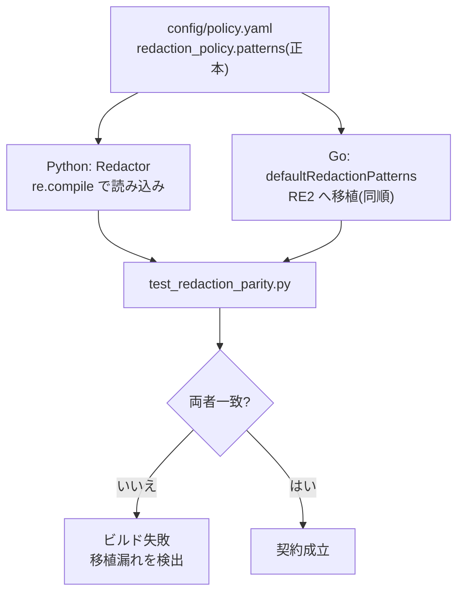
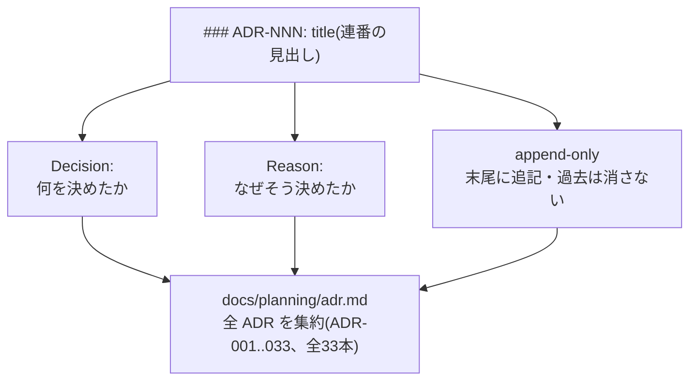
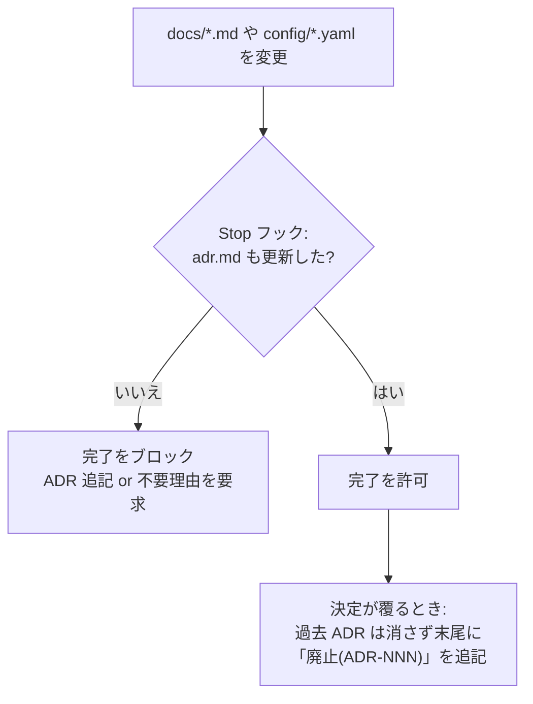
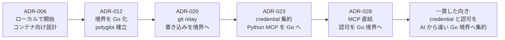

# ポリグロット設計と ADR を読む — なぜ Python と Go に分けたのか、決定をどう残すのか

本書は、7mimi-agent がなぜ一つの言語で書かれず、Python と Go という二つの言語に分かれているのか、そしてその分割をはじめとする設計上の決定が、どのようにして記録され後戻りを防いでいるのかを解説するものである。前半では「ポリグロット(多言語)設計」の分割線とその根拠を、後半では設計判断を残す仕組みである「ADR(Architecture Decision Record)」を、実際のディレクトリ構成と ADR 本文を引用しながら順に確認していく。口語的な読み物ではなく、順を追って理解を積み上げる教科書として記述する。

## 目次

1. [ポリグロットとは — なぜ1言語でないのか](#第1章-ポリグロットとは--なぜ1言語でないのか)
2. [責務の分割線 — Python と Go の担当範囲](#第2章-責務の分割線--python-と-go-の担当範囲)
3. [なぜ Go が境界に向くのか](#第3章-なぜ-go-が境界に向くのか)
4. [なぜ Python がオーケストレーションに向くのか](#第4章-なぜ-python-がオーケストレーションに向くのか)
5. [両言語の境界における「契約」](#第5章-両言語の境界における契約)
6. [ADR とは何か — フォーマットと実例](#第6章-adr-とは何か--フォーマットと実例)
7. [ADR が決定を残す仕組み](#第7章-adr-が決定を残す仕組み)
8. [ADR 史の要約 — 主要な転換点](#第8章-adr-史の要約--主要な転換点)
9. [むすび](#むすび)

---

## 第1章 ポリグロットとは — なぜ1言語でないのか

### 1.1 ポリグロット設計の定義

ポリグロット(polyglot)とは「複数言語を操る」を意味する。ソフトウェア開発における polyglot 設計とは、一つのシステムを単一の言語で書き通すのではなく、部分ごとに最も適した言語を選んで組み合わせる方針を指す。7mimi-agent は Python と Go の二言語で構成される。アーキテクチャ文書は端的にこう述べる。「`7mimi-agent` は polyglot 構成にする」。

一言語で書けばビルドも配布も単純になる。それでもあえて分けるのは、システムの中に**性質のまったく異なる二種類の仕事**が同居しているからである。片方は「何を調べ、どう書くか」を決める頭脳の仕事であり、もう片方は「認証情報を守り、通信を安全に中継する」境界の仕事である。前者は素早い試行錯誤とデータ処理を求め、後者はネットワーク処理の堅牢さと配布の軽さを求める。求めるものが違えば、向く道具も違う。

### 1.2 分割の一行要約

本書全体を貫く分割線を、先に一文で示す。**Python はオーケストレーション・研究ロジック・Markdown 生成を担い、Go はセキュリティ境界のネットワークサービスを担う**。この決定は ADR-012 に記録されている(第6章で全文を引用する)。



*図1-1 一つのシステムに同居する二種類の仕事。求める性質が異なるため、適する言語も分かれる。*

### 1.3 分割の代償と、それでも分ける理由

言語を分ければ代償も生じる。二つのビルド系(Python と Go)を維持し、二言語間で受け渡すデータの形をそろえ、開発者は両方を読めなければならない。それでも分割を選ぶのは、代償が**境界という限定された面**にしか現れないよう設計されているからである。Python と Go が接するのは HTTP の数本の経路だけであり、そこで交わす約束(第5章の「契約」)を固定しておけば、内部はそれぞれの言語で自由に書ける。分割線を正しい位置に引けば、多言語化の負担は最小に抑えられる。

---

## 第2章 責務の分割線 — Python と Go の担当範囲

### 2.1 アーキテクチャ文書が定める分担

担当範囲は設計文書 `docs/architecture/README.md` に明記されている。原文をそのまま引く。

```text
Python:
  - agent orchestration
  - scheduler
  - runner management
  - research logic
  - markdown/document generation
  - config validation
  - local development CLI

Go:
  - claude-proxy
  - auth-proxy
  - security-sensitive network boundary components
```

Python 側はエージェントの司令塔(orchestration)、定時実行(scheduler)、実行コンテナの管理(runner management)、調査ロジック(research logic)、そして生成物である Markdown の作成を担う。Go 側は二つの境界サービス — `claude-proxy` と `auth-proxy` — に代表される、**セキュリティ上重要なネットワーク境界の部品**だけを担う。この対応は、次に見るディレクトリ構成にそのまま現れる。

### 2.2 ディレクトリがそのまま責務を表す

リポジトリのディレクトリ構成を見れば、二言語の分担が物理的に分離されていることがわかる。Python のコードは `src/shichimimi_agent/` に、Go のコードは `services/` に、はっきりと別の場所へ置かれている。

```text
# Python — オーケストレーション / 研究 / 文書生成
src/shichimimi_agent/
  ├─ cli.py          # ローカル開発 CLI
  ├─ config/         # YAML 読み込みと検証
  ├─ scheduler/      # 定時実行ループ
  ├─ orchestrator/   # 司令塔
  ├─ runner/         # 実行コンテナ管理
  ├─ research/       # 調査ロジック
  ├─ documents/      # Markdown 生成
  ├─ hooks/          # PreToolUse / PostToolUse
  └─ security/       # path / policy チェック

# Go — セキュリティ境界のネットワークサービス
services/
  ├─ claude-proxy/   # Claude API 中継・APIキー境界
  ├─ auth-proxy/     # tool 認可 / git relay / MCP / Slack
  └─ egress-proxy/   # WebFetch の出口強制(ADR-025)
```

言語の境界がディレクトリの境界と一致している。`src/` を開けば Python の関心事(調査・生成・段取り)だけが、`services/` を開けば Go の関心事(中継・認可・監査)だけが目に入る。読み手は「どの言語で、何を探すか」を迷わない。



*図2-1 ディレクトリと言語の対応。Python(src/)と Go(services/)は HTTP の限られた経路でのみ接し、認証情報は Go 側の境界にしか存在しない。*

### 2.3 なぜ「境界」で切ったのか

分割線を機能(例:X 担当 vs 株担当)で引くこともできたはずだが、そうはしなかった。切ったのは**セキュリティ境界**である。理由は明快で、認証情報(APIキー・秘密鍵・トークン)を持つコードと、持たないコードを、言語のレベルで隔てたかったからである。AI が動く agent-runner と、それを支える Python のオーケストレーションは**本物の認証情報を一切持たない**。認証情報を保持し、通信の瞬間に代理で差し込むのは Go の境界サービスだけである。分割線をセキュリティ境界に一致させることで、「どこに秘密があるか」が「どの言語か」で判別できるようになる。

---

## 第3章 なぜ Go が境界に向くのか

ADR-012 は Go を選んだ理由を「これらのプロキシはセキュリティに敏感なネットワーク境界の部品である。Go は HTTP リバースプロキシ、ストリーミング/SSE、並行処理、小さな静的バイナリ、コンテナ配備により適している」と述べる。本章では、この五つの適性を一つずつ確認する。

### 3.1 リバースプロキシとストリーミング

境界サービスの本業は「要求を受け、検査し、上流へ中継し、応答を返す」ことである。Go の標準ライブラリには `net/http` と `net/http/httputil.ReverseProxy` があり、HTTP サーバとリバースプロキシを外部依存なしで書ける。とりわけ大規模言語モデルの応答は、生成された順に少しずつ届く**ストリーミング**形式をとる。Go では応答を逐次読んで即座に書き出し、`http.Flusher` で「溜めずに今すぐ送れ」と指示するだけで、この逐次性を保ったまま中継できる。

```go
// 上流の応答を少しずつ読み、書くたびに Flush して逐次転送する
flusher, _ := w.(http.Flusher)
buf := make([]byte, 32*1024)
for {
	n, err := body.Read(buf)
	if n > 0 {
		w.Write(buf[:n])
		if flusher != nil {
			flusher.Flush()  // 溜めず即送信 → 逐次表示が成立
		}
	}
	if err != nil { return }
}
```

この単純な部品が、ユーザから見た「AI が考えながら喋る」体験を成立させている。ストリーミングの中継はネットワークサービスの基本要件であり、Go はそれを標準機能だけで満たす。

### 3.2 静的バイナリと distroless コンテナ

Go はコンパイルすると**単一の静的バイナリ**になる。実行に外部のランタイム(Python インタプリタや Node.js のような)を必要としない。この性質が配布時に効く。境界サービスは `distroless`(最小構成)のコンテナイメージで配布され、そこには `curl` も `wget` も、シェルさえも入っていない。攻撃者が侵入しても使える道具がほとんどない、という防御である。

ただし道具がないと、コンテナ実行環境がサービスの生存を確認する手段(ヘルスチェック)も失われる。そこで `claude-proxy` は、バイナリ自身が診断コマンドを兼ねる。

```go
func main() {
	if len(os.Args) > 1 && os.Args[1] == "-healthcheck" {
		runHealthcheck()  // 自分の /healthz を叩き 200 なら exit 0
		return
	}
	// ... 通常のサーバ起動 ...
}
```

`claude-proxy -healthcheck` と実行すると、通常のサーバ起動ではなく自己診断だけを行う。外部ツールに頼らず自足する — これは静的バイナリだからこそ自然に選べる設計である。

### 3.3 並行処理・タイムアウト・キャンセル

プロキシは同時に多数の要求を捌く。Go は**ゴルーチン(goroutine)**という軽量な並行実行の仕組みを言語に組み込んでおり、`http.ListenAndServe` は要求ごとに自動でゴルーチンを割り当てる。開発者はスレッドプールを自前で組む必要がない。加えて `context` による所要時間の打ち切り(タイムアウト)や取り消し(キャンセル)も標準で扱える。上流が応答しなければ待ち続けず `502 Bad Gateway` を返す、といった制御が素直に書ける。境界サービスに求められる「速く、止まらず、暴走しない」性質を、言語が下支えする。

### 3.4 小さく保てる監査・レート制御

境界サービスは監査(誰が何をしたか)とレート制御(呼びすぎを止める)を担う。Go では、これらを HTTP ハンドラの前後に挟む小さな「ミドルウェア」として書ける。ADR-012 の言葉を借りれば「監査/レート制限のミドルウェアを小さく保てる」。コードが小さいほど読みやすく、セキュリティの根幹を目視で検証できる。実際、`claude-proxy` は4ファイル・約200行に収まっている。



*図3-1 ADR-012 が挙げる Go の五つの適性。いずれも「ネットワーク境界を堅牢かつ軽量に保つ」ことに寄与する。*

---

## 第4章 なぜ Python がオーケストレーションに向くのか

ADR-008 は初期実装言語を Python とした理由を「データ収集、SQLite、金融データ処理、スケジューラー、バッチ実行との相性がよく、まず自律リサーチの縦切りを作るため」と述べる。ADR-012 も「Python はエージェントのオーケストレーション、データ処理、研究ワークフロー、Markdown 生成により適している」と繰り返す。四つの適性を確認する。

### 4.1 データ処理と金融データ

本システムの本業は、X から集めた投稿や J-Quants から得た株価・財務を、正規化し、突き合わせ、要約することである。Python は文字列処理・辞書・リスト・日付計算といったデータ加工の標準機能が豊かで、SQLite も標準ライブラリで扱える。実際、正規化されたデータは `.data/normalized/app.sqlite` に蓄積される。金融データの前処理と蓄積を素直に書ける点が、まず Python を選ばせた。

### 4.2 スケジューラと研究ロジック

定時実行(cron)のループ、ジョブの発火・リトライ・結果記録は、外部依存なしに Python の標準ライブラリだけで書かれている(ADR-022)。研究ロジック — どのトピックを選び、どのシグナルを代表とし、どう要約へ渡すか — も、決定的なルールとして Python 側に置かれる。これらは頻繁に手が入る部分であり、次に述べる「素早い反復」が効く領域である。

### 4.3 Markdown 生成

成果物である digest は Markdown として書き出される。文字列を組み立て、テンプレートに流し込み、整形する — この種の文書生成は Python の得意分野である。生成された note は本リポジトリではなく別リポジトリ(`7milch/ai-it-research-notes`)へ push されるが、その文面を組み立てるのは Python の役割である。

### 4.4 素早い反復

オーケストレーションと研究ロジックは、仕様が固まりきらないまま試行錯誤で育つ領域である。Python はコンパイル不要で、書いて即実行し、結果を見て直せる。ADR-008 が「まず自律リサーチの縦切りを作るため」と述べるとおり、動くものを速く作って検証する段階では、この反復速度が決定的に重要だった。境界サービスのように「一度固めたら滅多に変えない・変えるなら慎重に」という Go 側の性質とは、対照的である。



*図4-1 Python と Go の適性の対照。頻繁に育つ頭脳の仕事は Python、滅多に変えない境界の仕事は Go。*

---

## 第5章 両言語の境界における「契約」

Python と Go が別々に書かれても、二つが接する面では**形をそろえた約束(契約)**が要る。契約が食い違えば、片方の変更がもう片方を静かに壊す。7mimi-agent は四つの契約で境界をつないでいる。

### 5.1 セッショントークン

agent-runner(および Python オーケストレーション)は本物の認証情報を持たず、代わりに**短命でロールに縛られたセッショントークン**を持つ。Python 側はこのトークンを Bearer として送り、Go 側はそれを検証し、一致すれば本物の認証情報を代理で差し込む。トークンの発行は auth-proxy の `/session/issue` が行い、TTL は約35分、ロールが紐づく(ADR-028)。「Python は合言葉を送るだけ、Go が本物を持つ」という約束が、認証情報の分離を成立させている。

### 5.2 監査イベントの形

両言語とも監査ログを出すが、その**形(記録できる項目)をそろえる**。Go の `audit.Event` は、時刻・セッションID・ロール・メソッド・パス・上流ステータス・所要時間・判定・理由だけを持ち、会話内容や認証情報は**型のレベルで持てない**。Python 側の監査も同じ項目に限る。形をそろえることで、どちらの言語が出したログも同じ道具で読め、「秘密は残さない」原則が両側で守られる。

### 5.3 policy.Decision のミラー

最も明示的な契約が、認可判定の返り値である。Go の `policy.Decision` は、Python の `PolicyEngine` が返す判定の形を**そのまま鏡写しにしている**。ソース冒頭のコメントがそれを宣言している。

```go
// Decision mirrors the Python PolicyEngine decision shape so agent-runner
// hooks can treat local and remote decisions identically.
type Decision struct {
	Decision      string `json:"decision"`
	Reason        string `json:"reason"`
	PolicyVersion string `json:"policy_version"`
}
```

`decision`(allow/block)・`reason`・`policy_version` の三つ組は、Python がローカルで判定しても、Go の auth-proxy がリモートで判定しても、**同じ JSON の形**で返る。だから agent-runner のフック(PreToolUse)は、判定がローカルかリモートかを気にせず同一に扱える。二言語の実装が異なっても、外から見た振る舞いは一つになる。これがミラーの意味である。

### 5.4 リダクションのパリティ

四つめが最も精妙な契約である。ログや出力から秘密を伏せる**リダクション(redaction)の正規表現**が、Python と Go で**一致していなければならない**。片方だけがあるパターンを見落とせば、そちら側から秘密が漏れる。設定の正本は `config/policy.yaml` の `redaction_policy.patterns` であり、Python の `Redactor` はこれを読み込み、Go の `xmcp.go` は同じパターンを RE2 構文へ移植して持つ。

```go
// policy.yaml の各パターンを Go 側へ移植。並び順も同一に保つ。
var defaultRedactionPatterns = []redactionPattern{
	{
		name:  "env_assignment",
		regex: regexp.MustCompile(`(?i)(api[_-]?key|secret|token|password)\s*=`),
	},
	{
		name:  "bearer_token",
		regex: regexp.MustCompile(`Bearer\s+[A-Za-z0-9._~+/-]+=*`),
	},
	// ... private_key, anthropic_key, ... 以下同順で続く
}
```

ここで重要なのは、この一致を**人手の注意にではなく、テストに担保させている**点である。`tests/test_redaction_parity.py` が「`policy.yaml` に追加された各パターンが Go 側 `defaultRedactionPatterns` へ移植されているか」を検査し、移植漏れがあればビルドを失敗させる。Go ソースのコメントも「このリストとパリティ検査テストを同期させ続けよ」と明記している。言語間の契約を、口約束ではなく機械が守る仕組みにしてある。



*図5-1 リダクションのパリティ。正本は policy.yaml。Python と Go への反映が一致することをテストが機械的に担保する。*

---

## 第6章 ADR とは何か — フォーマットと実例

ここまで見てきた「なぜ Python と Go に分けたか」は、誰かの記憶ではなく文書に残っている。その文書が **ADR(Architecture Decision Record、アーキテクチャ決定記録)**である。本章では ADR のフォーマットを、実物を引きながら説明する。

### 6.1 ADR の目的

ソフトウェアの設計では、無数の判断が下される。「なぜこうしたのか」を残さないと、後から見た者(未来の自分を含む)は理由を再構築できず、良かれと思って決定を覆し、同じ失敗を繰り返す。ADR は**一つの決定につき一つの記録**を残し、「何を決めたか(Decision)」と「なぜそう決めたか(Reason)」をセットで保存する。7mimi-agent では全 ADR が `docs/planning/adr.md` 一本に集約される。

### 6.2 フォーマット

本プロジェクトの ADR は次の三つの規律に従う。

- **見出し**: `### ADR-NNN: <title>` の形式。`NNN` は連番。
- **本文**: `Decision:`(決めたこと)と `Reason:`(理由)を必ず併記する。
- **追記のみ(append-only)**: 既存 ADR を書き換えて消すのではなく、末尾に新しい番号で足していく。決定を覆す場合も、古い ADR は残し、新しい ADR がそれを廃止する。

最も短い実例として、ADR-003 の全文を引く。

```text
### ADR-003: X is signal, not evidence

Decision: X情報は調査トリガーとして扱い、銘柄評価の根拠にはしない。
Reason: Xには噂、ノイズ、ポジショントーク、誤情報が混ざるため。
```

わずか二行だが、「X を証拠にしない」という設計原則と、その理由が完結している。この決定は後続の多くの ADR(要約の扱い、Slack digest の免責、evidence 系 tool の分離)の前提として繰り返し参照される。次に、本書の主題である言語分割そのものを決めた ADR-012 を引く。

```text
### ADR-012: Implement proxy boundary services in Go

Decision: Implement claude-proxy and auth-proxy as Go services, while
keeping agent orchestration and research logic in Python.

Reason: These proxies are security-sensitive network boundary components.
Go is better suited for HTTP reverse proxying, streaming/SSE, concurrency,
small static binaries, and container deployment. Python remains better for
agent orchestration, data processing, research workflows, and Markdown
generation.
```

Decision が「何を(プロキシを Go で)」、Reason が「なぜ(境界部品であり、Go が中継・並行・配布に向くから)」を述べる。第2章から第4章までの内容は、要するにこの一つの ADR を敷衍したものである。



*図6-1 ADR のフォーマット。連番の見出し・Decision・Reason・追記のみ。すべて adr.md 一本に集約される。*

---

## 第7章 ADR が決定を残す仕組み

フォーマットを定めただけでは、記録は書かれない。7mimi-agent は ADR を「書かれる」ものにするための仕組みを三つ備えている。

### 7.1 仕様駆動 — docs が仕様である

本プロジェクトでは `docs/` 以下の設計文書が**仕様そのもの**とされる。実装は思いつきではなく仕様に従って行う。CLAUDE.md はこう定める。「もし最近の ADR が古い設計文書と矛盾するなら、**先に設計文書を ADR に合わせて更新し**、それから更新後の文書に対して実装せよ。どちらにも従わないコードは決して書くな」。つまり ADR は文書の中で最上位の効力を持ち、設計文書は ADR に追随する。決定は宙に浮かず、必ず仕様に反映される。

### 7.2 Stop フックによる強制

規律は、人の善意だけに頼ると守られない。そこで機械的な強制が置かれている。アーキテクチャ・セキュリティ境界・言語/ツール選択・プラットフォーム方針を変える変更(具体的には `docs/architecture/`、`docs/detailed-design/`、`docs/workflows/`、`config/*.yaml` への変更)は、**同じ作業セッション内で ADR に記録しなければならない**。これを `.claude/hooks/adr-check.sh` という Stop フックが検査する。

```text
# 概念(Stop フックの判定)
対象パスが変更された && adr.md が未更新
  → 完了をブロック(「ADR を追記せよ」)
そうでなければ
  → 完了を許可
```

対象パスに変更があるのに `adr.md` が更新されていなければ、作業の「完了」そのものがブロックされる。開発者は ADR を追記するか、あるいは「なぜ ADR 不要か(誤字修正、既存 ADR で説明済み等)」を明示的に述べねばならない。決定の記録を、任意の作法から**完了の必要条件**へ引き上げている。

### 7.3 暫定を宣言し、後続が廃止する運用

append-only の妙が最もよく現れるのが、**決定が覆るとき**の扱いである。ADR は消さない。代わりに、暫定的な決定は**自らを暫定と宣言**し、後続の ADR がそれを正式に廃止する。ADR-018 がその実例である。この ADR は「notes repo への publish はホスト credential による暫定 local 構成とする」と定め、Reason の中で自ら「将来は document-store MCP + auth-proxy に credential を移す」と将来の置き換えを予告していた。そして後に、末尾へ次の一行が追記された。

```text
廃止(2026-07-05): git relay の E2E 成功に伴い、本経路
(--publish / runner からの writer.publish 呼び出し)は廃止した(ADR-020)。
path policy 検証は security/path_policy.py として引き続き有効。
```

ADR-018 の本文はそのまま残り、末尾の追記が「この決定は ADR-020 に置き換えられた」と示す。読み手は、なぜ暫定構成が採られ、何をもって解消されたかという**判断の履歴**をたどれる。決定を消して現在だけを見せるのではなく、決定の変遷を残して「なぜ今こうなっているか」を説明する — これが append-only の狙いである。同じ運用は ADR-015(Python 製 MCP が ADR-023 で auth-proxy へ統合され撤去)などにも見られる。



*図7-1 決定を残す強制。Stop フックが記録なき完了を止め、覆る決定は削除でなく追記で表現される。*

---

## 第8章 ADR 史の要約 — 主要な転換点

ADR-001 から ADR-033 まで(全33本)を通して読むと、このシステムが「ローカルで動く最小構成」から「認証情報を Go 境界に集約した自律システム」、そして「本番プラットフォームを k3s + ArgoCD へ移行した自律システム」へと段階的に進化した軌跡が見える。主要な転換点を時系列でたどる。

### 8.1 六つの転換点

- **ADR-006(ローカルで始め、コンテナ向けに設計)**: MVP はローカル実行で始めるが、将来のセッション隔離コンテナへ移行可能な設計にする、という出発点。
- **ADR-012(境界を Go 化)**: 本書の主題。プロキシ境界を Go に切り出し、polyglot 構成を確立した。
- **ADR-020(git relay)**: git 書き込みを auth-proxy の Smart HTTP 中継に一本化し、GitHub App の短命トークンで注入。ADR-018 のホスト credential 依存を解消し、「credential-free runner」を書き込みまで拡張した。
- **ADR-023(credential 集約)**: Python 製の x-mcp-readonly を撤去し、同じ MCP 契約を auth-proxy(Go)に再実装。X credential を Go 境界へ集約し、常駐プロセスを 4→3 に削減した。
- **ADR-028(MCP 直結)**: X シグナル収集を、orchestrator の事前収集から、runner 内 Claude Code が auth-proxy の `/mcp` を直接叩く方式へ移行。認可を Go 境界のネットワーク呼び出し上のチェックへ移し、回避を難しくした。
- **本番プラットフォームの k3s + ArgoCD 移行(ADR-031〜033)**: docker.sock sibling → k8s Job(namespace 限定 RBAC、ADR-031)、internal 網 → NetworkPolicy(ADR-032)、ネスト docker → `KubernetesClaudeLauncher`(ADR-033)。compose は local/dev の実行形態として残る。

### 8.2 転換の一貫した方向

これらの転換には一つの向きがある。**認証情報と認可判定を、AI が動く面から遠ざけ、Go の境界サービスへ集約していく**方向である。ADR-023 の Reason はこの動機を率直に述べる。「ADR-015 時点では『データ収集は Python』の整理だったが、実装後の運用で credential 分散と常駐プロセス数の方が支配的な関心事になったため方針を改訂する」。当初の分割線(データ収集は Python)が運用を経て見直され、より少ない境界に credential を集める方向へ調整された。ポリグロットの分割線は一度引いて終わりではなく、ADR を通じて更新され続ける生きた判断である。



*図8-1 ADR 史の主要な転換点。各決定は「認証情報と認可を Go の境界に集約する」という一貫した向きを持つ。*

---

## むすび

本書は二つの問いを追った。「なぜ Python と Go に分けたのか」と「決定をどう残すのか」である。答えは互いに結びついていた。言語の分割は、機能ではなく**セキュリティ境界**に沿って引かれ、認証情報を持つ Go の境界サービスと、持たない Python のオーケストレーションを隔てた。Go はリバースプロキシ・ストリーミング・静的バイナリ・並行処理・distroless で境界に向き、Python はデータ処理・スケジューラ・研究ロジック・Markdown 生成・素早い反復でオーケストレーションに向く。二言語が接する面では、セッショントークン・監査イベントの形・`policy.Decision` のミラー・リダクションのパリティという四つの契約が、テストによって機械的に守られていた。

そしてこの分割線そのものが、ADR という記録の仕組みによって残され、検証され、更新されてきた。`### ADR-NNN / Decision / Reason` という簡素なフォーマット、append-only の追記、Stop フックによる強制、暫定を宣言し後続が廃止する運用 — これらが、判断の履歴を消さずに保った。ADR-006 から ADR-028 へ至る転換は、credential を Go 境界へ集約するという一貫した向きを描いていた。

言語をどう選ぶかも、決定をどう記録するかも、別々の作法ではない。どちらも「一貫した設計判断を、後から検証できる形で残す」という同じ規律の現れである。良い設計は、正しい分割線を引くことと、なぜそう引いたかを残すことの、両輪で成り立つ。
