# claude-proxy と auth-proxy を読む — Go とWebプロトコルの入門を兼ねた技術解説

本書は、7mimi-agent の 2 つの境界サービス **claude-proxy** と **auth-proxy** を題材に、これらがどのような仕組みで動いているのかを、Go 言語およびHTTPを中心とするWebプロトコルの前提知識がない読者に向けて解説するものである。実際のソースコードを引用しながら、一行ずつ意味を確認していく形式をとる。口語的な読み物ではなく、順を追って理解を積み上げる教科書として記述する。

## 第1章 準備 — 本書で扱う対象と前提

### 1.1 プロキシとは何か

プロキシ(proxy)とは「代理」を意味する。ネットワークにおけるプロキシサーバとは、クライアント(要求する側)とサーバ(応答する側)の間に立ち、通信を中継するプログラムである。中継する際に、内容を検査したり、書き換えたり、記録したりできる。

7mimi-agent では、AIエージェント(agent-runner)が外部サービス(Anthropic API、GitHub、X、Slack)と通信する経路のすべてにプロキシを挟んでいる。目的は一つである。**本物の認証情報(APIキーや秘密鍵)を、AIが動くコンテナに一切置かないこと**。認証情報はプロキシだけが保持し、通信を中継する瞬間にプロキシが代理で差し込む。

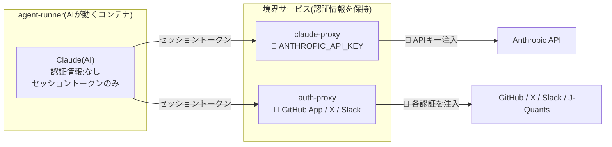

*図1-1 プロキシの立ち位置。AIは認証情報を持たず、プロキシが中継の瞬間に代理で差し込む。*

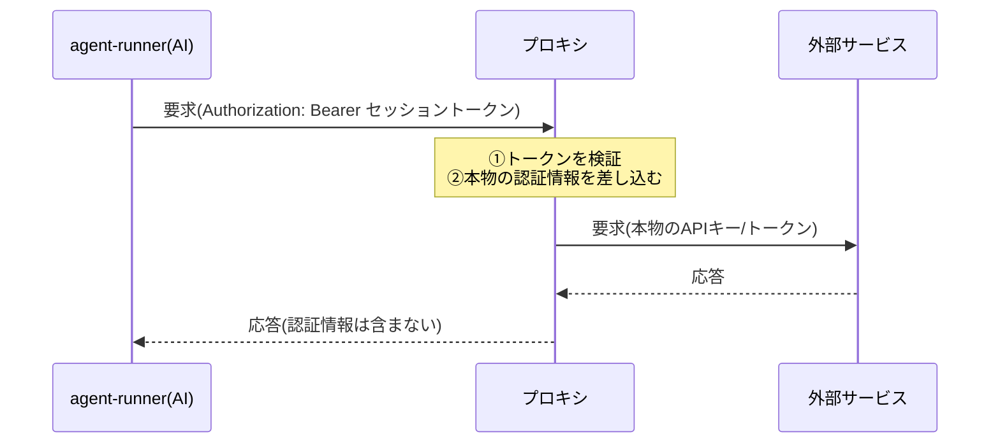

*図1-2 中継の基本パターン。左側の区間に本物の認証情報は存在せず、右側の区間で初めて現れる。*

- **claude-proxy**: Anthropic API(大規模言語モデル)への通信を中継する。`ANTHROPIC_API_KEY` を保持する。
- **auth-proxy**: GitHub・X・Slack・J-Quants への通信を中継する。GitHub App秘密鍵、Xトークン、Slackトークン等を保持する。

### 1.2 HTTPの最小限の知識

両サービスはHTTP(HyperText Transfer Protocol)で通信する。HTTPは「要求(リクエスト)」と「応答(レスポンス)」の往復で成り立つ。理解に必要な用語を先に定義する。

- **メソッド**: 要求の種類。`GET`(取得)、`POST`(送信)などがある。
- **パス**: 要求先を表す文字列。例:`/v1/messages`。
- **ヘッダ**: 要求・応答に付随するメタ情報。`名前: 値` の形式で複数並ぶ。例:`Content-Type: application/json`。
- **ボディ**: 要求・応答の本体データ。
- **ステータスコード**: 応答の結果を表す3桁の数字。`200`(成功)、`401`(認証失敗)、`403`(禁止)、`502`(上流ゲートウェイ異常)など。

特に重要なヘッダが `Authorization` である。これは「私は誰々である」ことを証明する情報を運ぶ。本書に頻出する形式は次の2つである。

```
Authorization: Bearer <トークン文字列>
Authorization: Basic <base64でエンコードした「利用者名:パスワード」>
```

`Bearer`(ベアラー)方式は「このトークンを持っている者(bearer)を正当とみなす」という意味である。トークンそのものが鍵になる。

### 1.3 Goの最小限の知識

Go(ゴー)はGoogleが開発したプログラミング言語である。本書のコードを読むために必要な文法を先に押さえる。

- **パッケージ**: コードのまとまり。ファイル冒頭に `package proxy` のように書く。
- **import**: 他のパッケージを取り込む宣言。
- **関数**: `func 関数名(引数) 戻り値の型 { ... }` の形式。
- **構造体(struct)**: 複数の値をまとめた型。`type Config struct { ... }` のように定義する。
- **メソッド**: 特定の型に結びついた関数。`func (h *Handler) Routes() ...` の `(h *Handler)` の部分をレシーバと呼び、「この関数は Handler 型に属する」ことを表す。
- **エラー処理**: Goは例外機構を多用せず、関数が値とエラーの2つを返し、呼び出し側が `if err != nil` でエラーを確認する慣習をとる。
- **ポインタ**: `*Config` は「Config構造体への参照」を表す。値のコピーではなく実体を指す。

これらは章が進むごとに実例で確認する。

---

## 第2章 claude-proxy — もっとも単純な境界

claude-proxy は4ファイル・約200行の小さなプログラムである。単純であるがゆえに、プロキシの基本構造を学ぶ教材として適している。まずこのサービスを完全に読み解く。

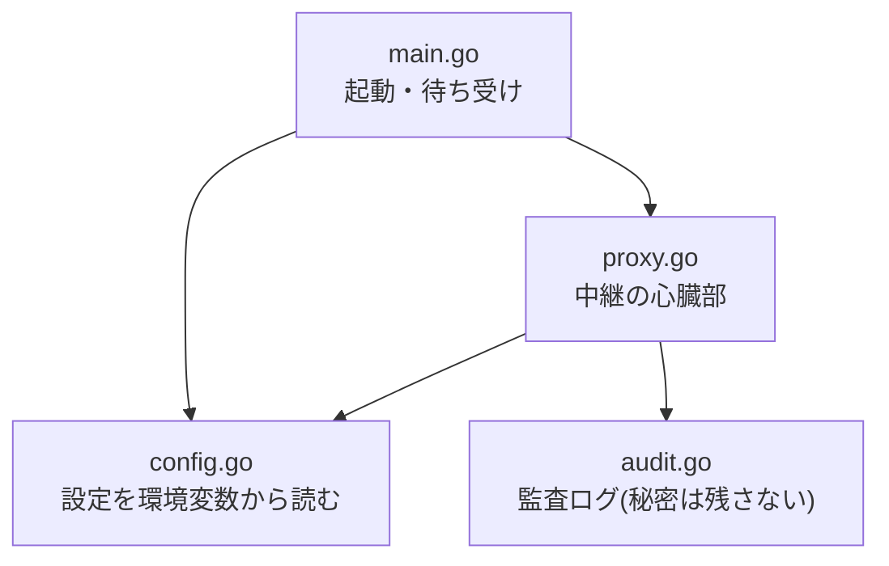

*図2-0 claude-proxy の4ファイルの関係。本章はこの順に読み進める。*

### 2.1 設定を環境変数から読む(config.go)

プログラムは起動時に「どのポートで待ち受けるか」「どの認証情報を使うか」といった設定を必要とする。7mimi-agent では設定を**環境変数**から読む。環境変数とは、プログラムの外側(OSやコンテナ)から与えられる名前付きの値である。ソースコードに秘密情報を書き込まずに済む利点がある。

```go
package config

import (
	"fmt"
	"os"
)

// Config holds claude-proxy runtime configuration.
// ANTHROPIC_API_KEY is the provider credential boundary: it lives here and
// must never be forwarded to agent-runner or written to logs.
type Config struct {
	Addr             string
	AnthropicAPIKey  string
	AnthropicBaseURL string
	DevSessionToken  string
}
```

`Config` は4つの文字列を持つ構造体である。それぞれ、待ち受けアドレス、Anthropic APIキー、Anthropic APIの接続先URL、開発用セッショントークンを表す。コメントが明記しているとおり、`AnthropicAPIKey` が「認証情報の境界」であり、これがagent-runnerに転送されたりログに書かれたりしてはならない。

次に、環境変数から実際に値を読み取る関数を見る。

```go
func FromEnv() (*Config, error) {
	cfg := &Config{
		Addr:             envOr("CLAUDE_PROXY_ADDR", ":18080"),
		AnthropicAPIKey:  os.Getenv("ANTHROPIC_API_KEY"),
		AnthropicBaseURL: envOr("ANTHROPIC_BASE_URL", "https://api.anthropic.com"),
		DevSessionToken:  envOr("CLAUDE_PROXY_DEV_TOKEN", "cp_sess_dev"),
	}
	if cfg.AnthropicAPIKey == "" {
		return nil, fmt.Errorf("ANTHROPIC_API_KEY is required")
	}
	return cfg, nil
}
```

`FromEnv` は `(*Config, error)` という2つの値を返す。成功すれば設定へのポインタとエラーなし(`nil`)を、失敗すればエラーを返す。これがGoの典型的なエラー処理の形である。

注目すべきは末尾の検査である。`AnthropicAPIKey` が空文字列であれば、`fmt.Errorf` でエラーを生成して返す。これは**fail-closed(フェイルクローズド)**、すなわち「必須情報が欠けていれば安全側に倒して起動を拒否する」設計である。APIキーなしで起動してしまえば、認証情報の境界という前提が崩れるため、最初から動かさない。

補助関数 `envOr` は「環境変数があればその値、なければ既定値」を返す。

```go
func envOr(key, fallback string) string {
	if v := os.Getenv(key); v != "" {
		return v
	}
	return fallback
}
```

`os.Getenv` は環境変数を読む標準ライブラリの関数である。`:18080` のように既定値を与えることで、環境変数が未設定でも動作する。

### 2.2 監査ログ — 記録するが秘密は残さない(audit.go)

境界サービスの重要な責務の一つが監査である。「いつ・誰が・何をした」を記録する。ただし、**記録にも秘密情報を残さない**という原則を貫く。claude-proxy の監査ログの型を見る。

```go
// Event is metadata-only audit information. Request/response bodies and
// provider credentials must never appear here.
type Event struct {
	Timestamp      string `json:"timestamp"`
	SessionID      string `json:"session_id"`
	Role           string `json:"role"`
	Method         string `json:"method"`
	Path           string `json:"path"`
	UpstreamStatus int    `json:"upstream_status"`
	DurationMS     int64  `json:"duration_ms"`
	Decision       string `json:"decision,omitempty"`
	Reason         string `json:"reason,omitempty"`
}
```

記録するのは、時刻・セッションID・ロール・HTTPメソッド・パス・上流の応答ステータス・所要時間・許可/拒否の判定・理由だけである。**リクエストボディ(実際の会話内容)もAPIキーも、この構造体には存在しない**。型のレベルで「秘密は記録できない」ことを保証している。

各フィールド右側の `` `json:"timestamp"` `` はタグと呼ばれ、この構造体をJSON形式の文字列に変換する際のキー名を指定する。`omitempty` は「値が空なら出力しない」という指定である。

ログを書き出すメソッドを見る。

```go
func (l *Logger) Log(event Event) {
	if event.Timestamp == "" {
		event.Timestamp = time.Now().UTC().Format(time.RFC3339Nano)
	}
	line, err := json.Marshal(event)
	if err != nil {
		return // fail-open: audit must not break proxying
	}
	l.out.Write(append(line, '\n'))
}
```

`json.Marshal` が `Event` 構造体をJSON文字列(正確にはバイト列)に変換する。ここで注目すべきコメントが `fail-open` である。監査ログの書き出しに失敗しても、`return` するだけで何もしない。**監査の失敗が本来の中継処理を止めてはならない**という方針である。

第2.1節の設定読み込みは fail-closed(欠けたら止める)、この監査は fail-open(失敗しても続ける)であった。この使い分けは意図的である。セキュリティの根幹(認証情報)は欠けたら止め、補助機能(ログ)は失敗しても本業を止めない。

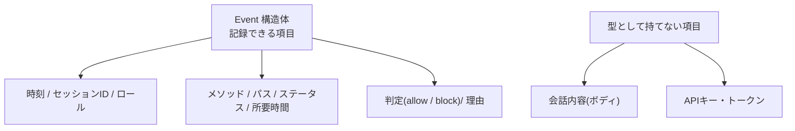

*図2-1 監査イベントの型。上段が記録する項目、下段が「型として持てない=構造的に残らない」項目。*

### 2.3 プログラムの起動(main.go)

`main` 関数がプログラムの入口である。まず本体部分を見る。

```go
func main() {
	if len(os.Args) > 1 && os.Args[1] == "-healthcheck" {
		runHealthcheck()
		return
	}
	cfg, err := config.FromEnv()
	if err != nil {
		log.Fatalf("claude-proxy: %v", err)
	}
	handler := proxy.NewHandler(cfg, audit.NewLogger(os.Stdout))
	log.Printf("claude-proxy listening on %s (upstream %s)", cfg.Addr, cfg.AnthropicBaseURL)
	if err := http.ListenAndServe(cfg.Addr, handler.Routes()); err != nil {
		log.Fatalf("claude-proxy: %v", err)
	}
}
```

処理の流れは次のとおりである。

1. コマンド引数の先頭が `-healthcheck` なら、ヘルスチェック処理を実行して終了する(後述)。
2. `config.FromEnv()` で設定を読む。失敗すれば `log.Fatalf` でメッセージを出して即座に終了する。
3. `proxy.NewHandler` で「中継を担うハンドラ」を作る。監査ロガーには標準出力(`os.Stdout`)を渡す。
4. `http.ListenAndServe` でHTTPサーバを起動し、指定アドレスで要求を待ち受ける。第2引数の `handler.Routes()` が、パスと処理の対応表(後述)である。

`http.ListenAndServe` はGo標準ライブラリの関数で、これだけでHTTPサーバが立ち上がる。Goがネットワークサービス開発に向いていると言われる一因が、この標準ライブラリの充実にある。

### 2.4 ヘルスチェック — 外部ツールに頼らない自己診断

`runHealthcheck` は、コンテナ実行環境がサービスの生存を確認するための仕組みである。

```go
func runHealthcheck() {
	addr := os.Getenv("CLAUDE_PROXY_ADDR")
	if addr == "" {
		addr = ":18080"
	}
	if idx := strings.LastIndex(addr, ":"); idx >= 0 {
		addr = addr[idx:]
	}
	client := http.Client{Timeout: 3 * time.Second}
	resp, err := client.Get("http://127.0.0.1" + addr + "/healthz")
	if err != nil {
		os.Exit(1)
	}
	defer resp.Body.Close()
	if resp.StatusCode != http.StatusOK {
		os.Exit(1)
	}
	os.Exit(0)
}
```

この関数は、自分自身の `/healthz` エンドポイントに `GET` 要求を送り、応答が `200 OK` なら終了コード `0`(正常)、そうでなければ `1`(異常)でプロセスを終了する。

なぜこんな回りくどいことをするのか。コメントに理由がある。本サービスは配布時にdistroless(最小構成)のコンテナイメージを使うため、`curl` や `wget` といったツールも、シェルさえも入っていない。外部ツールでヘルスチェックできないので、**バイナリ自身が診断コマンドを兼ねる**。`claude-proxy -healthcheck` と実行すると、通常のサーバ起動ではなくこの自己診断だけを行う。第2.3節冒頭の分岐がこれを切り替えている。

`defer resp.Body.Close()` の `defer` は「この関数を抜ける直前に必ず実行する」という予約である。応答ボディは使い終わったら閉じる必要があり、`defer` を使うと閉じ忘れを防げる。Goで頻出する定型である。

### 2.5 中継の心臓部(proxy.go)

いよいよ本体である。まず、パスと処理の対応表を作る `Routes` メソッドを見る。

```go
func (h *Handler) Routes() *http.ServeMux {
	mux := http.NewServeMux()
	mux.HandleFunc("GET /healthz", h.handleHealthz)
	// Claude Code also calls /v1/messages/count_tokens (and may add more
	// /v1/messages/* endpoints); all share the same validation/injection.
	mux.HandleFunc("POST /v1/messages", h.handleMessages)
	mux.HandleFunc("POST /v1/messages/", h.handleMessages)
	return mux
}
```

`http.ServeMux` は「マルチプレクサ」の略で、要求のメソッドとパスを見て、適切な処理関数に振り分ける役割を持つ。ここでは3つの経路を登録している。

- `GET /healthz` → ヘルスチェック応答
- `POST /v1/messages` → メッセージ中継
- `POST /v1/messages/` → 同上(末尾スラッシュ付きの派生パスも同じ処理に流す)

`/v1/messages/count_tokens` のような派生エンドポイントも `/v1/messages/` の登録で拾える。すべて同じ検証と認証情報の差し込みを通すため、一つの処理関数 `handleMessages` に集約している。

`handleMessages` が中継の心臓部である。長いので段階的に読む。まず冒頭。

```go
func (h *Handler) handleMessages(w http.ResponseWriter, r *http.Request) {
	start := time.Now()
	sessionID := r.Header.Get("X-7mimi-Session-Id")
	role := r.Header.Get("X-7mimi-Role")

	deny := func(status int, reason string) {
		h.logger.Log(audit.Event{
			SessionID: sessionID, Role: role,
			Method: r.Method, Path: r.URL.Path,
			UpstreamStatus: 0, DurationMS: time.Since(start).Milliseconds(),
			Decision: "block", Reason: reason,
		})
		http.Error(w, reason, status)
	}
```

HTTPの処理関数は、慣習的に `w http.ResponseWriter`(応答を書き込む先)と `r *http.Request`(受け取った要求)の2つを引数にとる。

- `start := time.Now()` で処理開始時刻を記録する。後で所要時間を計算するためである。
- `r.Header.Get(...)` で要求ヘッダから値を取り出す。`X-7mimi-Session-Id` と `X-7mimi-Role` は、この7mimi-agentが独自に付けているヘッダで、どのセッションのどのロールからの要求かを示す。
- `deny` は関数内で定義された無名関数である。「要求を拒否する」処理を一箇所にまとめている。拒否時には監査ログに `Decision: "block"` として記録し、`http.Error` でエラー応答を返す。

続いて、認証と検証の部分。

```go
	token, ok := bearerToken(r.Header.Get("Authorization"))
	if !ok {
		deny(http.StatusUnauthorized, "missing or malformed Authorization bearer token")
		return
	}
	if token != h.cfg.DevSessionToken {
		deny(http.StatusUnauthorized, "invalid session token")
		return
	}
	if sessionID == "" {
		deny(http.StatusBadRequest, "missing X-7mimi-Session-Id")
		return
	}
	if role == "" {
		deny(http.StatusBadRequest, "missing X-7mimi-Role")
		return
	}
```

4段階の検査を順に行う。

1. `Authorization` ヘッダから Bearer トークンを取り出す。取り出せなければ `401 Unauthorized` で拒否。
2. そのトークンが、設定された**セッショントークン**と一致するか確認する。一致しなければ拒否。ここで確認しているのは Anthropic のAPIキーではない。agent-runner が持つのは「その場限りの合言葉」であるセッショントークンだけで、本物のAPIキーは持っていない。プロキシは合言葉を確認するだけである。
3. セッションIDが空でないか。
4. ロールが空でないか。

いずれの検査でも、失敗すれば `deny` して `return` で処理を打ち切る。これも fail-closed の実践である。要求が完全に条件を満たすまで、先へ進ませない。

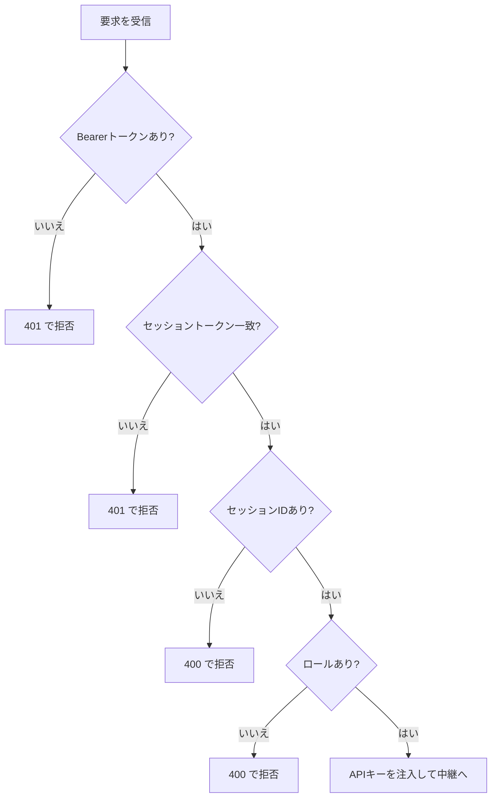

*図2-2 handleMessages の検査フロー。4段階すべてを通過して初めて中継へ進む(fail-closed)。*

検査を通過したら、いよいよ上流(Anthropic API)への要求を組み立てる。

```go
	upstreamURL := strings.TrimRight(h.cfg.AnthropicBaseURL, "/") + r.URL.Path
	upstreamReq, err := http.NewRequestWithContext(r.Context(), http.MethodPost, upstreamURL, r.Body)
	if err != nil {
		deny(http.StatusInternalServerError, "failed to build upstream request")
		return
	}
	copyProxyHeaders(upstreamReq.Header, r.Header)
	// Credential injection happens only here; the caller-provided session
	// token and 7mimi headers are stripped from the upstream request.
	upstreamReq.Header.Set("x-api-key", h.cfg.AnthropicAPIKey)
	if upstreamReq.Header.Get("anthropic-version") == "" {
		upstreamReq.Header.Set("anthropic-version", defaultAnthropicVersion)
	}
```

ここが**認証情報の差し込み(credential injection)**が起きる、本サービスで最も重要な数行である。

- `upstreamURL` は、Anthropicの接続先URLに、受け取った要求のパスを連結して作る。
- `http.NewRequestWithContext` で、上流に送る新しい要求を作る。ボディ(`r.Body`)は受け取ったものをそのまま流す。
- `copyProxyHeaders` で、安全なヘッダだけを転送する(後述)。
- `upstreamReq.Header.Set("x-api-key", h.cfg.AnthropicAPIKey)` — **ここで初めて本物のAPIキーが登場する**。上流への要求にだけ `x-api-key` ヘッダとして差し込む。agent-runner から来た要求には、このヘッダは存在しなかった。プロキシが代理で付けたのである。
- `anthropic-version` ヘッダが未設定なら既定値を補う。

つまり、agent-runner → claude-proxy の区間では要求はセッショントークンしか持たず、claude-proxy → Anthropic の区間で初めてAPIキーが付く。**APIキーが存在するのはプロキシの内側だけ**である。

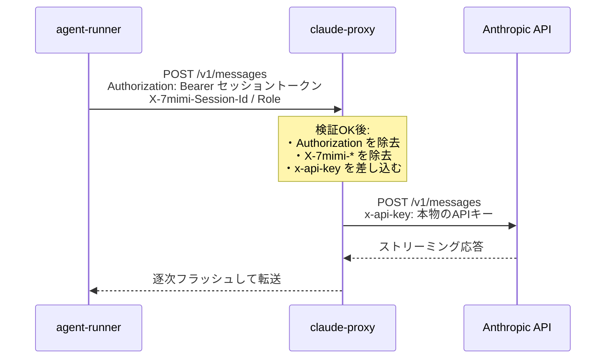

*図2-3 認証情報の差し込み。左区間はセッショントークンのみ、右区間で初めて x-api-key が現れる。*

上流へ送信し、応答を受け取る。

```go
	resp, err := h.client.Do(upstreamReq)
	if err != nil {
		deny(http.StatusBadGateway, "upstream request failed")
		return
	}
	defer resp.Body.Close()

	for key, values := range resp.Header {
		for _, v := range values {
			w.Header().Add(key, v)
		}
	}
	w.WriteHeader(resp.StatusCode)
	streamCopy(w, resp.Body)
```

- `h.client.Do(upstreamReq)` で実際に要求を送る。失敗すれば `502 Bad Gateway`(上流が応答しない)で拒否する。
- 上流の応答ヘッダを、そのままクライアントへの応答にコピーする。
- `w.WriteHeader(resp.StatusCode)` で上流のステータスコードをそのまま返す。
- `streamCopy` で応答ボディをクライアントへ流す(後述)。

最後に成功を監査ログに記録する。

```go
	h.logger.Log(audit.Event{
		SessionID: sessionID, Role: role,
		Method: r.Method, Path: r.URL.Path,
		UpstreamStatus: resp.StatusCode, DurationMS: time.Since(start).Milliseconds(),
		Decision: "allow",
	})
}
```

`Decision: "allow"`、上流ステータス、所要時間を記録する。ここでも会話内容やAPIキーは記録されない。

### 2.6 ヘッダの衛生管理(copyProxyHeaders)

第2.5節で触れた `copyProxyHeaders` を詳しく見る。これは「どのヘッダを上流へ通すか」を厳格に制御する関数である。

```go
// copyProxyHeaders forwards content/accept/anthropic-* headers only.
// Authorization (session token) and X-7mimi-* attribution headers must not
// leak to the provider.
func copyProxyHeaders(dst, src http.Header) {
	for key, values := range src {
		lower := strings.ToLower(key)
		switch {
		case lower == "content-type", lower == "accept", lower == "accept-encoding":
		case strings.HasPrefix(lower, "anthropic-"):
		default:
			continue
		}
		for _, v := range values {
			dst.Add(key, v)
		}
	}
}
```

受け取ったヘッダ群 `src` を一つずつ調べ、次のいずれかに該当するものだけを転送先 `dst` に追加する。

- `content-type`、`accept`、`accept-encoding`(内容の種類や受理形式を表す標準ヘッダ)
- `anthropic-` で始まるヘッダ(Anthropic API固有の指示)

それ以外はすべて `continue` で読み飛ばす。これは**許可リスト方式(allowlist)**である。「通してよいものを列挙し、それ以外は通さない」。

この方式が守っている重要な性質が、コメントに書かれている。`Authorization`(agent-runner が付けたセッショントークン)と `X-7mimi-*`(内部の属性情報)を**上流に漏らさない**。セッショントークンをAnthropicに送ってしまえば、内部の合言葉が外部に露出する。属性ヘッダを送れば、内部の構造が外部に見える。どちらも許可リストに載っていないので、確実に除去される。

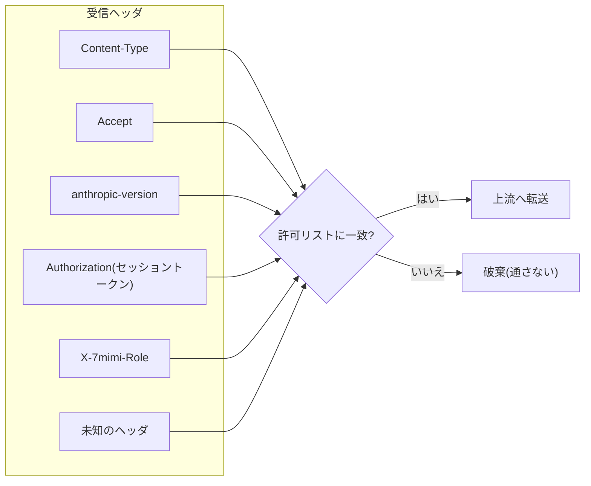

*図2-4 ヘッダの許可リスト。Content-Type/Accept/anthropic-* だけが通り、セッショントークンや内部ヘッダは破棄される。*

「拒否リスト(通さないものを列挙)」ではなく「許可リスト(通すものを列挙)」を選ぶ理由は、安全側に倒れるからである。新しいヘッダが将来増えても、許可リストに明示的に加えない限り上流へは行かない。列挙し忘れによる漏洩が起きない。

### 2.7 ストリーミングの中継(streamCopy)

大規模言語モデルの応答は、生成された順に少しずつ届く「ストリーミング」形式をとることが多い。この逐次性を保ったまま中継するのが `streamCopy` である。

```go
// streamCopy copies the upstream body flushing after each chunk so SSE
// streaming responses reach the caller incrementally.
func streamCopy(w http.ResponseWriter, body io.Reader) {
	flusher, _ := w.(http.Flusher)
	buf := make([]byte, 32*1024)
	for {
		n, err := body.Read(buf)
		if n > 0 {
			if _, werr := w.Write(buf[:n]); werr != nil {
				return
			}
			if flusher != nil {
				flusher.Flush()
			}
		}
		if err != nil {
			return
		}
	}
}
```

- `buf := make([]byte, 32*1024)` で32キロバイトの一時領域(バッファ)を用意する。
- 無限ループ `for {}` の中で、上流の応答ボディから `body.Read(buf)` で少しずつ読み、読んだ分を `w.Write(buf[:n])` でクライアントへ書く。
- `flusher.Flush()` が肝である。通常、書き込んだデータは効率のためいったん溜められてから送られる。`Flush` は「溜めずに今すぐ送れ」という指示である。これにより、モデルが生成した断片が生成されるそばからクライアントに届く。
- 上流の読み取りが終端やエラーに達したら(`err != nil`)、ループを抜ける。

もし `Flush` をしなければ、全応答が揃うまでクライアントは何も受け取れず、逐次表示ができない。この一行が、ストリーミング体験を成立させている。

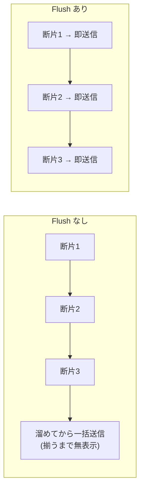

*図2-5 Flush の有無。ありの場合、生成された断片が生成そばから届き、逐次表示が成立する。*

以上でclaude-proxyの全体を読み終えた。「設定を読む→検証する→認証情報を差し込む→中継する→記録する」という流れは、次章のauth-proxyでも共通する骨格である。

---

## 第3章 auth-proxy — 複数の境界を束ねる

auth-proxy は claude-proxy よりはるかに大きい。一つのサービスの中に、性質の異なる4つの境界を同居させている。

| 境界 | パス | 役割 | 保持する認証情報 |
|---|---|---|---|
| ツール認可 | `/v1/tool/authorize` | ロールごとに許可/拒否を判定 | なし(判定のみ) |
| git中継 | `/git/{owner}/{repo}/...` | gitのHTTP通信を透過中継 | GitHub App秘密鍵 |
| MCPサーバ | `/mcp` | X・J-QuantsのデータをAIに提供 | Xトークン、J-Quantsトークン |
| Slack通知 | `/v1/slack/notify` | Slackへの投稿 | Slack botトークン |

加えて、これらを支える**セッション管理**(`/session/issue`)がある。本章では、起動時の組み立て、セッション管理、ロール認可、そしてgit中継における発展的なプロキシ技法を順に扱う。

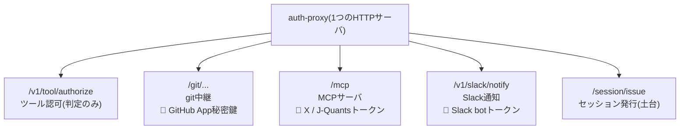

*図3-0 auth-proxy が同居させる4つの境界と、それを支えるセッション管理。*

### 3.1 起動時に境界を組み立てる(main.go)

auth-proxy の `main` 関数は、各境界を条件付きで組み立てる。

```go
func main() {
	if len(os.Args) > 1 && os.Args[1] == "-healthcheck" {
		runHealthcheck()
		return
	}
	addr := os.Getenv("AUTH_PROXY_ADDR")
	if addr == "" {
		addr = ":18081"
	}
	logger := audit.NewLogger(os.Stdout)
	handler := tools.NewHandler(policy.NewDevEngine(), logger)

	// ADR-028: a single shared session.Store backs both /session/issue (mint)
	// and the /mcp + /git consumers (resolve/validate), so one minted token
	// works across both surfaces.
	sessionStore := session.NewStore(sessionStoreOptionsFromEnv()...)

	mux := http.NewServeMux()
	mux.Handle("/", handler.Routes())
	mountGitRelay(mux, logger, sessionStore)
	mountXMCP(mux, logger, sessionStore)
	mountSlackNotify(mux, logger)
	mountSessionIssue(mux, sessionStore)

	log.Printf("auth-proxy listening on %s", addr)
	if err := http.ListenAndServe(addr, mux); err != nil {
		log.Fatalf("auth-proxy: %v", err)
	}
}
```

claude-proxy との構造上の違いは、一つの `mux`(振り分け表)に**複数のハンドラを後付けで登録していく**点である。`mount...` で始まる関数群がそれぞれ一つの境界を担当する。

重要なのは、これらの `mount` 関数が**必要な認証情報が揃っているときだけ経路を有効化する**ことである。git中継を担う `mountGitRelay` を見る。

```go
func mountGitRelay(mux *http.ServeMux, logger *audit.Logger, store *session.Store) {
	sessionToken := os.Getenv("AUTH_PROXY_SESSION_TOKEN")
	if sessionToken == "" {
		log.Printf("git relay disabled: no session token configured")
		return
	}

	tokens, err := githubapp.NewTokenSourceFromEnv()
	if err != nil {
		log.Printf("git relay disabled: github app credentials unavailable")
		return
	}
	// ... 中略 ...
	mux.Handle("/git/", relay.Routes())
}
```

セッショントークンが未設定なら、`git relay disabled` とだけ記録して `return` する。**経路そのものを登録しない**。登録しなければ `/git/` へのアクセスは「存在しないパス」として `404` になる。GitHub App の認証情報がなければ、同様に登録しない。

これは fail-closed の一形態である。設定が不完全な機能を「一見動くが実は無防備」な状態で公開するのではなく、そもそも生やさない。記録されるメッセージにも認証情報は一切含まれない(「no session token configured」「credentials unavailable」といった事実だけ)。

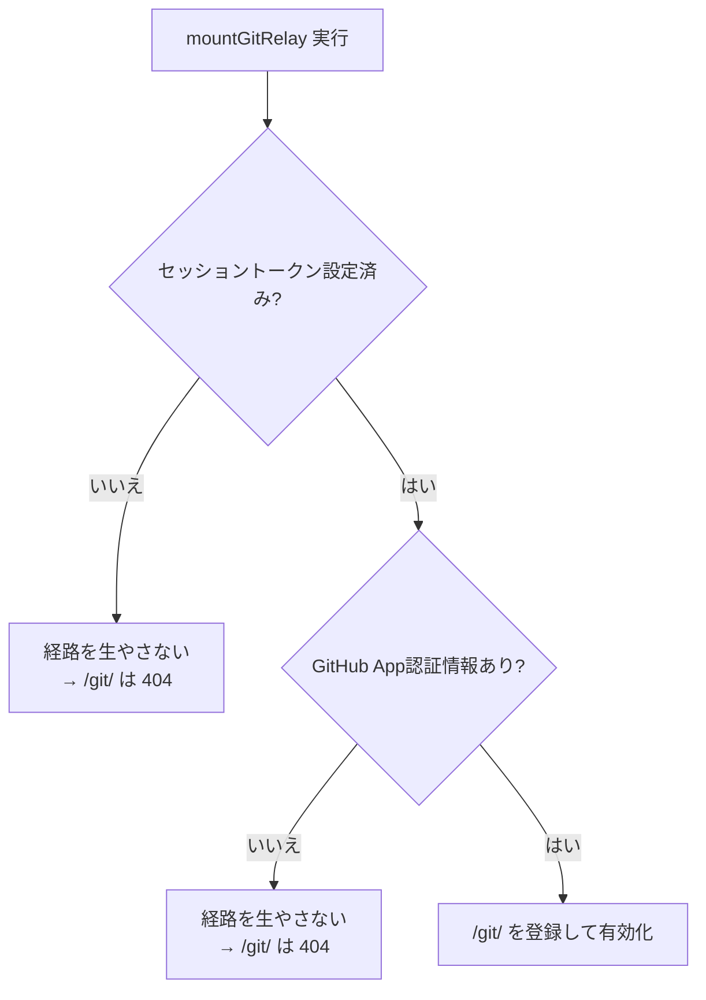

*図3-1 条件付き有効化。必要な認証情報が揃わない境界は「無防備に公開」ではなく「そもそも存在しない」。*

### 3.2 セッション管理 — 短命でロールに縛られたトークン(session.go)

auth-proxy の認可設計の中核が、`session` パッケージである。目的は、AIエージェントに渡すトークンを「短命で、特定のロールに縛られ、使用回数に上限がある」ものにすることである。

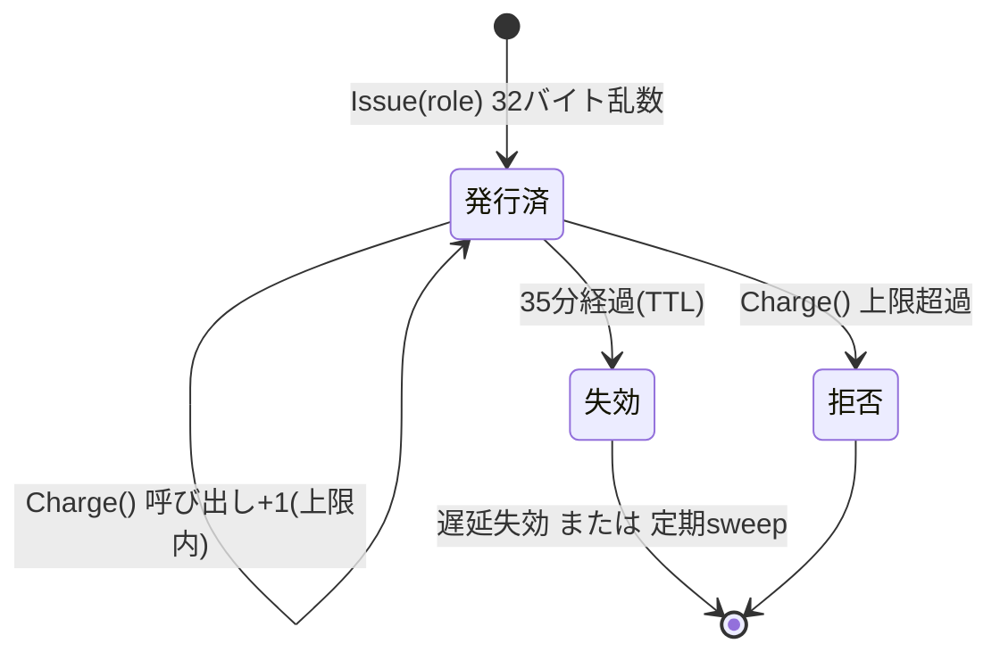

*図3-2 セッショントークンの一生。発行 → 使用(回数制限)→ 失効(TTL)→ 削除。*

まず、トークン一件分の情報を表す構造体と、それを束ねる保管庫を見る。

```go
const defaultTTL = 35 * time.Minute
const sweepInterval = 5 * time.Minute

type entry struct {
	role      string
	expiresAt time.Time
	calls     int
}

// Store holds minted session tokens in memory, guarded by a mutex.
type Store struct {
	mu        sync.RWMutex
	entries   map[string]*entry
	ttl       time.Duration
	callCap   int
	stopSweep chan struct{}
}
```

- `entry` は1トークンの状態である。どのロールに縛られているか(`role`)、いつ失効するか(`expiresAt`)、これまで何回使われたか(`calls`)。
- `Store` はトークン文字列から `entry` を引くための地図(`map[string]*entry`)を持つ。TTL(有効期間、既定35分)、呼び出し上限(`callCap`)も持つ。
- `mu sync.RWMutex` は**ミューテックス(排他制御)**である。複数の要求が同時にこの地図を読み書きすると、データが壊れる危険がある。ミューテックスは「今は私が使っているので待て」という札で、同時アクセスを整理する。

トークンを発行する `Issue` メソッドを見る。

```go
func (s *Store) Issue(role string) (string, time.Duration) {
	token := generateToken()
	s.mu.Lock()
	s.entries[token] = &entry{role: role, expiresAt: time.Now().Add(s.ttl)}
	s.mu.Unlock()
	return token, s.ttl
}

func generateToken() string {
	buf := make([]byte, 32)
	if _, err := rand.Read(buf); err != nil {
		// crypto/rand failures are effectively unrecoverable; panic rather
		// than mint a predictable token.
		panic("session: crypto/rand read failed: " + err.Error())
	}
	return hex.EncodeToString(buf)
}
```

- `generateToken` は `crypto/rand`(暗号論的に安全な乱数生成器)から32バイトの乱数を読み、16進文字列に変換する。32バイト=256ビットの乱数であり、推測は事実上不可能である。乱数生成に失敗した場合は `panic` でプログラムを止める。予測可能なトークンを発行するくらいなら止まる方が安全、という判断である。
- `Issue` は、生成したトークンをロールと失効時刻に結びつけて地図に登録する。`s.mu.Lock()` と `s.mu.Unlock()` で挟むことで、登録中に他の要求が割り込まないようにしている。

発行したトークンを検証する側を見る。まず、トークンからロールを引く `Resolve`。

```go
func (s *Store) Resolve(token string) (string, bool) {
	s.mu.Lock()
	defer s.mu.Unlock()
	e, ok := s.entries[token]
	if !ok {
		return "", false
	}
	if time.Now().After(e.expiresAt) {
		delete(s.entries, token)
		return "", false
	}
	return e.role, true
}
```

- 地図にトークンがなければ「無効」(`false`)。
- 現在時刻が失効時刻を過ぎていれば、その場でエントリを削除して「無効」を返す。これを**遅延失効(lazy expiry)**という。参照した瞬間に期限切れを検出して掃除する。
- 有効なら、縛られているロールを返す。

呼び出し回数の上限を課す `Charge` メソッドが、コスト制御の要である。

```go
func (s *Store) Charge(token string) bool {
	s.mu.Lock()
	defer s.mu.Unlock()
	e, ok := s.entries[token]
	if !ok {
		return false
	}
	if time.Now().After(e.expiresAt) {
		delete(s.entries, token)
		return false
	}
	e.calls++
	return e.calls <= s.callCap
}
```

`Charge` はトークンの使用回数を1増やし、上限(`callCap`、既定60回)以内なら `true`、超えたら `false` を返す。/mcp境界はツールを呼ぶたびにこの `Charge` を通す。AIが暴走して無限に検索を繰り返そうとしても、この決定的な上限が確実に止める。プロンプトによる「なるべく控えめに」という指示は補助であって、最終的な歯止めはこのコードにある。

遅延失効だけでは、二度と参照されないトークンが地図に残り続ける。そこで背景で定期的に掃除する仕組みを持つ。

```go
func (s *Store) sweep() {
	now := time.Now()
	s.mu.Lock()
	defer s.mu.Unlock()
	for token, e := range s.entries {
		if now.After(e.expiresAt) {
			delete(s.entries, token)
		}
	}
}
```

`sweep` は地図全体を走査し、失効済みのエントリを削除する。これを5分ごとに実行する背景処理(goroutine)が `NewStore` の中で起動される。goroutine はGoの軽量な並行処理単位で、`go 関数()` と書くだけで別の実行の流れとして動き出す。

トークンを発行する入口が `/session/issue` である(main.go)。

```go
func handleSessionIssue(staticToken string, store *session.Store) http.HandlerFunc {
	return func(w http.ResponseWriter, r *http.Request) {
		const prefix = "Bearer "
		auth := r.Header.Get("Authorization")
		if !strings.HasPrefix(auth, prefix) || subtle.ConstantTimeCompare([]byte(auth[len(prefix):]), []byte(staticToken)) != 1 {
			http.Error(w, "unauthorized", http.StatusUnauthorized)
			return
		}
		// ... ロールを読み取り、store.Issue でトークンを発行して返す ...
```

トークンを発行できるのは、**静的な管理トークン(`staticToken`)を持つ者だけ**である。これはオーケストレーター(全体を統括するPython側)だけが保持する。AIエージェント自身はトークンを発行できない。オーケストレーターがAIを起動する直前に、そのAIのロールに縛られた短命トークンを発行し、AIに渡す。

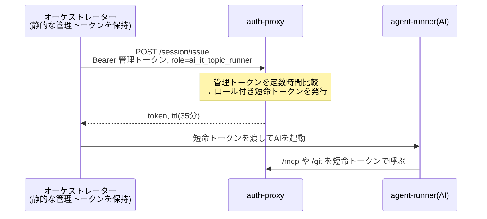

*図3-3 誰が何を持つか。管理トークンはオーケストレーターだけ、AIは短命トークンだけ。AIは自分でトークンを発行できない。*

ここで `subtle.ConstantTimeCompare` に注目する。通常の文字列比較(`==`)は、先頭から比べて違いが出た時点で終わる。すると「一致した文字数」が処理時間に表れ、攻撃者が時間を測ってトークンを一文字ずつ推測する「タイミング攻撃」が理論上可能になる。`ConstantTimeCompare` は、一致・不一致によらず常に同じ時間で比較し、この漏洩を塞ぐ。認証情報の比較では標準的な作法である。

### 3.3 ロールとツールの認可(policy.go)

「どのロールがどのツールを使ってよいか」を判定するのが `policy` パッケージである。これは認証情報を扱わない、純粋な判定ロジックである。

```go
// RolePolicy holds glob-style allow/deny tool patterns. Deny wins over allow;
// anything not explicitly allowed is blocked (default deny).
type RolePolicy struct {
	Allow []string
	Deny  []string
}
```

一つのロールは、許可パターンの一覧(`Allow`)と拒否パターンの一覧(`Deny`)を持つ。コメントが判定の3原則を述べている。**拒否は許可に優先する**。**明示的に許可されていないものはすべて拒否**する(default deny、既定拒否)。

判定の本体 `Decide` を見る。

```go
func (e *Engine) Decide(role, toolName string) Decision {
	rolePolicy, ok := e.roles[role]
	if !ok {
		return block(fmt.Sprintf("unknown role or missing role policy: %s", role))
	}
	for _, pattern := range rolePolicy.Deny {
		if matched, err := path.Match(pattern, toolName); err == nil && matched {
			return block(fmt.Sprintf("tool denied for role %s: %s", role, pattern))
		}
	}
	for _, pattern := range rolePolicy.Allow {
		if matched, err := path.Match(pattern, toolName); err == nil && matched {
			return allow("allowed")
		}
	}
	return block(fmt.Sprintf("tool not allowed for role %s: %s", role, toolName))
}
```

判定は次の順で進む。

1. そのロールの方針が登録されていなければ拒否(未知のロールは通さない)。
2. 拒否パターンのいずれかに一致すれば拒否。`path.Match` はワイルドカード照合で、例えば `jq.*` は `jq.get_listed_info` などに一致する。
3. 許可パターンのいずれかに一致すれば許可。
4. どちらにも一致しなければ拒否(既定拒否)。

この関数は決定的である。同じ入力には常に同じ判定を返し、AIの気分や乱数に左右されない。セキュリティ上の判断を、非決定的なAIの外側の、この確定したコードに置いていることが要点である。

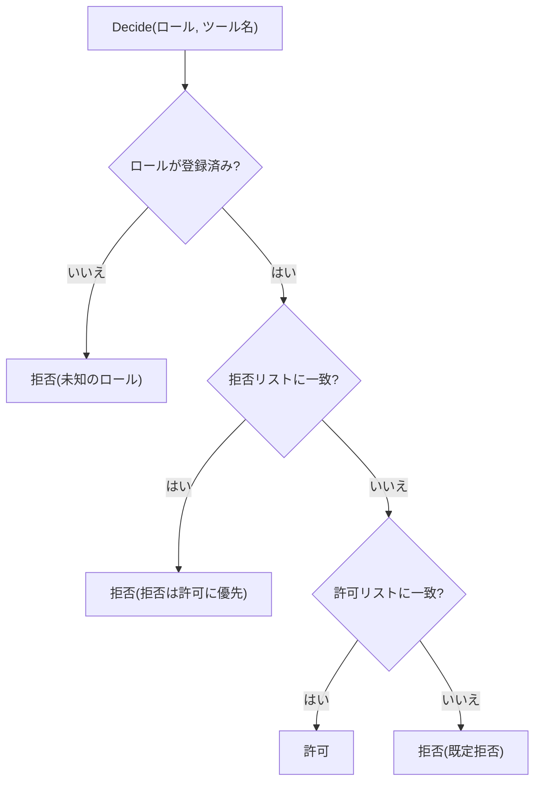

*図3-4 Decide の判定順。①未知ロール拒否 → ②拒否優先 → ③許可 → ④どれでもなければ既定拒否。*

実際のロール方針の一例を見る。投資シグナル収集ロールの定義である。

```go
"investment_signal_runner": {
	Allow: []string{
		"x.search_posts_recent",
		"slack.post_digest",
	},
	Deny: []string{
		"x.create_post",
		"x.like_post",
		"x.repost",
		"x.follow_user",
		"x.send_dm",
		"jquants.*",
		"trading.*",
		// ... 中略 ...
	},
},
```

このロールが許されるのは、Xの最近の投稿を検索すること(`x.search_posts_recent`)とSlackへの投稿(`slack.post_digest`)だけである。一方、Xへの書き込み(投稿・いいね・リポスト・フォロー・DM)、J-Quants関連(`jquants.*`)、取引関連(`trading.*`)はすべて明示的に拒否される。「読むことはできるが書くことはできない」という制約が、コードとして固定されている。

### 3.4 git中継 — 発展的なプロキシ技法(gitrelay.go)

git中継は、本書で最も高度なプロキシ技法を含む。AIがコンテナ内で普通の `git clone` や `git push` を実行すると、その通信がauth-proxyを経由し、auth-proxyがGitHub向けの認証を代理で差し込んでGitHubへ中継する。AIはGitHubの認証情報を一切見ない。

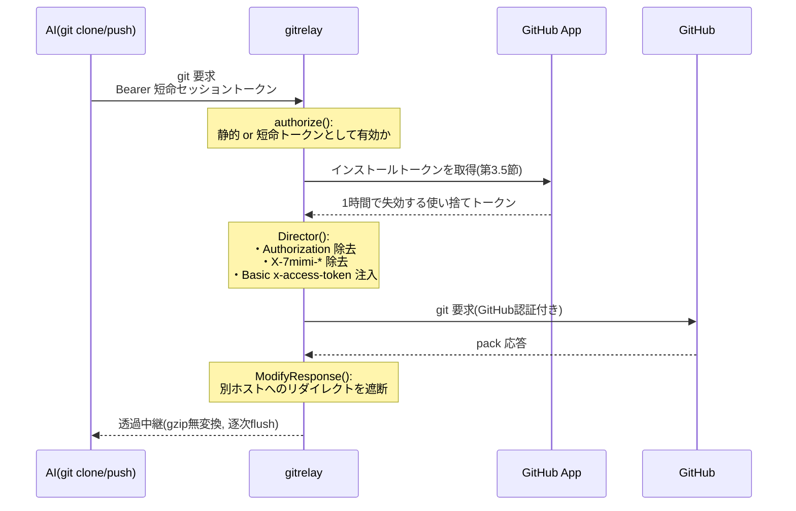

*図3-5 git中継の全体像。AIはGitHub認証を一切見ず、gitrelayが短命トークンを取得して代理注入する。*

まず認可を見る。第2.5節と同じくBearerトークンを検証するが、2種類のトークンを受け付ける。

```go
func (h *Handler) authorize(w http.ResponseWriter, r *http.Request) bool {
	const prefix = "Bearer "
	auth := r.Header.Get("Authorization")
	if !strings.HasPrefix(auth, prefix) {
		http.Error(w, "unauthorized", http.StatusUnauthorized)
		return false
	}
	token := auth[len(prefix):]
	if subtle.ConstantTimeCompare([]byte(token), []byte(h.sessionToken)) == 1 {
		return true
	}
	// ADR-028: a role-bound session token minted via POST /session/issue is
	// also valid here (validity only, no role check -- git relay has no
	// tool-level distinctions to enforce).
	if h.store != nil && h.store.Valid(token) {
		return true
	}
	http.Error(w, "unauthorized", http.StatusUnauthorized)
	return false
}
```

静的な管理トークンに一致するか、あるいは `/session/issue` で発行された短命トークンとして有効(`store.Valid`)であれば通す。git中継はツール単位の区別を持たないので、ロールまでは見ず、有効性だけを確認する。

中継の本体は、Goの標準ライブラリ `httputil.ReverseProxy` を使う。これは「リバースプロキシ」を作るための部品で、要求を上流に転送し応答を戻す骨組みを提供する。7mimi-agent はこの骨組みに独自の振る舞いを差し込む。

```go
	rp := &httputil.ReverseProxy{
		FlushInterval: -1,
		Transport: &http.Transport{
			DialContext:           (&net.Dialer{Timeout: 10 * time.Second}).DialContext,
			TLSHandshakeTimeout:   10 * time.Second,
			ResponseHeaderTimeout: 30 * time.Second,
			// Protocol-transparent relay: never let Go auto-negotiate/decompress
			// gzip on our behalf, or Content-Encoding/body bytes would diverge
			// from what upstream actually sent.
			DisableCompression: true,
		},
```

3つの設定がgit通信特有の要求に対応している。

- `FlushInterval: -1` は「受け取った端から即座に送れ」を意味する。gitのpack転送は要求と応答が交互に噛み合う対話的なやりとりで、溜め込むと停止(ハング)する。第2.7節の `Flush` と同じ発想である。
- `DisableCompression: true` は「Goが勝手にgzip圧縮を交渉・解凍するな」を意味する。gitのデータはgit自身が管理する。プロキシが途中で解凍してしまうと、`Content-Encoding` ヘッダと実データが食い違い、gitのプロトコルが壊れる。**透過的に、一バイトも変えずに中継する**ためにこれを無効化する。
- 各種タイムアウトは接続確立やヘッダ受信に上限を設けるが、応答本体の転送には全体の締め切りを設けない。大きなクローンが途中で打ち切られないようにするためである。

次に `Director`(要求を上流向けに書き換える関数)を見る。ここに認証情報の差し込みがある。

```go
		Director: func(req *http.Request) {
			req.URL.Scheme = upstreamURL.Scheme
			req.URL.Host = upstreamURL.Host
			req.Host = upstreamURL.Host
			req.URL.Path = upstreamURL.Path + "/" + owner + "/" + repo + ".git/" + upstreamSuffix

			req.Header.Del("Authorization")
			for name := range req.Header {
				if strings.HasPrefix(strings.ToLower(name), "x-7mimi-") {
					req.Header.Del(name)
				}
			}
			req.Header.Set("Authorization", "Basic "+basicAuth("x-access-token", token))
		},
```

- 上流(GitHub)のスキーム・ホスト・パスを設定する。パスは `owner/repo.git/...` の形に組み立てる。
- `req.Header.Del("Authorization")` で、AIが付けたセッショントークンを**除去する**。第2.6節の許可リストと同じ思想で、内部の合言葉を外部に漏らさない。
- `X-7mimi-` で始まる内部ヘッダも除去する。
- そして `req.Header.Set("Authorization", "Basic "+...)` で、GitHub向けの認証を**差し込む**。ここで使う `token` は、GitHub App が発行した短命のインストールトークンである(第3.5節)。`basicAuth` はBasic認証形式(利用者名とパスワードをコロンで繋ぎbase64符号化)を組み立てる小さな関数である。

```go
func basicAuth(username, password string) string {
	return base64.StdEncoding.EncodeToString([]byte(username + ":" + password))
}
```

最後に `ModifyResponse`(応答を検査・書き換える関数)を見る。これはセキュリティ上の防御である。

```go
		ModifyResponse: func(resp *http.Response) error {
			if resp.StatusCode >= 300 && resp.StatusCode < 400 {
				location := resp.Header.Get("Location")
				if location != "" {
					locURL, err := url.Parse(location)
					if err == nil && locURL.Host != "" && locURL.Host != upstreamHost {
						return errors.New("gitrelay: cross-host redirect blocked")
					}
					if err == nil {
						locURL.User = nil
						resp.Header.Set("Location", locURL.String())
					}
				}
			}
			statusCapture.statusCode = resp.StatusCode
			return nil
		},
```

`3xx` はリダイレクト(別の場所へ誘導する応答)である。上流が「別のホストへ行け」と誘導してきた場合、その誘導先へは今差し込んだGitHub認証が付いたまま追従してしまう恐れがある。そこで、誘導先のホストが本来の上流(GitHub)と異なれば、**異なるホストへのリダイレクトを遮断する**(エラーを返す)。同一ホスト内の誘導でも、URLに埋め込まれた認証情報(`locURL.User`)を除去する。認証情報が意図しない宛先へ漏れる経路を塞いでいる。

この一連の技法 — 逐次フラッシュ、圧縮の無効化、認証情報の除去と差し込み、リダイレクトの検査 — は、いずれも「透過的に、かつ安全に」中継するための実務的な工夫である。単純な claude-proxy にはなかった、実プロトコルの機微に対応した層である。

### 3.5 GitHub App による短命トークンの発行(githubapp.go)

git中継が差し込むGitHub認証は、固定のパスワードではない。GitHub App の仕組みを使い、**1時間で失効する使い捨てトークンを、必要になるたびにその場で発行する**。漏れても被害が1時間・対象リポジトリに限定される。

トークン発行の第一歩は、App の秘密鍵で署名した JWT(JSON Web Token)を作ることである。JWTは「ヘッダ・主張・署名」の3部をドットで繋いだ認証用の文字列である。

```go
// appJWT mints a short-lived RS256 App JWT per GitHub App auth requirements.
func (t *TokenSource) appJWT() (string, error) {
	now := time.Now()
	header := map[string]string{"alg": "RS256", "typ": "JWT"}
	claims := map[string]any{
		"iat": now.Add(-60 * time.Second).Unix(),
		"exp": now.Add(540 * time.Second).Unix(),
		"iss": t.appID,
	}

	headerJSON, err := json.Marshal(header)
	if err != nil {
		return "", err
	}
	claimsJSON, err := json.Marshal(claims)
	if err != nil {
		return "", err
	}

	signingInput := base64URLEncode(headerJSON) + "." + base64URLEncode(claimsJSON)
	digest := sha256.Sum256([]byte(signingInput))
	signature, err := rsa.SignPKCS1v15(rand.Reader, t.privateKey, crypto.SHA256, digest[:])
	if err != nil {
		return "", errors.New("failed to sign app jwt")
	}

	return signingInput + "." + base64URLEncode(signature), nil
}
```

順に読む。

- `header` は署名方式(`RS256`、RSA鍵とSHA-256を使う署名)と種別(`JWT`)を宣言する。
- `claims` は主張である。`iat`(発行時刻、時計のずれを吸収するため60秒前に設定)、`exp`(失効時刻、9分後)、`iss`(発行者、App のID)を含む。
- ヘッダと主張をそれぞれJSON化し、base64URL符号化してドットで繋ぐ。これが「署名対象の文字列」`signingInput` である。
- `sha256.Sum256` でその文字列のハッシュ(要約値)を計算し、`rsa.SignPKCS1v15` でApp秘密鍵を使って署名する。署名は「この文字列は確かにこの秘密鍵の持ち主が作った」ことを証明する。
- 最後に、署名対象と署名をドットで繋いで完成したJWTを返す。

このJWTをGitHubに提示すると、GitHubはApp公開鍵で署名を検証し、正当なら「インストールアクセストークン」を発行する。auth-proxy はそれを取得してキャッシュし(有効期間が短いので期限が近づくと再発行し)、第3.4節の `Director` でgit要求に差し込む。

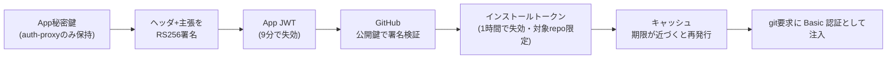

*図3-6 短命トークンの発行連鎖。秘密鍵は外に出ず、漏れても被害が1時間・対象リポジトリに限定される。*

パッケージ冒頭のコメントが、このパッケージの守るべき一線を述べている。「App秘密鍵も、署名したJWTも、発行したインストールトークンも、決してログに残さない」。認証情報を扱うコードほど、それを漏らさないことに神経を使う。秘密鍵の読み込みも、PKCS1・PKCS8という2つの標準形式に対応し、RSA鍵でなければエラーにするなど、堅牢に作られている。

---

## 第4章 全体を貫く設計原則

2つのサービスを読み終えた。最後に、両者に共通する設計原則を明文化する。これらは個々のコードの背後にある一貫した思想であり、7mimi-agentのセキュリティ設計そのものである。

### 4.1 認証情報の境界

本物の認証情報は、それを必要とする境界サービスだけが保持する。claude-proxy は `ANTHROPIC_API_KEY` を、auth-proxy はGitHub App秘密鍵・Xトークン・Slackトークンを持つ。AIが動くagent-runner は、これらを一切持たない。持つのは、その場限りで失効する短命のセッショントークンだけである。

認証情報は「中継する瞬間」にだけ、上流向けの要求に差し込まれる。agent-runner → プロキシの区間には存在せず、プロキシ → 外部サービスの区間で初めて現れる。

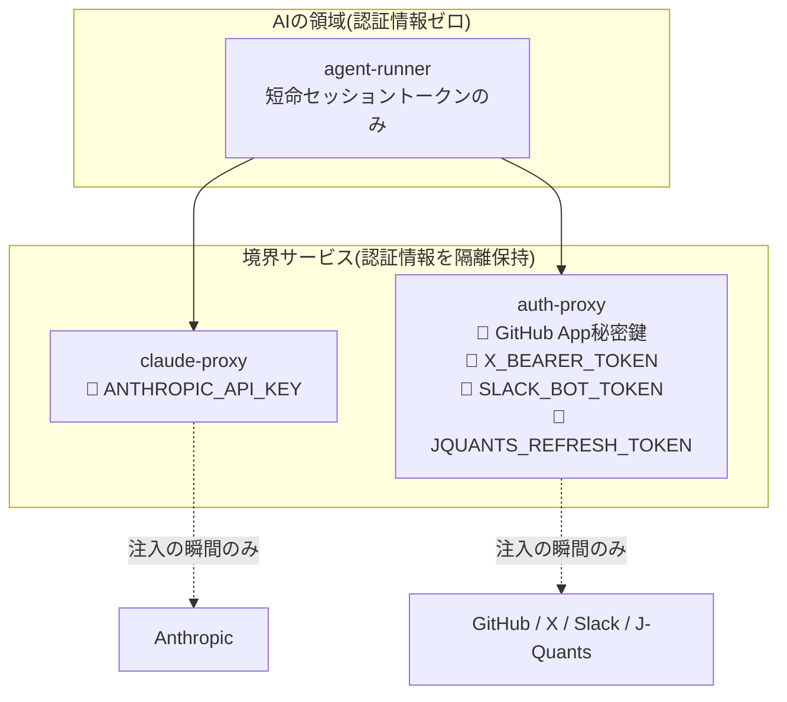

*図4-1 認証情報の所在マップ。すべての鍵は境界サービス側にあり、AIの領域には一つも存在しない。*

### 4.2 fail-closed と fail-open の使い分け

- **セキュリティの根幹は fail-closed**: 必須の認証情報が欠ければ起動を拒否(config.go)、検証を通らなければ要求を拒否(handleMessages、authorize)、設定が不完全な境界は経路自体を生やさない(mountGitRelay)、未知のロールや未許可ツールは拒否(Decide)。疑わしきは通さない。
- **補助機能は fail-open**: 監査ログの書き出しに失敗しても本業を止めない(audit.go)。ログが本業を殺してはならない。

この使い分けは、どこで安全側に倒し、どこで可用性を優先するかの明確な意思表示である。

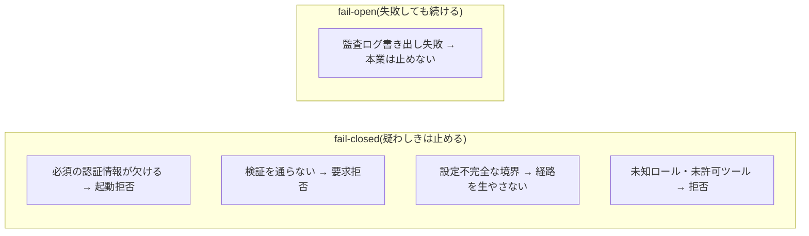

*図4-2 fail-closed と fail-open の使い分け。セキュリティの根幹は止め、補助機能は本業を殺さない。*

### 4.3 許可リストと決定的判定

通してよいものを列挙する許可リスト方式(copyProxyHeaders、policy.Decide)を一貫して用いる。列挙し忘れは「漏れる」のではなく「通らない」方向に働くため、安全側に倒れる。

そして、セキュリティ上の判定はすべて、非決定的なAIの外側にある確定したコードで行う。ロール認可、呼び出し回数の上限、ヘッダの取捨、リダイレクトの遮断 — いずれもAIの判断ではなくGoのコードが決める。AIには「何をしたいか」を委ね、「してよいか」「どう繋ぐか」は境界サービスが決める。

### 4.4 秘密を記録しない監査

監査は徹底するが、記録に秘密は残さない。監査イベントの型が、そもそも会話内容や認証情報を持てないように設計されている(audit.Event)。「いつ・誰が・何を・結果は」は残し、「中身」は残さない。

---

## むすび

claude-proxy は「設定を読む→検証する→認証情報を差し込む→中継する→記録する」という骨格を最小の形で示し、auth-proxy はその骨格の上に、セッション管理・ロール認可・実プロトコルに対応した透過中継・短命トークン発行という層を重ねていた。

これらのコードを貫くのは、「AIを信頼する」のではなく「AIが誤っても、あるいは乗っ取られても、システムとして壊れない側に置く」という設計思想である。認証情報を渡さず、経路を境界に限定し、判定を決定的なコードに委ね、すべてを(秘密を除いて)記録する。Go の標準ライブラリ — `net/http`、`httputil.ReverseProxy`、`crypto/*` — は、この思想を簡潔なコードで実現するのに十分な部品を提供している。

本書で読んだのは200行と数百行の、決して大きくないプログラムである。しかし小さいからこそ、境界サービスが担うべき責務 — 認証情報の隔離、決定的な認可、透過的な中継、秘密を残さない監査 — が、余分なものなく現れている。
