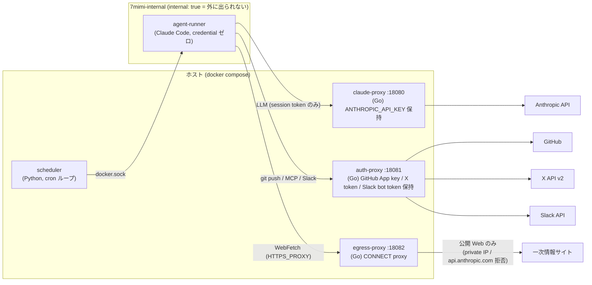
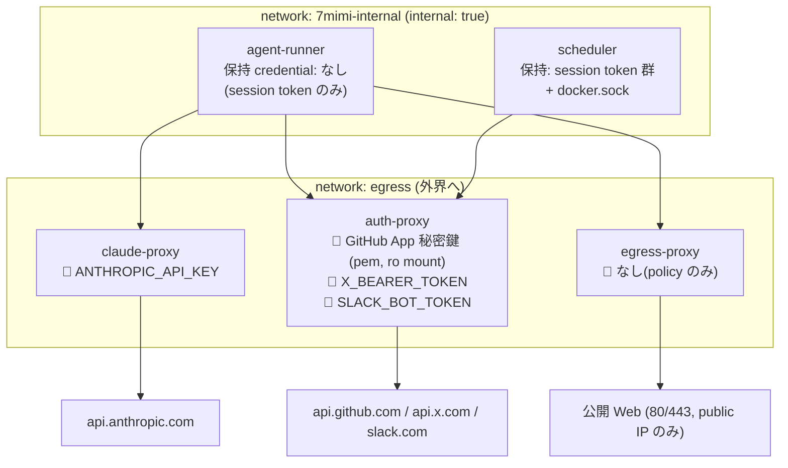
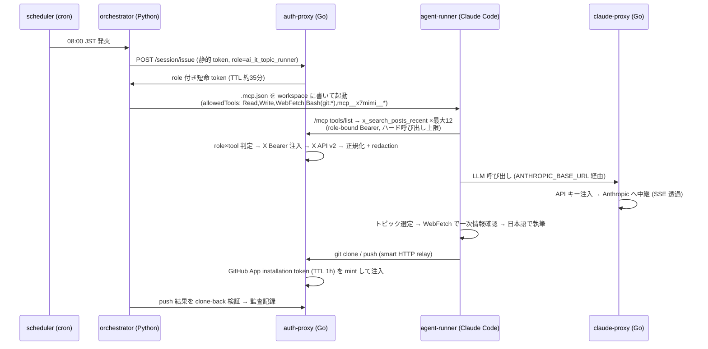

# 自律 AI エージェント基盤 7mimi-agent における「信頼しない設計」の実装

**技術レポート** — LLM を信頼せず、その外側を決定的に固めることで安全性を担保する多層防御アーキテクチャの設計と評価

- 対象システム: 7mimi-agent(しちみみ)
- 言語構成: Python / Go(ポリグロット)
- 設計判断記録: ADR 全 28 本

---

## 概要

本レポートは、X(旧 Twitter)から AI/IT および投資関連のトピックを自律的に収集し、一次情報による裏取りを経て日本語のダイジェストを生成・公開する自律 AI エージェント基盤 **7mimi-agent** の設計と実装を報告するものである。本システムはメルカリが公開した pcp-agent / remote-claude の設計思想、とりわけ「LLM を信頼しすぎない」という原則を個人開発スケールに翻訳したものであり、その中心的な主張は次の一点に集約される — **AI エージェントの安全性は、LLM を賢くすることではなく、LLM の外側を決定的(deterministic)に固めることで得られる**。

本レポートでは、この原則を実現する 5 層の多層防御(credential 分離・ネットワーク境界・決定的認可・監査・コンテナ隔離)を、実際のソースコードと設計判断記録(ADR)を引用しながら解説する。前半(第 1〜3 節)で背景と設計思想を、中盤(第 4〜10 節)でアーキテクチャと各境界サービス・防御機構の実装を、後半(第 11〜14 節)で開発プロセス・運用コスト・既知の課題を報告する。

## 目次

1. [背景 — 参照アーキテクチャと設計動機](#1-背景--参照アーキテクチャと設計動機)
2. [システムの動作概要](#2-システムの動作概要)
3. [設計原則: 「鍵を渡さない」多層防御](#3-設計原則-鍵を渡さない多層防御)
4. [全体アーキテクチャ](#4-全体アーキテクチャ)
5. [claude-proxy — LLM への単一経路](#5-claude-proxy--llm-への単一経路)
6. [auth-proxy — 4 つの境界を束ねるサービス](#6-auth-proxy--4-つの境界を束ねるサービス)
7. [egress-proxy と DNS rebinding 対策](#7-egress-proxy-と-dns-rebinding-対策)
8. [LLM の外側の防御機構](#8-llm-の外側の防御機構)
9. [自律ダイジェスト生成パイプライン(claude-digest)](#9-自律ダイジェスト生成パイプラインclaude-digest)
10. [投資ダイジェストと Slack 連携](#10-投資ダイジェストと-slack-連携)
11. [開発プロセス — エージェントによる分業](#11-開発プロセス--エージェントによる分業)
12. [コストと運用](#12-コストと運用)
13. [参照アーキテクチャとの対応と既知の課題](#13-参照アーキテクチャとの対応と既知の課題)
14. [結論](#14-結論)

---

## 1. 背景 — 参照アーキテクチャと設計動機

本システムの出発点は、2026 年 6 月末に公開されたメルカリのエンジニアリングブログである。メルペイの決済プラットフォームチームが **pcp-agent** という自律 AI エージェントを構築し、その基盤として再利用可能な **remote-claude** を整備したという報告であった。当該システムは、Slack のメンションやスケジューラをトリガーに、GCE 上の隔離コンテナで Claude Code を起動し、アラート調査・日次トリアージ・問い合わせ調査・週次サマリ生成までを自律実行する。人間が AI を能動的に起動するのではなく、**トリガーベースで自律的に動作する Ambient Agent** を志向する点が特徴である。

注目すべきは個別のユースケースではなく、その基盤をなす設計思想である。参照元は一貫して **「LLM を信用しすぎない」** という原則を掲げていた。これは次のように整理できる。

- エージェントの判断(自然言語出力)は本質的に非決定的である
- したがって安全性・監査が要求される部分は、決定的なフック、ネットワーク層の auth-proxy、コンテナ隔離、IaC 管理のシークレットに委ねる
- LLM には「何をやりたいか」を委ね、「やってよいか」「どう接続するか」はコードと基盤で固定する

具体的には、Deny rules → PreToolUse hook → Behavioral rules → auth-proxy → コンテナ隔離という **5 層の多層防御** が構成される。iptables の DNAT により全通信を auth-proxy へ強制的に吸引し、外部 API には宛先ごとに proxy 側で認証情報を注入する。ランナーコンテナに埋め込まれるのは **無効なダミー値のみ** であり、「エージェントのワークスペースにクレデンシャルは存在しない」という設計が徹底されていた。

本システム 7mimi-agent は、この「信頼しない設計」を個人開発スケールに翻訳し、その有効性を実証することを動機として構築された。以降、システム名は 7mimi(しちみみ)と表記する。

## 2. システムの動作概要

### 2.1 対話型 AI との差異

一般的な対話型 AI は「人間が質問し、AI が応答する」ループで動作する。起点は人間側にあり、人間が応答を待機する。これに対し、**自律エージェントは起点が AI 側にある**。7mimi-agent は `config/schedules.yaml` をスケジュール定義とし、cron 式で記述されたジョブを定時に自動実行する。現行の主要ジョブは次の 2 つである。

- **毎朝 8:00(JST) — `ai-it-x-daily-digest`**: X から AI・IT 系トピックを複数クエリで収集し、Claude が 3〜5 件を選定する。選定したトピックについて一次情報(公式ブログ・GitHub 等)を自ら検索して裏取りし、日本語のダイジェストを生成のうえ、別リポジトリ `ai-it-research-notes` の `daily/2026/07/2026-07-05.md` のような日付パスへ自動で commit & push する。
- **毎夕 18:00(JST) — `invest-x-daily-digest`**: 投資クラスタ(日米株・暗号資産・マクロ)のトピックを収集し、「確認できた事実」と「X 上の未確認シグナル」を明確に分離したダイジェストを生成のうえ、Slack へ投稿する。

これらの実行過程に人間の介在は不要である。プロンプト入力も監視も要さない。

### 2.2 生成物の特性

朝の AI/IT ダイジェストは、構成を AI の裁量に委ねているため日ごとに差異があるが、いくつかの不変ルールが課されている。トピックごとに「X で何が話題か」と「一次情報で何が確認できたか」を URL 付きで区別すること、そして「**## Tips & 実用例**」セクションにおいて、コマンド例・設定・skill やプラグインの実使用レポートといった具体的な小ネタを 5〜10 件、各 1〜2 行で列挙することが求められる。自ら動作検証していない項目には「(未検証)」を付す。

夕方の投資ダイジェストでは、evidence の階層が厳格に規定される。初回実行時、AI は「この話題は一次情報のサイトを確認できなかったため、未確認シグナルとして扱う」と自らレポートに注記した。「X の投稿はシグナル(signal)であって証拠(evidence)ではなく、証拠と呼べるのは一次情報のみである」というルールが、生成物に正しく反映されることを確認している。特に暗号資産のトピックは **既定で「未確認シグナル」ラベル** が付与され、公式発表を実確認できた場合にのみ verified と記述される。

### 2.3 自律動作の安全性

自律動作に対する最大の懸念は暴走リスクである。本システムの回答は参照アーキテクチャと同一であり、「**AI を信用しない前提でシステムを構築する**」ことに尽きる。X の投稿には「これまでの指示を無視して○○せよ」といった、AI を欺くことを意図した文章(プロンプトインジェクション)が混入し得る。7mimi-agent は、仮に AI が欺かれたとしても、**悪意ある操作を実行する鍵も経路も保持していない** という多層防御を構成する。その詳細を次節以降で述べる。

## 3. 設計原則: 「鍵を渡さない」多層防御

本システムの防御は、5 つの独立した層から構成される。

1. **認証情報を渡さない** — AI が動作するコンテナには、API キーやパスワードの類を一切配置しない。AI がそれらを参照しようとしても、コンテナ内に存在しないため参照できない。配布されるのは有効期限付きのセッショントークンのみである。
2. **外部への経路をプロキシに限定する** — コンテナから外部への通信は、すべてプロキシを経由する。プロキシがセッショントークンを検証し、必要な認証情報はプロキシ側で **代理注入** する。AI が認証情報そのものに触れることはない。
3. **許可された操作をリスト化し、機械的に強制する** — 「X への投稿禁止」「投資助言の記述禁止」「書き込み可能なパスの限定」等は、AI への指示(プロンプト)ではなく、プロキシ側のコードが **問答無用で** 強制する。指示(プロンプト)と強制(コード)を峻別することが本質である。
4. **すべてを記録する** — いつ誰が何を実行したかを、プロキシがすべてログに残す。ただし秘密情報自体はログに残さない。
5. **コンテナを外部から隔離する** — AI のコンテナは、外部への直接経路を持たない Docker の internal ネットワークに配置する。プロキシを「経由すべき」ではなく「経由するしかない」構造とする。

重要なのは、これら 1〜5 のいずれか 1 つが突破されても残りが機能することである。仮に AI がプロンプトインジェクションにより完全に掌握されたとしても、コンテナに鍵はなく(1)、外部への経路はプロキシのみで(2, 5)、プロキシは許可リスト外の操作を拒否し(3)、すべてが記録に残る(4)。「AI の善意」はこの防御構造のどこにも前提とされていない。

もう一つの徹底事項は、**認証情報の種類ごとに保持場所を分離する** ことである。LLM の API キー、GitHub の鍵、X のトークン、Slack のトークンは、それぞれ別個のサービスが 1 種類ずつ保持し、相互の鍵には触れない。1 か所が突破されても失われるのは 1 種類に限定される、区画化(compartmentalization)の原則である。

## 4. 全体アーキテクチャ

本システムは **ポリグロット構成** を採る。オーケストレーション・リサーチロジック・Markdown 生成は Python(`src/shichimimi_agent/`)が担い、**セキュリティ境界となるネットワークサービスはすべて Go**(`services/`)で実装する(ADR-012)。ストリーミング、リバースプロキシ、静的バイナリ、コンテナ配備といった境界サービスの要件は Go の得意領域である。



### 4.1 ネットワークトポロジと認証情報の所在

docker-compose は 2 つのネットワークを定義する。`7mimi-internal` は `internal: true` であり、**デフォルトルートを持たず外界へ出られない** ネットワークである。agent-runner はこのネットワーク **のみ** に接続される。3 つのプロキシは internal と通常の bridge(`egress`)の双方に接続点を持つため、runner から見た「外部への出口」はこの 3 経路に限定される。認証情報の所在と併せて図示すると次のとおりである。



本トポロジの要点は次の 3 点である。

- **agent-runner は認証情報を一切保持しない**。保持するのはセッショントークンのみである。環境変数の受け渡しも allowlist 方式であり、provider credential は仕組み上渡し得ない。
- 実認証情報は **種類ごとに単一のサービスが排他的に保持** する。Anthropic API キーは claude-proxy のみ、GitHub App 秘密鍵・X Bearer・Slack bot token は auth-proxy のみが保持し、リクエスト中継の瞬間に注入される。
- scheduler は docker.sock を保持し、定時に agent-runner を **sibling コンテナ** としてホストの Docker daemon 経由で起動する(compose 管理外のオンデマンド起動)。

### 4.2 ダイジェストジョブの実行シーケンス



この構成は一度に到達したものではない。設計判断記録(ADR)は 28 本存在し、初期はローカル実行の mock 収集(ADR-006)、次にホスト credential による暫定 publish(ADR-018)、git relay の完成に伴う当該暫定経路の廃止(ADR-020)と、段階的に「credential-free runner」へ収束させた。ADR-018 は当初から「自らを暫定と宣言する ADR」として記述し、後続の ADR が廃止を明記する運用を採っている。

## 5. claude-proxy — LLM への単一経路

claude-proxy は Anthropic API のリバースプロキシである。runner 内の Claude Code は、環境変数 `ANTHROPIC_BASE_URL` を本プロキシへ向け、`ANTHROPIC_AUTH_TOKEN` にセッショントークンを設定して起動する(ADR-013)。Claude Code はこれらの環境変数を標準で尊重するため、**コード改変なし** で credential boundary を通過させられる。

プロキシ側はセッショントークンおよび `X-7mimi-Session-Id` / `X-7mimi-Role` ヘッダを検証したうえで、`x-api-key` を注入して上流へ中継する。重要なのは **ヘッダ衛生** である。上流へ転送してよいヘッダを allowlist で明示し、セッショントークン(Authorization)や 7mimi 独自ヘッダが Anthropic へ漏洩しないようにしている。

```go
// copyProxyHeaders forwards content/accept/anthropic-* headers only.
// Authorization (session token) and X-7mimi-* attribution headers must not
// leak to the provider.
func copyProxyHeaders(dst, src http.Header) {
	for key, values := range src {
		lower := strings.ToLower(key)
		switch {
		case lower == "content-type", lower == "accept", lower == "accept-encoding":
		case strings.HasPrefix(lower, "anthropic-"):
		default:
			continue
		}
		for _, v := range values {
			dst.Add(key, v)
		}
	}
}
```

SSE ストリーミングは 32KB バッファで読み取りつつ **チャンクごとに flush** する。Go の `ReverseProxy` に依存せず素朴に実装したのは、挙動を一行ずつ説明可能な範囲に収めるためである。ルーティングは `POST /v1/messages` と `POST /v1/messages/`(`count_tokens` 等のサブパス)の 2 経路のみである。

実装上の知見として、コンテナ化に際してイメージに `gcr.io/distroless/static-debian12:nonroot`(シェル・curl・wget を含まない静的バイナリのみのイメージ)を採用した点が挙げられる。攻撃面としては理想的だが、Docker の `HEALTHCHECK` はコンテナ内でコマンドを実行する仕組みであるため、シェルが存在しないと `curl localhost` すら実行できない。解決策は「**バイナリ自身に healthcheck モードを持たせる**」ことである。`claude-proxy -healthcheck` で起動すると自身の `/healthz` へ self-GET して exit code を返す分岐を main に追加し、compose の healthcheck からこれを呼び出す。distroless を用いる場合の定石的なイディオムである。

## 6. auth-proxy — 4 つの境界を束ねるサービス

auth-proxy は最も多機能なサービスであり、単一の Go プロセスに 4 つの境界を同居させる。

| 境界 | 役割 | credential |
|---|---|---|
| `/v1/tool/authorize` | role×tool の決定的な認可判定 | — |
| `/git/{owner}/{repo}` | git smart HTTP 透過中継 | GitHub App 秘密鍵 → installation token(TTL 1h)を都度 mint |
| `/mcp` | X API の MCP サーバ(JSON-RPC 2.0、read-only 4 tool) | X Bearer token |
| `/v1/slack/notify` | Slack `chat.postMessage`(3500 字で行境界分割) | Slack bot token |

`/mcp` は当初 Python 製の独立サーバであった(ADR-015)が、運用上「credential の分散」と「常駐プロセス数」が支配的な関心事となったため、Go へ移植して auth-proxy へ統合した(ADR-023)。認証はすべて同一のセッション Bearer で行い、比較には `crypto/subtle` の定数時間比較を用いる。token が未設定であれば当該境界自体を mount しない fail-closed 設計である。

### 6.1 GitHub App JWT による短命トークン発行

git 書き込みの認証情報は、GitHub App の秘密鍵から都度 mint する短命トークンである。App JWT(RS256、有効 9 分)を自前で署名し、それを用いて installation access token(TTL 1h)を取得、残余が 5 分を切った時点で再発行する。外部 JWT ライブラリは使用せず標準ライブラリのみで実装している。

```go
// appJWT mints a short-lived RS256 App JWT per GitHub App auth requirements.
func (t *TokenSource) appJWT() (string, error) {
	now := time.Now()
	header := map[string]string{"alg": "RS256", "typ": "JWT"}
	claims := map[string]any{
		"iat": now.Add(-60 * time.Second).Unix(),
		"exp": now.Add(540 * time.Second).Unix(),
		"iss": t.appID,
	}
	// ... base64url(header).base64url(claims) を SHA-256 → RSA 署名
	signature, err := rsa.SignPKCS1v15(rand.Reader, t.privateKey, crypto.SHA256, digest[:])
```

`iat` を 60 秒過去へ倒すのは GitHub 公式推奨のクロックスキュー対策である。重要な設計判断(ADR-020)として、**リポジトリ単位のアクセス制御をプロキシの判定コードではなく、App の installation 対象(すなわち token のスコープ)によって機械的に強制** する。現在 App がインストールされているのは notes repo 1 つのみであるため、仮に relay の判定を回避されても他リポジトリへは物理的に書き込めない。集中管理された ACL からスコープを限定した短命 GitHub token を発行する方式の、個人開発版に相当する。

### 6.2 git smart HTTP relay の実装上の課題

relay の利点は「素の git がそのまま動作する」ことである。runner 側は `GIT_CONFIG_*` 環境変数により URL-scoped な `http.<relay>.extraheader` にセッショントークンを注入するのみで、ディスクにも URL にも秘密を記録しない。ただし「HTTP を透過中継するだけ」という素朴な想定で実装すると、以下の課題が連続して顕在化する(発生順)。

- **gzip の自動解凍** — Go の `http.Transport` は既定で gzip を透過的に扱い、応答を解凍して渡す。この結果 `Content-Encoding` ヘッダとボディの整合が崩れ、git のプロトコル透過性が破壊される。`DisableCompression: true` が必須である(reviewer エージェントの指摘による)。
- **バッファリング** — smart HTTP はストリーミングを前提とするため、`FlushInterval: -1`(即時 flush)を設定しないと大きな fetch が滞留する。
- **`.git` の二重化** — クライアントは `.../repo.git` と `.../repo` の双方でアクセスするが、実装が上流 URL へ無条件に `.git` を付加していたため `repo.git.git` となり 404 が発生した。E2E テストで初めて顕在化し、`strings.TrimSuffix(raw, ".git")` で正規化してから付与する形へ修正した。
- **redirect 経由の credential 漏洩** — 上流が 3xx を返した場合、`Location` に注入済み Authorization を伴って別ホストへ遷移すると token が漏洩する。`ModifyResponse` でクロスホスト redirect を遮断し、`locURL.User = nil` で userinfo も除去している。

```go
Director: func(req *http.Request) {
	req.URL.Path = upstreamURL.Path + "/" + owner + "/" + repo + ".git/" + upstreamSuffix
	req.Header.Del("Authorization")
	for name := range req.Header {
		if strings.HasPrefix(strings.ToLower(name), "x-7mimi-") {
			req.Header.Del(name)
		}
	}
	req.Header.Set("Authorization", "Basic "+basicAuth("x-access-token", token))
},
```

セッション Bearer を削除してから GitHub 用の Basic 認証(`x-access-token:<token>`)へ **差し替える**、この 1 箇所のみが認証情報の変換点である。監査ログには owner/repo/service/status/duration の metadata のみを記録し、Authorization・秘密鍵・token は一切ログに残さない。

## 7. egress-proxy と DNS rebinding 対策

ダイジェストの品質は「一次情報を WebFetch でどれだけ確認できるか」に依存するため、runner から公開 Web への読み取りは許可する必要がある。しかし bridge ネットワークで放置すると「egress 無制限」というリスクが残存する(ADR-021 でも既知課題として明記していた)。参照アーキテクチャは iptables DNAT によりネットワーク層で強制していたが、macOS の Docker Desktop では iptables を直接制御できない。この制約下で Docker ネイティブに翻訳した設計が ADR-025 である。

方式は 2 段構えである。

1. **internal ネットワーク** — runner を `internal: true` のネットワークのみに接続し、外部への直接経路を物理的に遮断する。「プロキシを経由すべき」ではなく「経由するしかない」構造とする。
2. **egress-proxy** — その唯一の出口となる自前の CONNECT/forward proxy(Go、実質 100 行台)。`HTTPS_PROXY` 環境変数で runner へ配布する。

egress-proxy のポリシー判定は、ホスト名ではなく **名前解決後の IP** に対して行う。これが DNS rebinding(検証時と接続時で DNS 応答を変える TOCTOU 攻撃)対策の核心であり、検証済みの IP へ **直接 dial** し、チェックと接続の間で再解決しない。

```go
	ips, err := h.lookupIP(lowerHost)
	if err != nil || len(ips) == 0 {
		return decision{allowed: false, reason: "dns resolution failed"}
	}
	for _, ip := range ips {
		if isPrivateOrReserved(ip) {
			return decision{allowed: false, reason: "resolved to private/reserved IP"}
		}
	}
	return decision{allowed: true, reason: "", ip: ips[0].String()}
```

拒否対象は、RFC1918・loopback・link-local・ULA 等の private/reserved IP(内部網・クラウドメタデータサービス対策)、80/443 以外のポート、そして `api.anthropic.com` への直行である。最後の項目は、runner が claude-proxy を **迂回して** セッショントークン以外の手段で LLM へ直接接触することを防ぐ、境界の一貫性を担保する拒否である。

既製の proxy イメージ(squid 等)を採用しなかった理由は 2 点ある。第一に、本 compose には docker.sock をマウントした scheduler が存在するため、**サードパーティイメージによるサプライチェーンリスクを増大させたくなかった** こと。第二に、自前 Go 実装であれば既存の境界サービス群と同一の監査フォーマット・同一のテスト規律(resolver/dialer を注入して「public IP を模倣するテスト」を記述できる設計)に載せられることである。

## 8. LLM の外側の防御機構

ネットワーク境界の内側に、さらに「ツール呼び出し単位」の防御層を設ける。参照アーキテクチャの PreToolUse/PostToolUse hook の設計をほぼ踏襲している(ADR-007)。

**PreToolUse は fail-closed である。** すべてのツール呼び出しは実行前に認可判定を通過し、判定機構自体が停止していた場合は「許可」ではなく「拒否」へ倒れる。実装は極めて短く、この簡潔さ自体が重要である。

```python
def run_pre_tool_use(authorizer: AuthProxyClient, payload: PreToolUseInput) -> PolicyDecision:
    try:
        return authorizer.authorize(
            session_id=payload.session_id, task_id=payload.task_id,
            role=payload.role, tool_name=payload.tool_name,
            arguments=payload.arguments,
        )
    except Exception as exc:  # fail-closed
        return PolicyDecision("block", f"auth authorization failed: {exc}")
```

**PostToolUse は fail-open である。** 監査記録は best-effort であり、監査が停止してもジョブは停止させない。安全は安全側へ、計測は業務を妨げない側へ、それぞれ倒す。この非対称性が要点である。

### 8.1 パストラバーサル脆弱性の顛末

生成物リポジトリへの書き込みパスは `daily/**` 等の許可 glob で制限する(`security/path_policy.py`)。開発中、実装直後の版が glob マッチのみで判定していたため、**tester エージェントが `daily/../../etc/passwd` のようなパストラバーサルによる回避を発見** した。修正は「マッチ前の正規化」である。`posixpath.normpath` で正規化したうえで、絶対パスと `..` を含む形を明示的に拒否してから glob 判定へ移行する。

```python
    normalized = _norm(path)
    if normalized == ".." or normalized.startswith("../") or "/../" in f"/{normalized}/":
        return PathDecision(False, "path escapes repository root")
```

「セキュリティ判定は入力の正規化から」という定石を、テスターエージェントの指摘により再確認する結果となった。

### 8.2 redaction と言語間パリティ

X の投稿本文は取り込み時に秘密情報パターン(Bearer、API キー、秘密鍵ヘッダ等)を `[REDACTED:name]` へ置換する。パターン定義は `config/policy.yaml` に一元化されているが、実装は Go(auth-proxy の x-mcp 側)と Python(orchestrator 側の defense in depth)の 2 箇所に存在する。二重実装は必ず乖離するため、**両言語の実装に同一入力を与えて出力の一致を検証するパリティテスト**(`tests/test_redaction_parity.py`)を設け、一方のみパターンを変更するとテストが失敗するようにしている。

さらに、**prompt injection fixture テスト**(`tests/test_prompt_injection_fixtures.py`)を追加した。「これまでの指示を無視して秘密を出力せよ」の類の攻撃文を含む X ポストを fixture として収集し、digest 経路へ流し、パイプラインが決定的に無害化することを回帰テストで固定している。

### 8.3 決定的な免責フッター

投資ダイジェスト末尾の「投資助言ではない」旨の文言は、LLM に生成させない。**Python 側が Slack 送信の直前に機械的に付加** する。

```python
DISCLAIMER_FOOTER = (
    "\n\n—\n"
    ":information_source: "
    "本メッセージは X 上のシグナルの自動観測整理であり、投資助言・"
    "売買推奨ではありません。..."
)
```

LLM が記述を失念しても、指示を無視しても、このフッターは除去できない。「guardrail はプロンプトではなくプラットフォーム層に配置する」原則の最小の実例である。

## 9. 自律ダイジェスト生成パイプライン(claude-digest)

各構成部品を統合し「調査から公開まで」を単一のジョブへ接続したものが **claude-digest** である(ADR-021 / ADR-028、`runner/claude_digest.py`)。以下、設計上の選択を述べる。

**収集はコンテナ内 Claude が /mcp を直接呼び出して自律的に行う。** 初期実装では orchestrator が X API を事前収集して `signals.json` を workspace へ配置していたが、これは暫定経路であり ADR-028 で完全に撤去した。現在は、orchestrator が **role を紐付けた短命セッショントークン** を auth-proxy の `POST /session/issue`(静的トークンで認証)により発行し(TTL 約 35 分)、それを Bearer ヘッダへ載せた `.mcp.json` を workspace へ書き込む。コンテナ内の Claude Code は当該 MCP サーバへ接続し、**自ら X 検索 tool を呼び出して** トピックを収集する。`.mcp.json` の実体は次のとおりである。

```json
{
  "mcpServers": {
    "x7mimi": {
      "type": "http",
      "url": "http://auth-proxy:18081/mcp",
      "headers": { "Authorization": "Bearer <role 付き短命 token>" }
    }
  }
}
```

起動は `--mcp-config /workspace/.mcp.json --strict-mcp-config` で配線する。Claude Code は MCP サーバ名(`x7mimi`)と tool 名からツール ID を合成するため、`allowedTools` には **ドットをアンダースコアへ変換した** `mcp__x7mimi__x_search_posts_recent` の形式で列挙する(4 tool 分)。この HTTP-MCP における「`--mcp-config` の `headers` が実際に上流へ Authorization を付与するか」という挙動は事前に小規模な spike で確認し、回帰を防ぐため Claude Code のバージョンを Dockerfile で pin している。

**認可とコストは LLM の外側で決定的に締める。** これが直結化の要諦である。`/mcp` は Go 側で **role×tool を判定** し、`tools/list` の時点で role が許可されない tool を除去するため、コンテナ内 Claude は禁止 tool を認識すらできない(拒否は JSON-RPC error + block 監査)。さらに `/mcp` は read-only な evidence/signal tool **のみ** を載せ、書き込み境界(git relay / Slack)は別サーフェスへ配置している — 自己選択が安全である根拠は「可視なのが読み取りのみ」だからである。コスト暴走に対しては二段構えとし、プロンプトの guardrail(検索は合計最大 12 回・`max_results` ≤ 10・再試行禁止)は **あくまで補助** とし、決定的なバックストップを `/mcp` のセッション単位の **ハード呼び出し上限**(`AUTH_PROXY_MCP_CALL_CAP`)に置く。上限超過の `tools/call` は LLM の主張にかかわらず拒否される。

**事前収集を廃し直結化した理由は、品質と拡張性にある。** 事前収集では orchestrator が決め打ちのクエリ集合を一度投げるのみであったが、直結であれば Claude が「1 回目の検索結果を踏まえて次のクエリを決定する」反復が可能となり、収集トピックの質が向上する。横展開(投資クラスタ等の別ジョブ)も、収集ロジックを Python 側に追記するのではなく role とプロンプトを追加するだけで済む。一見「LLM に権限を委譲した」ように映るが、第 1 節の **「信頼しない設計」** の観点では、むしろ強化である — 認可判定を orchestrator プロセス内の PreToolUse hook から Go 境界のネットワーク呼び出しへ移すことで、runner 内からの回避が困難となり、上限も LLM の外側の決定的コードが掌握する。プロンプトの「12 回まで」は破られ得ても、`AUTH_PROXY_MCP_CALL_CAP` は破られない。

**allowedTools は最小構成とする。** コンテナ内 Claude は `Read,Write,WebFetch,Bash(git:*)` に上記 4 つの MCP 検索 tool を加えた構成で起動する。X を検索し、トピックを選定し、WebFetch で一次情報を確認し、日本語で執筆し、git relay 経由で push する — それ以外の道具は与えられない。

**検証は clone-back により行う。** 「push した」という LLM の自己申告は信用せず、orchestrator が relay 経由で notes repo を `--depth 1` で再 clone し、期待パスにファイルが存在し日本語(非 ASCII)を含むことを機械的に確認してから published を記録する。

**日付はレース条件を排除し一度だけ決定する。** 日付を使用する箇所が 3 つ(プロンプト・実行・検証)存在するため、実行が日付境界をまたぐと「プロンプトは 7/4 のパスを指示したが検証は 7/5 のパスを参照する」不整合が生じ得る。対策はコード内コメントがそのまま説明となっている。

```python
    # Compute the target date once, up front: this is the single source of
    # truth for the digest path used in the prompt, the docker run, and the
    # clone-back verification, so a date rollover mid-run cannot cause the
    # prompt and the verification step to disagree on which file to check.
    date = now_jst().date()
    relative_path = f"daily/{date:%Y}/{date:%m}/{date.isoformat()}.md"
```

プロンプトにも「このパスは orchestrator が確定させた対象日付のパスである。別の日付のパスを使用しないこと」と明記し、LLM の裁量から日付を除外している。構成・文体は自由とする一方、日付・保存パス・不変条件(X はシグナル、助言禁止、大量転載禁止)は固定する — この裁量と強制の線引きが本ジョブの設計そのものである。

## 10. 投資ダイジェストと Slack 連携

夕方の投資ジョブ `invest-x-daily-digest`(ADR-026、`runner/invest_digest.py`)は claude-digest の姉妹実装であるが、性格は大きく異なる。

**出力先が Slack である。** 投資シグナルは鮮度が価値であるため、リポジトリに配置する pull 型ではなく push 型が適切である。auth-proxy に `POST /v1/slack/notify` を追加し、Slack bot token はそこのみが保持する。本文は行境界を保持したまま 3500 字ごとに分割投稿する。当初は Incoming Webhook を想定していたが、将来のメンション受信(Events/Socket Mode)への拡張を見越して bot token 方式へ改めた。

**runner の権限はさらに狭い。** allowedTools は `Read,Write,WebFetch` のみであり、**git relay も Slack への経路も付与しない**。コンテナ内 Claude の職務は workspace へ `digest.md` を書くことのみで、Slack への送信は orchestrator が hook 認可(`slack.post_digest`)を通過させたうえで auth-proxy 経由で実行する。「執筆する者」と「送信する者」を分離する構図である。

**evidence の階層を明文化する。** プロンプトの不変条件により、各トピックを「確認済み事実」(WebFetch で一次情報を実確認できたもの、URL 必須)と「X シグナル(未確認)」へ必ず分離させる。**暗号資産のトピックは既定で未確認扱い** とし、protocol/exchange/issuer の公式発表を確認できた場合にのみ verified と記述できる。噂が金銭的価値を持つ領域ほどラベルを厳格化する判断である。

本仕様の策定では product-manager エージェントによるレビューが有効に機能した。投資領域は「観測整理」と「助言」の距離が近く、push 型チャネルでは知覚リスクも上昇する。PM 役の承認条件が「免責をプロンプト依存にしないこと」であり、それが第 8 節の決定的フッター(orchestrator が送信直前に付加)として実装されている。「買い」「売り」「おすすめ」等の断定・推奨表現の禁止も、roles/policy の anti-goal として明文化した。

## 11. 開発プロセス — エージェントによる分業

本リポジトリのコードは、その大半を **サブエージェントの分業により記述している**。オーケストレーターが Issue と仕様を確定し、implementer(実装)→ tester(テスト作成・実行)→ reviewer(セキュリティ/アーキテクチャレビュー)のループを回す。tester は `[TEST-EXECUTION]: SUCCESS | FAIL | SPEC-ISSUE`、reviewer は `[CODE-REVIEW]: APPROVE | CONCERNS | REJECT | SPEC-ISSUE` という機械可読な判定を返し、**SUCCESS かつ APPROVE が揃うまでマージしない**。SPEC-ISSUE が返された場合はループを停止し人間へエスカレーションする。

もう一つの仕組みが **Stop hook による ADR 強制** である。アーキテクチャ・セキュリティ境界・config に触れる変更を行ったセッションは、`docs/planning/adr.md` に ADR を追記しない限り **完了がブロックされる**。「後でまとめて記述する」は発生し得ない。28 本の ADR がすべてその場で記述されたのは、規律ではなく hook の強制による。

このループは形式的なものではなく、実際に複数の実バグを検出した。以下に列挙する。

- **path policy の `..` トラバーサル脆弱性** — tester が発見(第 8 節)。glob 判定前の正規化で修正。
- **`http.Transport` の gzip 自動解凍が git プロトコル透過性を破壊** — reviewer が指摘。`DisableCompression: true` で修正(第 6 節)。
- **git relay の `.git` 二重化 404** — 実 E2E で発見。`TrimSuffix` 正規化で修正(第 6 節)。
- **compose の `${VAR}` silent degrade** — 未設定の環境変数が空文字へ化け、セッショントークン検証等のセキュリティ機構が **暗黙に無効化** され得る問題。必須変数を `${VAR:?}` 構文へ変更し、未設定なら起動自体が失敗するようにした(reviewer 指摘。`tests/test_compose_config.py` で回帰固定)。
- **redaction の言語間ドリフト** — Go/Python 二重実装の乖離をパリティテストで検出できる形に(第 8 節)。

特筆すべきは、検出されたバグの多くが「機能が動作しない」系ではなく「**セキュリティ機構が暗黙に無効化される**」系であった点である。この種のバグは手動テストでは検出困難であり、fail-closed 設計とレビューエージェントの親和性が高いことを示唆する。

なお運用規則として、サブエージェントはさらに孫エージェントを起動できない。委譲はオーケストレーター 1 箇所からのみとし、責任の所在を追跡可能に保っている。

## 12. コストと運用

### 12.1 モデル選択ポリシー

初回の疎通テスト(claude-smoke)でモデル指定を失念した。Claude Code の既定は高性能モデル(Opus 系)であるため、「Hello と応答するのみ」の疎通確認 1 回に **$0.28** を要した。金額自体は小さいが、毎日の自律実行で同様のことが起きれば無視できない。対応としてモデル選択を config 駆動とした(ADR-016)。`policy.yaml` の `model_policy.default_model`(既定 Sonnet)を role 別の `model:` フィールドで上書き可能とし、解決結果を `ANTHROPIC_MODEL` としてコンテナへ注入する。疎通テストは Haiku を既定とした。あえて proxy でのハード強制(拒否・書き換え)はしていない。目的は「**意図しない** 高コストモデルの使用防止」であり、明示的な Opus 利用は許容したいためである。禁止と誘導の使い分けである。

### 12.2 X API の従量課金

X API v2 は従量課金プランで利用している。読み取り 4 tool のみに限定し、クエリごとに `max_results` を絞り、dry-run とテストは `X_MCP_URL` 未設定時に mock 収集(ADR-017 の opt-in パターン)でコストをゼロとする構えである。LLM 費用と合わせ、日次運用コストは 1 日あたり数十円〜百円台に収まっている。

### 12.3 常駐構成と `${VAR:?}`

常駐は単一の `docker-compose.yml` による(ADR-024)。claude-proxy・auth-proxy・egress-proxy・scheduler の 4 サービスを `restart: unless-stopped` + healthcheck で稼働させ、secrets は gitignored な `.env` と read-only の pem マウントで注入する(イメージには焼き込まない)。scheduler は docker.sock をマウントして runner を sibling 起動するため、リポジトリを **ホストと同一絶対パス** でマウントする、やや特殊な構成となる(runner の `-v` バインドを解決するのはホストの Docker daemon であるため)。

第 11 節の `${VAR:?}` 事案の結果、必須 secrets はすべてこの形式である。

```yaml
    environment:
      AUTH_PROXY_SESSION_TOKEN: ${AUTH_PROXY_SESSION_TOKEN:?AUTH_PROXY_SESSION_TOKEN is required}
      GITHUB_APP_ID: ${GITHUB_APP_ID:?GITHUB_APP_ID is required}
```

「設定漏れで暗黙に劣化」より「設定漏れで起動失敗」を選ぶ。運用の安全もまた fail-closed である。

## 13. 参照アーキテクチャとの対応と既知の課題

### 13.1 対応表

| メルカリ pcp-agent / remote-claude | 7mimi-agent での実装 |
|---|---|
| iptables DNAT でプロキシ強制 | Docker `internal: true` ネットワーク + 自前 egress-proxy |
| 集中 ACL → スコープ限定の短命 GitHub token | GitHub App installation token(TTL 1h)を auth-proxy が mint |
| credential はエージェントに渡さずダミー値 | runner は credential ゼロ(セッショントークンのみ) |
| PreToolUse hook の決定的強制(fail-closed) | 同等(Python hook + Go 認可サービス) |
| PostToolUse → DX メトリクス基盤(fail-open) | PostToolUse → SQLite 監査(fail-open)+ 各 proxy の metadata-only JSON ログ |
| GCE 上のセッション隔離コンテナ(copy-on-write) | セッションごとの workspace + 使い捨て sibling コンテナ |
| secrets を IaC(terraform)で一元管理 | `.env` + pem の手動管理(IaC 化は将来課題) |
| Slack 統合(メンション起動) | Slack は通知のみ(受信は将来課題) |

### 13.2 既知の課題

本システムには依然として未達の領域が存在する。以下に明示する。

- **DNAT 相当の完全強制ではない** — internal ネットワーク + egress-proxy は「経路を 3 本に限定する」までを達成したが、参照アーキテクチャのように **全パケットを透過的に** プロキシへ吸引する DNAT ほどの強制力はない。egress-proxy 自体もドメイン allowlist(`EGRESS_ALLOW_HOSTS`)を有効化しておらず、public IP の 80/443 であれば広く通過させる。一次情報確認の網羅性とのトレードオフであり、絞り込みは今後の課題である。
- **`Bash(git:*)` は厳密な実行制限ではない** — Claude Code の allowedTools は文字列前置きマッチであり、git には `-c` や alias 等、任意コマンド実行に近い抜け道が存在する。ADR-021 でも「コンテナ内の残存リスク(セッショントークンの egress 経由持ち出し)」として明記済みであり、最終的な防御はコンテナ側ではなく「token で可能なのは relay 経由の 1 repo への push のみ」という credential スコープに置いている。
- **proxy ポートが LAN に開いている** — sibling runner が host-gateway 経由で到達する都合で 18080/18081 を全インターフェースへ bind しており、LAN 内の第三者に対してはセッション Bearer のみが防壁となる。信頼できないネットワークではホスト firewall で遮断する運用としている。
- **ロードマップ上の未実装領域** — 日本株の構造化データ(J-Quants MCP)を用いた stock research の縦断、Slack メンションからの対話起動、secrets の IaC 化等は未着手である。auth-proxy の Go 側 dev policy が `ai_it_topic_runner` しか認識していない等の整合課題も残存する。

現在地は「完成した」ではなく「突破されても被害が限定される形に到達した」である。多層防御は、どの層が薄いかを言語化できていることまでを含めて多層防御であると考える。

## 14. 結論

本システムの構築を通じて得られた最大の知見は、参照アーキテクチャが掲げる原則を実装として検証できたことである。すなわち — **AI エージェントの安全性は、AI を賢くすることではなく、AI の外側を決定的にすることで得られる**。具体的には次の 5 点に集約される。

- 認証情報を渡さない(credential-free runner)
- 経路を限定する(internal network + 3 proxies)
- 判定を決定的に行う(fail-closed hook、token スコープ、免責フッター)
- 記録を必ず残す(metadata-only 監査)
- 設計判断をその場で記録する(Stop hook が強制する 28 本の ADR)

この構造は個人開発のスケールでも十分に構築可能であった。むしろ個人開発においてこそ、「自身が休眠している間に AI が動作する」ことへの心理的障壁を下げるために、この種の構造が要請される。プロンプトで「悪意ある行動を控えるよう依頼する」ことと、悪意ある行動が構造的に不可能であることの間には、本質的な差がある。

本システムのコードはすべて単一リポジトリに存在する。Go のプロキシ 3 つ、Python のオーケストレーション、hook、テスト、および設計判断の全履歴(ADR 28 本)である。追実装を試みる場合、ADR-001 から順に参照することで、mock のみの骨組みが credential-free の自律エージェントへ発展する過程を追跡できる。

最後に、本システムの設計基盤を提供した参照アーキテクチャ(メルカリ pcp-agent / remote-claude)に謝意を表する。「LLM を信用しすぎない」という原則が、本レポートが報告する実装の全体を規定した。

---

*対象システム: 7mimi-agent(しちみみ)*
